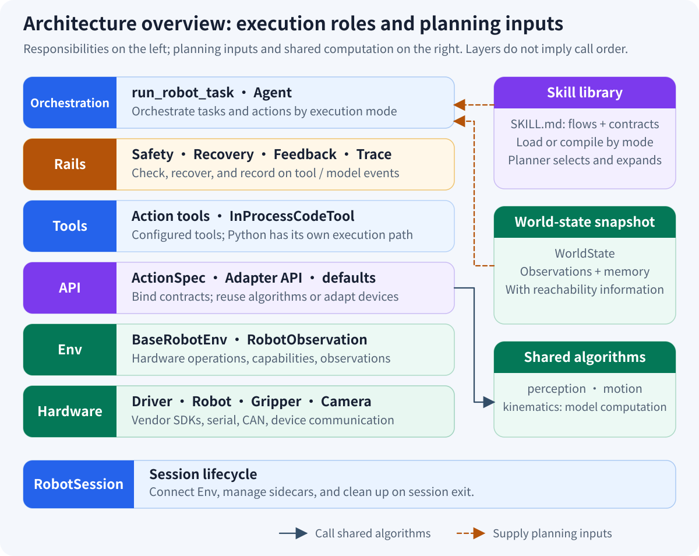

# JiuwenSymbiosis

English | [中文](README.zh.md)

JiuwenSymbiosis is an embodied-agent framework built on openjiuwen for adapting one safe, auditable Agent workflow to different robot bodies.

## Core Features

- **Body agnostic**: Capability Mixins and adapters separate robot geometry and vendor SDKs from Agent workflows.
- **Safety loop**: Motion bounds, failure recovery, visual feedback, and execution diagnosis protect physical execution.
- **Visual manipulation**: Detection, depth, calibration, and coordinate transforms form a reusable perception pipeline.
- **Skill workflows**: Built-in `visual_pick` and `visual_place` skills standardize common manipulation procedures.
- **Auditable execution**: Structured traces, saved frames, replay, and feedback analysis make runs reproducible and diagnosable.

## Architecture



The runtime forms a **Perceive → Plan → Execute → Observe → Feedback** loop. Commands flow through Agent, Rails, Tools, API, Env, and Hardware; observations, failures, and trace evidence flow back to the Agent. See the [Architecture explanation](docs/en/explanation/architecture.md) for the full dependency and task sequence diagrams.

## Related Documentation

- [Documentation](docs/en/README.md) — tutorials, how-to guides, API reference, and explanations
- [Examples](examples/README.en.md) — hardware-free Mock and real-hardware examples
- [Feature Matrix](docs/en/reference/feature-matrix.md) — built-in adapter and capability status
- [Contributing](CONTRIBUTING.md) — development, testing, and contribution workflow

## Requirements

| Dependency | Version or requirement |
| --- | --- |
| Operating system | Ubuntu 22.04 (currently verified platform) |
| Python | `>=3.11,<3.14`; the SO-101 adapter requires Python 3.12 |
| Core | `openjiuwen>=0.1.13`; other versions follow `[project.dependencies]` in `pyproject.toml` |
| Vision/GPU | The `[full]` extra uses the CUDA 12.8 build of PyTorch 2.8.0 |
| Real hardware | Prepare the adapter's CAN/serial bus, camera, calibration, vendor SDK, and validated safety bounds |

## Installation

```bash
git clone https://gitcode.com/openJiuwen/jiuwensymbiosis.git
cd jiuwensymbiosis
conda create -n jiuwensymbiosis python=3.12
conda activate jiuwensymbiosis
python -m pip install -e .
```

Install only the optional capabilities you need:

```bash
python -m pip install -e ".[dev]"       # Tests and development tools
python -m pip install -e ".[piper]"     # Piper SDK
python -m pip install -e ".[so101]"     # SO-101 / LeRobot; Python 3.12
python -m pip install -e ".[voice]"     # ASR and audio capture
python -m pip install -e ".[gui]"       # Browser GUI
python -m pip install -e ".[calib]"     # Hand-eye calibration
python -m pip install -e ".[full]" \
  --extra-index-url https://download.pytorch.org/whl/cu128  # Vision/GPU stack
```

See [Installation and Quick Start](docs/en/tutorial/01-quick-start.md) for combined extras and pinned runtime dependencies.

## Built-in Adapters

| Adapter | Status | Main capabilities | Optional dependencies |
| --- | --- | --- | --- |
| Piper | Built-in real adapter | 6-DoF motion, parallel gripper, eye-in-hand RealSense vision | `[piper]`; add `[full]` for vision |
| SO-101 | Built-in real adapter | 5-DoF motion, parallel gripper, eye-to-hand RealSense vision | Python 3.12 + `[so101]`; add `[full]` for vision |

`MockArmEnv` remains available as a built-in in-memory simulation Env and powers `--mock`, but it is not a hardware adapter.

SCARA and suction are supported extension contracts, but this repository does not currently ship a hardware-accepted built-in adapter for them. See the [Feature Matrix](docs/en/reference/feature-matrix.md) for exact activation conditions.

## Quick Start

Run the Piper Agent with an in-memory arm and offline model. It needs no robot, GPU, external service, or API key:

```bash
python examples/piper_pick_demo.py \
  --config configs/piper/piper.yaml \
  --mock \
  --max-iter 1 \
  --no-visual-feedback \
  --workspace /tmp/jiuwensymbiosis-demo \
  --query "Pick up the black box and place it on the white box."
```

Expected result: the Mock Session and Agent initialize, one offline model turn completes, the result contains `"mock: no real model, task skipped"`, and the process exits with status `0`. Mock mode validates Agent wiring; it does not simulate successful physical manipulation.

When writing a Python entry point, call `clear_proxy_env()` before importing `openjiuwen` or modules that import it. The bundled CLI and examples already do this.

## License

This project is licensed under the [Apache License 2.0](LICENSE).

This product serves solely as a workflow orchestration tool and does not embed any AI model capabilities. When users integrate AI models for specific business scenarios, they shall bear full responsibility for compliance obligations under the EU AI Act and other relevant regulatory frameworks.
