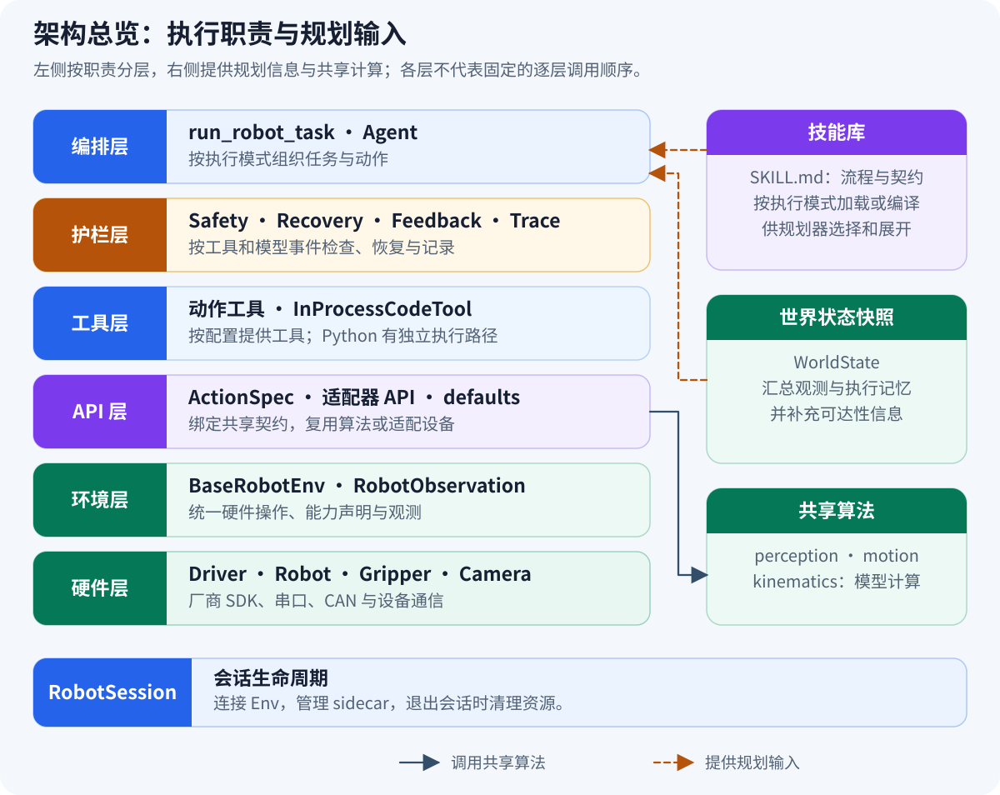

# JiuwenSymbiosis

[English](README.md) | 中文

JiuwenSymbiosis 是基于 openjiuwen 的具身智能体框架，让一套安全、可审计的 Agent 工作流适配不同机器人本体。

## 核心特性

- **构型无关**：Capability Mixin 与适配器将机器人几何、厂商 SDK 和 Agent 工作流解耦。
- **安全闭环**：运动边界检查、异常恢复、视觉反馈和执行诊断共同保护物理执行。
- **视觉操作**：将检测、深度、标定和坐标变换组成可复用感知管线。
- **技能工作流**：内置 `visual_pick` 和 `visual_place` 技能，规范常见操作流程。
- **可审计执行**：结构化轨迹、帧保存、回放和反馈分析便于复现与排障。

## 架构设计



运行时形成“**感知 → 规划 → 执行 → 观测 → 反馈**”闭环：命令依次经过 Agent、Rails、Tools、API、Env 和 Hardware，观测、失败与轨迹证据反向反馈给 Agent。完整依赖关系和任务时序见[架构解释](docs/zh/explanation/architecture.md)。

## 相关文档

- [文档中心](docs/README.md) — 教程、操作指南、API 参考与设计解释
- [示例工程](examples/README.md) — 无硬件 Mock 示例和真机示例
- [特性矩阵](docs/zh/reference/feature-matrix.md) — 内置适配器与能力支持状态
- [贡献指南](CONTRIBUTING.md) — 开发、测试和提交要求

## 环境要求

| 依赖 | 版本或要求 |
| --- | --- |
| 操作系统 | Ubuntu 22.04（当前已验证平台） |
| Python | `>=3.11,<3.14`；SO-101 适配器需要 Python 3.12 |
| 核心依赖 | `openjiuwen>=0.1.13`；其他版本以 `pyproject.toml` 的 `[project.dependencies]` 为准 |
| 视觉/GPU | `[full]` 使用 CUDA 12.8 对应的 PyTorch 2.8.0 构建 |
| 真机 | 准备适配器所需的 CAN/串口、相机、标定、厂商 SDK，并验收安全边界 |

## 安装指南

```bash
git clone https://gitcode.com/openJiuwen/jiuwensymbiosis.git
cd jiuwensymbiosis
conda create -n jiuwensymbiosis python=3.12
conda activate jiuwensymbiosis
python -m pip install -e .
```

按需安装可选能力：

```bash
python -m pip install -e ".[dev]"       # 测试与开发工具
python -m pip install -e ".[piper]"     # Piper SDK
python -m pip install -e ".[so101]"     # SO-101 / LeRobot；Python 3.12
python -m pip install -e ".[voice]"     # ASR 与录音
python -m pip install -e ".[gui]"       # 浏览器 GUI
python -m pip install -e ".[calib]"     # 手眼标定
python -m pip install -e ".[full]" \
  --extra-index-url https://download.pytorch.org/whl/cu128  # 视觉/GPU 栈
```

组合安装和固定版本运行依赖见[安装与快速开始](docs/zh/tutorial/01-quick-start.md)。

## 内置适配器

| 适配器 | 状态 | 主要能力 | 可选依赖 |
| --- | --- | --- | --- |
| Piper | 内置真机适配器 | 6-DoF 运动、平行夹爪、眼在手上 RealSense 视觉 | `[piper]`；视觉另加 `[full]` |
| SO-101 | 内置真机适配器 | 5-DoF 运动、平行夹爪、眼在手外 RealSense 视觉 | Python 3.12 + `[so101]`；视觉另加 `[full]` |

`MockArmEnv` 仍作为内置内存模拟 Env 提供，并用于 `--mock`，但它不是硬件适配器。

SCARA 和吸盘属于框架已支持的扩展契约，但仓库目前没有经过真机验收的对应内置适配器。准确的启用条件见[特性矩阵](docs/zh/reference/feature-matrix.md)。

## Quick Start

使用内存机械臂和离线模型运行 Piper Agent，不需要真机、GPU、外部服务或 API Key：

```bash
python examples/piper_pick_demo.py \
  --config configs/piper/piper.yaml \
  --mock \
  --max-iter 1 \
  --no-visual-feedback \
  --workspace /tmp/jiuwensymbiosis-demo \
  --query "把黑色盒子放到白色盒子上面"
```

预期结果：Mock Session 和 Agent 完成初始化，执行一次离线模型调用，结果包含 `"mock: no real model, task skipped"`，程序以退出码 `0` 结束。Mock 模式验证 Agent 接线，不模拟物理操作成功。

自行编写 Python 入口时，必须在导入 `openjiuwen` 或间接导入它的模块前调用 `clear_proxy_env()`；仓库内置 CLI 和示例已处理。

## License

本项目基于 [Apache License 2.0](LICENSE) 开源。

本产品仅作为流程编排工具，不包含 AI 模型能力；用户在连接 AI 模型用于特定业务场景时，需自行承担欧盟 AI 法案等相关合规义务。
