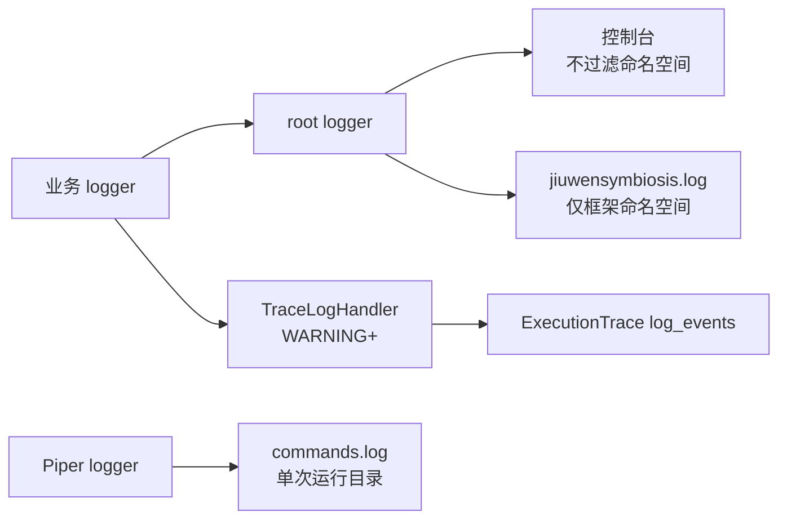

# 日志模块设计文档

## 1. 设计目的

本设计针对集中日志模块引入前的项目状态：各模块各自调用 `logging.getLogger()`，没有统一的
格式、级别和文件出口；Piper 另有一套只服务真机命令的文件 handler；执行轨迹也无法复用
业务日志中的告警信息。

设计要解决三个问题：

1. 为框架提供幂等的统一配置入口，重复构建 Agent 时不叠加 handler。
2. 区分“日常框架日志”“Piper 单次运行命令日志”和“执行轨迹告警事件”，避免三个用途互相污染。
3. 日志故障不得改变机器人任务结果，特别是 trace sink、目录创建或格式化失败时必须安全降级。

设计基线以集中日志模块首次接入 `build_robot_agent()` 时的代码状态为起点。用户配置与公共 API 用法见
[配置和使用日志](../docs/zh/how-to/configure-logging.md)。

## 2. 核心概念

- **受管 Handler（Owned Handler）**：由本框架创建并带 `_jiuwensymbiosis_owned` 标记的 handler。
  配置入口只更新或移除这类 handler，不接管宿主应用已有的日志设施。
- **框架日志流（Framework Log Stream）**：`jiuwensymbiosis` 命名空间产生的常规运行记录。
- **命令审计流（Command Audit Stream）**：Piper 单次进程运行的运动命令记录，保存到独立时间戳目录。
- **轨迹日志事件（Trace Log Event）**：从指定 logger 捕获的 `WARNING` 及以上记录，写入当前
  `ExecutionTrace` 步骤或 trace 级日志。

这些概念共同确定封装边界：集中日志模块薄封装 Python `logging`，不替换标准库 Logger；
Piper 和 Trace 只通过 handler 扩展输出目的地，不复制业务日志调用。

## 3. 设计逻辑

### 3.1 单一配置入口与所有权

`configure_logging()` 配置 root logger，并通过 Owned Handler 标记识别自己创建的输出端。
重复调用时更新级别和 formatter；请求文件输出时至多创建一个滚动文件 handler，取消文件输出时
只关闭受管文件 handler。宿主程序自行安装的 handler 保持不变。

选择显式管理而不是 `logging.config.dictConfig`，是为了保留宿主日志配置，并让“重复构建不叠加”
这一约束可以直接由 handler 标记实现和测试。

### 3.2 三种输出按用途分离



- 控制台保留所有传播到 root 的标准库日志，便于观察依赖初始化。
- `jiuwensymbiosis.log` 使用 `_FrameworkFilter`，只保存框架命名空间，防止 openjiuwen 初始化噪声淹没业务记录。
- Piper `commands.log` 直接挂在 Piper logger 上，以运行时间戳隔离，并保持统一格式。
- `TraceLogHandler` 只把告警事件转发给 trace sink，不写第二份普通日志文件。

### 3.3 Trace 转发采用可替换 Sink

`TraceLogHandler` 依赖最小的 `_TraceSinkLike.record_log_event()` 协议，不反向依赖 `TraceRail`
实现。Agent 构建时绑定 sink；一次 invoke 结束后把 sink 置空，下一次 invoke 再绑定；Session
结束时从目标 logger 移除 handler。这样既避免运行间串写，也避免长进程中的 handler 泄漏。

日志转发是 best-effort：sink 缺失时无操作，sink 的协议调用失败时吞掉异常。日志永远不能把
一次成功的工具调用变成失败。

### 3.4 Piper 命令日志保留独立生命周期

Piper 命令日志服务真机审计，生命周期与进程内驱动实例一致，而不是与某次 Agent invoke 一致。
`_attach_cmd_log_handler()` 使用模块级附加标志保证一次进程只安装一次，并支持：

- `JIUWEN_PIPER_CMD_LOG=0`：关闭命令日志；
- `JIUWEN_PIPER_CMD_LOG_DIR`：设置目录；
- `JIUWEN_CMD_LOG_DIR`：兼容旧目录变量。

其输出目录同时写入 `JIUWEN_MOTION_LOG_RUN_DIR`，供抓取调试产物与同一次真机运行对齐。

## 4. 核心数据结构

| 结构 | 关键成员 | 作用 |
| --- | --- | --- |
| Owned Handler 标记 | `_jiuwensymbiosis_owned=True` | 区分框架 handler 与宿主 handler |
| `_Formatter` | 标准格式、异常时 `repr(record.msg)` | 保证异常消息不会击穿日志路径 |
| `_FrameworkFilter` | `jiuwensymbiosis` 前缀 | 限定框架滚动日志的命名空间 |
| `TraceLogHandler` | `_sink`、`level` | 把告警转换为结构化 trace 日志事件 |
| Piper 命令日志状态 | `_CMD_LOG_ATTACHED`、`_CMD_LOG_PATH`、运行时间戳 | 保证进程内只附加一次并暴露实际路径 |

## 5. 接口定义

```python
def configure_logging(
    level: int | str = "INFO",
    *,
    log_dir: str | Path | None = None,
    fmt: str = DEFAULT_FMT,
) -> None:
    """配置或更新受管控制台/滚动文件 handler，不叠加重复实例。"""


def get_logger(name: str | None = None) -> logging.Logger:
    """返回标准库 Logger；name 为空时推断调用模块。"""


class TraceLogHandler(logging.Handler):
    def set_sink(self, sink: _TraceSinkLike | None) -> None:
        """在 invoke 生命周期边界绑定或解除 trace sink。"""
```

接口关系是：模块通过 `get_logger()` 或标准库 Logger 产生日志；应用在构建入口调用
`configure_logging()`；启用 tracing 时，builder 额外安装 `TraceLogHandler`，由
`TraceRail` 管理 sink 和卸载时机。

## 6. 一致性校验

- **所有权一致性**：只能更新或移除带 Owned Handler 标记的 handler。
- **幂等性**：连续调用 `configure_logging()` 不增加受管控制台或滚动文件 handler 数量。
- **隔离性**：文件日志仅包含 `jiuwensymbiosis.*`，控制台不应用该过滤器。
- **生命周期**：invoke 结束解除 sink，Session 结束移除 `TraceLogHandler`。
- **可靠性**：格式化、sink 调用和 Piper 日志目录创建失败均不得向业务路径传播。
- **可测试性**：上述约束由 `tests/unit_tests/utils/test_logging.py` 和
  `tests/unit_tests/rails/test_trace.py` 覆盖；Piper 输出路径由低层驱动相关测试和人工真机日志验收确认。

## 7. 变更历史

| 日期 | 变更内容 | 原因 |
| --- | --- | --- |
| 2026-08-10 | 新增集中日志模块设计文档 | 记录日志职责、封装边界、接口与一致性约束 |
