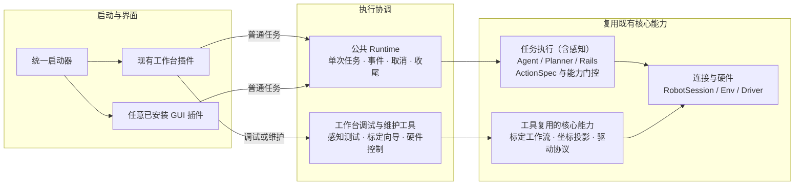
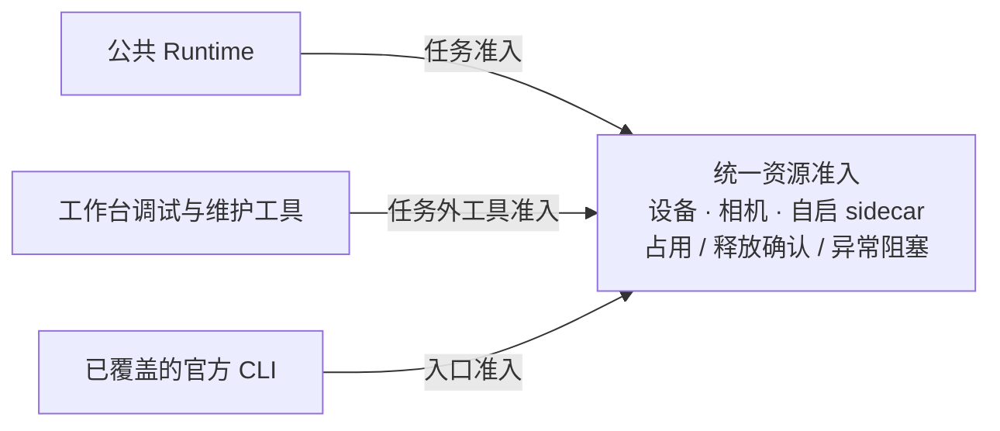
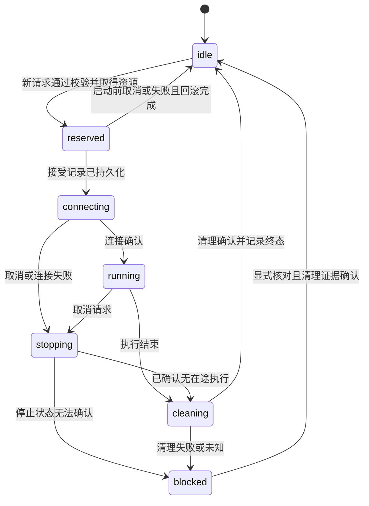

# 现有 GUI 迁移与新 GUI 接入设计

状态：步骤 1–7 已实现，已完成无硬件回归、插件安装、wheel 和本机 HTTP 启动验收。
未进行真机、真实 LLM 或完整浏览器交互验收；具体证据及静态检查遗留项见 §10。
计划见 §9，按实现复核后的契约与验证见 §10。

## 1. 目标与范围

**将现有 GUI 迁到仓库根目录的独立 Python 包 `jiuwensymbiosis_gui/`，
保留为 `workbench` 应用；通过 `--gui <key>` 选择已安装的 GUI。
将界面无关的任务执行和资源准入提取到核心包 `jiuwensymbiosis/runtime/`，
让后续 GUI 使用同一套后台契约。**

最初提出拆分，是因为后续界面可能采用完全不同的页面和前端组件，例如导航界面。
本次范围已明确收敛为**现有界面迁移、公共能力提取和新 GUI 如何接入**；
具体新应用的布局、业务模型、功能接口与开发计划均另行设计，不属于本文。
位置标注等业务工具可以独立、提前离线使用，是否提供界面由应用决定，不是 GUI 接入的必选项。

本轮交付：

1. 可继续使用的现有工作台，以及新旧启动入口、参数选择和重启行为。
2. 无 GUI 依赖的单次任务 runtime，以及任务/维护操作统一的资源准入。
3. 新 GUI 的注册、依赖、配置、生命周期、执行和测试接入规则。
4. 独立 GUI 测试套件与安装包验证；使用测试插件验证第二个入口。

本轮只发布 `workbench`，不创建第二个产品界面或预建其空目录。
新的 GUI 若只使用已有核心能力，应能注册并启动，而无需修改工作台或核心执行器；
若需要核心尚未提供的能力，应在其所属模块另行设计，不能把业务扩展包装成 GUI 迁移。

部署按用户已确认的**同机、本机浏览器**处理：插件宿主与 runtime 在同一 Python
进程，默认监听本机地址。一个应用进程最多一个触碰硬件的任务或维护操作；同机、
同一用户的不同进程遵守同一资源锁协议。独立后端服务、多机控制、跨环境进程委托、
运行中热切换、多轮会话及持续硬件连接均不在本轮接口或计划中。

成功条件是：原工作台功能保持可用；新 GUI 能只依赖公开契约接入；
未选择 GUI 的框架不会被装载；多标签页、GUI 与已覆盖 CLI 的竞争由后台统一裁决；
任务取消、完成和设备释放分别有可观察的结果。

## 2. 现状、证据与取舍

### 2.1 代码基线与主要问题

代码基线：`6fba0728ea0b37ac9c3006181eaecffca258d1ff`。
分析开始时已有未跟踪的 `design/multi-robot-fleet.md` 和
`design/jiuwenswarm-symbiosis-integration.md`；它们是相关草案，
不作为已实现接口，本次不修改。以下事实基于代码阅读及 §10 保留的初次验证。

| 代码事实 | 迁移需要解决的问题 |
|---|---|
| [GUI 公共导出](../jiuwensymbiosis/gui/__init__.py) 只有产品名和介绍；页面主要在 `layout.py`、`pages/` | 可以整体迁移，无需建立所有 GUI 都继承的页面基类 |
| [RunEngine](../jiuwensymbiosis_gui/workbench/run_engine.py) 不依赖 NiceGUI，但依赖 `TaskDef`、`ConfigModel`、GUI registry 和 imaging | “不导入 UI 框架”不等于公共后台；需要拆开执行输入与工作台模型 |
| 每次运行创建 session，完成后断开；每次生成新的 conversation ID | 保留现有单次任务语义，不将它描述成持续对话或持久连接 |
| 基线中的 `UIBridgeRail` 混合动作事实、中文文案与取图；`run_status.py` 另行判断结果 | 事实与执行结论归后台；文案、颜色和显示编码归 GUI；迁移后删除旧 bridge |
| `RunEngine.drain()` 破坏性读取单个 Queue | 多客户端会争抢事件；需要独立游标、快照和明确的补读边界 |
| `app.index()` 每个客户端建立 `AppState`；busy 只看自己的引擎 | 当前“同一时刻一个运行”主要依靠页面约定，缺少应用级原子准入 |
| 工作台的感知测试、标定、硬件控制工具各有线程和连接，由页面协调释放 | 工具流程可以保留，资源使用权必须接入同一准入机制 |
| [RobotSession](../jiuwensymbiosis/agent/session.py) 拥有 Env/sidecar；部分释放异常只记 warning；[取消工具](../jiuwensymbiosis/agent/cancel.py) 可以放弃等待后台线程 | 抛出取消异常或 disconnect 返回，都不足以证明资源可重用 |
| 重启固定使用旧模块入口；实例标记按端口命名；shell 启动脚本未透传参数 | GUI 身份、配置、端口和重启参数需要统一处理 |
| registry 从核心包路径反推仓库，找不到时使用 cwd；配置编辑后从 dict 构建 session | 需保留真实配置来源目录，并验证 wheel 安装后脱离仓库启动 |
| [pyproject.toml](../pyproject.toml) 已有可选 `gui` extra，但 GUI YAML/图标未显式列入 package-data | 可延续可选安装；资源是否完整必须通过构建和安装验证 |
| 核心绝对 import 的 AST 基线扫描未发现反向 GUI/NiceGUI 依赖 | 源码边界已有基础；迁移后仍需用依赖测试验证，不仅做文本替换 |

初次统计现有 GUI 为 28 个 Python 文件、7,635 行。迁移应保留现有行为断言，
不把全部纯 Python 文件都提升为公共框架。

### 2.2 方案取舍

| 方案 | 价值与代价 | 决定 |
|---|---|---|
| 只移目录并增加启动分支 | 能选入口，但新 GUI 仍需复制任务线程、取消和占用逻辑 | 可作为中间步骤，不能作为最终交付 |
| 要求新 GUI 复用现有 Layout/pages | 容易复用现有样式，但绑定任务卡片、工具切换和客户端状态 | 页面复用由应用自选，不作为插件契约 |
| 根目录 GUI 包 + 轻量 launcher + 核心 runtime | 界面独立演进，执行和准入只有一份所有者 | 采用 |
| 立即分仓库、分服务、分别发布 | 提供独立发布和部署，但增加版本、协议和运维成本 | 当前不需要；保留通过安装包注册插件的入口 |

首期仍由根 `pyproject.toml` 发布一个 distribution，包含
`jiuwensymbiosis` 与 `jiuwensymbiosis_gui` 两个 import package。
源码独立、可选依赖和独立发布是不同承诺；此次不将 GUI 变成独立发行产品。
独立开发的新 GUI 可以使用自己的 distribution，通过约定的 entry point 注册。

## 3. 模块边界：共享什么，保留什么

### 3.1 目标目录

以下目录均服务于本轮迁移；具体文件可按实现规模合并，但职责和依赖方向保持不变。

```text
jiuwensymbiosis/
  runtime/
    __init__.py              # 明确导出公共请求、结果与 Runtime
    bindings.py              # 配置快照、来源路径、adapter 解析
    resources.py             # 进程内/同机跨进程准入、lease 与释放记录
    jobs.py                  # 提交、去重、状态、取消与结果归一化
    worker.py                # 按任务构建、连接、执行与收尾
    events.py                # 执行事实与非破坏性游标读取
    store.py                 # job、请求指纹、状态/事件的最小持久化
    artifacts.py             # 既有 trace/帧的受限引用及有界预览读取
  agent/ api/ env/ ...        # 继续拥有原有执行、动作和硬件契约
  gui/
    __init__.py              # 兼容期不装载新 GUI
    __main__.py              # 旧 -m 入口的惰性转发

jiuwensymbiosis_gui/
  __init__.py                # 轻量，不导入核心执行层或 GUI 框架
  __main__.py                # 统一 CLI 入口
  plugin.py                  # GuiSpec / LaunchOptions / 启动错误契约
  launcher.py                # 参数、发现、选择与启动错误报告
  workbench/
    plugin.py                # 轻量插件描述工厂
    app.py / layout.py
    app_state.py             # 每个客户端的选择、草稿、游标
    pages/
    registry.py              # 工作台名称、任务预设与默认值
    config_model.py
    humanize.py / imaging.py / diagnostics.py
    perception_engine.py / calibration_engine.py / hardware_engine.py
    preflight.py / board_print.py
    data/                    # 工作台 YAML、图标等资源
```

不预建公共页面库。只有出现两个实际使用者并确认语义相同时，才提取展示组件；
启动器、任务接口和资源准入已经是可复用边界，不需要用一个 `common/` 包包住所有代码。

将调用关系与资源准入分开表示。主图从左到右展示界面如何使用已有执行能力：



箭头表示调用或使用关系，核心节点按职责合并展示；具体所有权见 §3.2。
普通任务由 runtime 管理 session 生命周期；维护操作由工具持有的既有工作流负责
连接和清理。图中的新插件仅表示接入方，不代表本轮新增一个应用。

**感知能力本身属于既有核心，任务中的检测、定位和视觉反馈仍在任务执行链中。**
工具分支的“感知测试”特指工作台的相机预览、点击像素并反投影到基座坐标的调试入口
（`PerceptionEngine`），其交互和采集循环留在工作台，复用核心投影能力；
不将整个 `perception/` 或任务中的感知迁到维护分支。

资源准入单独展示：所有已覆盖的硬件入口在连接前取得使用权，确认清理后才释放。



资源管理器只裁决使用权，不代替调用方执行任务或工作流。已有 CLI 保留自身的交互
和执行流程，共享绑定/准入，不强制改造成 GUI 的异步 job 客户端。

### 3.2 所有权与依赖规则

| 能力 | 所有者 | 新 GUI 如何使用 |
|---|---|---|
| 入口发现、选择、公共启动参数 | GUI launcher/plugin | 注册描述工厂及启动函数 |
| 配置来源、有效配置快照、adapter 解析 | runtime bindings + 既有 adapter 配置 | 提交配置来源或带来源目录的编辑快照 |
| 单次任务、取消、状态、结果、事件 | runtime | 调用公开任务接口，不复制 RunEngine |
| 设备/相机/sidecar 的资源准入 | runtime resources | 任务自动取得占用；维护工作流显式取得 lease |
| 动作、能力门控、规划、rails、机器人状态 | 既有核心模块 | 沿用核心契约，不另建 GUI 动作表或状态词表 |
| 检测、定位、投影等感知能力 | 既有 perception / API / adapter 实现 | 任务沿用动作/观测路径；调试工具复用既有接口，不复制算法 |
| 实际连接和释放 | RobotSession、Env/sidecar 所有者 | runtime 管生命周期；维护工具在已获准入范围内运行既有流程 |
| 页面、布局、表单、选择、文案、业务预设 | 各 GUI | 自行实现；不要求复用工作台 AppState/TaskDef |
| UI 框架、前端组件、构建、静态路由、浏览器通信 | 各 GUI 插件 | 各自声明并装载；共享执行语义，不共享框架对象 |
| 专用业务算法、数据或工具 | 对应领域模块/工具 | GUI 是消费者；其设计不进入通用插件协议 |

核心运行模块不能导入 `jiuwensymbiosis_gui`、NiceGUI 或前端框架。
`runtime` 不导入 calibration，标定仍是工作台工具和 CLI 消费的独立子系统。
兼容期只允许旧 `gui/__main__.py` 在实际启动时转发新 launcher；
核心依赖测试将例外限定到该文件。

普通任务页面不得自行取得 session/driver 执行机器人动作。维护工具是明确的受控
调用方：其线程可以在 lease 内运行既有 workflow/driver 协议，生命周期必须报告给
应用宿主及资源管理器。资源管理器只管使用权，不复制硬件工作流或变更标定发布策略。

### 3.3 现有代码的具体迁移

| 现有职责 | 迁移安排 |
|---|---|
| `layout.py`、`pages/`、表单、任务卡片、GUI 配置默认值 | 移到 workbench，保留内部协作，不提升为公共接口 |
| `app.py` 页面注册、回放路由、工作台框架生命周期 | 留 workbench；应用实例持有 runtime 和维护工具 |
| `__main__.py` 参数、错误兜底、脚本引导 | 移到 launcher；NiceGUI 检查留在 workbench 的惰性预检 |
| registry 的显示名、任务预设、标定 profiles | 留 workbench；无权定义硬件能力 |
| registry/runner/introspection 重复的 adapter 解析和有效配置构建 | 提取到 bindings，复用现有 builder、from_dict/from_yaml 语义 |
| RunEngine 的任务线程、连接、取消、日志采集、执行结果 | 提取到 runtime；调用既有 `run_robot_task`，不创建新规划器 |
| RunEngine 中工作台选项转换，如“禁用视觉服务”和任务默认指令 | 留工作台请求适配；runtime 接收转换并验证后的执行配置 |
| `UIBridgeRail` 动作事实、`run_status.py` 结果归一化 | 移到 runtime 执行事件/结果出口并删除旧 bridge；trace 持久化仍由 TraceRail 拥有 |
| humanize、颜色、诊断卡、图像展示编码 | 留 GUI；机器错误码仍由核心 `errors.py` 拥有 |
| 初始关节/执行观测和 trace/帧引用 | runtime 记录事实；“回到起始位”按钮和维护流程仍归工作台 |
| 感知测试/标定/硬件控制工具引擎 | 保留工作台流程，接统一准入、应用级所有权和清理报告 |
| `board_print.py` 等纯文件操作 | 随工作台迁移，不无故申请硬件资源 |

`runtime` 与 [MCP 集成草案](jiuwenswarm-symbiosis-integration.md) 的任务/资源职责
保持一致，复用 `RobotJob`、`TaskEvent`、`physical_device_id` 的术语。
本轮独立完成迁移，不等待 MCP 服务，也不引入其未实现的部署或调度能力。

## 4. 启动与插件契约

### 4.1 用户入口

统一启动器已提供以下命令：

```bash
jiuwensymbiosis-gui --list-guis
jiuwensymbiosis-gui --gui workbench
jiuwensymbiosis-gui --gui workbench --config configs/piper/piper.yaml --port 8771 --no-browser
python -m jiuwensymbiosis_gui --gui workbench
# 安装并注册 key 为 example 的插件后：
jiuwensymbiosis-gui --gui example --config /path/to/runtime.yaml
```

`--gui` 缺省为 `workbench`。`--config` 选择机器人运行配置，`--workspace`
选择工作区，`--gui-config` 提供所选 GUI 的展示配置；应用标识与本体型号相互独立。
未知 GUI、参数、重复 key 或不兼容的插件 API 版本都明确报错，不静默换成工作台。

### 4.2 最小公共接口

以下为契约草图，实施时从 `jiuwensymbiosis_gui.plugin` 公开导出。

```python
@dataclass(frozen=True)
class GuiSpec:
    key: str
    display_name: str
    api_version: int
    launch_target: str  # "package.module:main"

@dataclass(frozen=True)
class LaunchOptions:
    gui: str
    config_path: Path | None
    workspace: Path | None
    host: str
    port: int
    open_browser: bool
    gui_config_path: Path | None

def main(options: LaunchOptions) -> int:
    ...
```

`GuiSpec` 只描述如何启动，不返回页面、widget 或 Web app，不包含业务功能清单。
插件的 `main` 负责框架循环，阻塞到应用退出并返回退出码。
需要执行任务的应用在应用作用域创建一份 runtime；页面只持有客户端状态和任务引用。
纯展示插件可以不创建 runtime，列出/选择插件更不能隐式连接机器人。

内置清单只注册 workbench。外部 GUI 通过 Python entry-point group
`jiuwensymbiosis.gui` 提供轻量描述工厂；entry point 名与 `GuiSpec.key` 一致。
工厂及其包 `__init__` 不导入 GUI 框架、agent 或硬件 SDK。
发现阶段只读取元数据和轻量描述，不装载 `launch_target`；选定后才调用实际应用。
损坏的描述工厂在清单中报告所属包和错误，不影响其他有效插件；重复 key 拒绝启动。

`--help` / `--list-guis` 使用轻量路径，不导入核心执行层或 NiceGUI。
启动被选应用之前调用既有 `clear_proxy_env()`，保证早于 `openjiuwen` 导入；
不要为了在帮助阶段清理代理而提前导入整个核心包，也不复制第二份清理实现。
插件预检位于其轻量启动入口，先检查所需依赖，再导入框架。

缺依赖错误必须指出所选插件和实际安装方式。通用 launcher 不能对所有插件都建议
安装 `.[gui]`。预期错误使用明确的启动错误类型传递；未知异常保留日志/堆栈，
沿用现有桌面启动可见的错误兜底，不能只在没有终端的后台静默退出。

### 4.3 兼容、重启与实例身份

- console script 指向 `jiuwensymbiosis_gui.__main__:main`；旧
  `python -m jiuwensymbiosis.gui` 仅惰性转发。旧 Python 内部模块路径统一更新，
  不为每个页面模块保留别名。
- `scripts/gui_launcher.py`、`scripts/launch_gui.sh` 和桌面引导透传启动参数。
  原 shell 脚本未传 `"$@"`，必须一并修改。
- 重启以规范化 `LaunchOptions` 重建命令；保留 GUI、配置、workspace、地址、
  端口和 GUI 专属配置，接替进程使用 `open_browser=False`。
  工作台接管端口超时返回非零状态，同时记录错误并尝试 tkinter 桌面提示；
  `--no-browser` 不抑制这一重启失败提示。无图形显示或 Tk 不可用时仍只能依赖日志，
  本轮不新增跨进程启动状态文件或自动重启循环。
- 重启前完成任务和维护收尾。端口已有监听者时，只有验证应用 key、实例身份及兼容的
  启动配置后才能复用；否则报告冲突。端口可连接或锁文件存在都不足以证明身份。
  launcher 提供公共身份/重启数据约定，具体健康端点由所选插件宿主适配。
- 旧模块启动路径保留一个发布周期，再在 release note 中告知移除；不保留第二套
  参数解析或后台执行。旧路径会先经过核心包导入，因此轻量装载验收以新入口为准。
- 现有用户任务目录、workspace、轨迹和历史回放继续读取；包名迁移不改写用户数据。

### 4.4 配置与安装资源

适配器 Config 用 `path_fields` 声明本体自己的源配置路径字段；公共
`adapters._common.config.parse_config(factory, data, source_dir=...)` 统一规范化来源并
调用一次 `from_dict`，返回规范化副本和有效配置。Config 的 `from_yaml` 委托
`load_yaml_config`，Runtime 和 smoke 复用同一解析入口；核心不保留本体字段名单。
路径展开环境变量与 `~`，不依赖目标已存在。无来源的直接 `from_dict` 保留原调用语义。


执行配置以实际 `--config` 文件目录为相对路径基准。页面编辑配置后提交快照，
仍携带来源目录；不能因从 YAML 改为 dict 构建而改用 cwd 或本体默认目录。
重跑使用当前配置内容及其当前来源文件重新准备绑定，不得把新内容与旧引擎的来源拼接；
已接受任务的绑定保持不变。
外部 `--config` 路径必须在保存、刷新配置候选后继续保持选中；主动更换本体时才重置。
GUI 展示配置保留自己的来源目录；不将界面框架参数塞入公共执行请求。
默认工作区由 `runtime.default_workspace()` 单点给出；Runtime、独立绑定与工作台复用，
不在各 GUI 复制默认目录字面量。

包内只读 YAML、图标、模板使用 `importlib.resources` 读取；用户另存的配置和
运行结果写到原有用户目录/workspace，不修改 site-packages。
默认本体配置须在 wheel 中有可用来源，例如随 adapter 打包的模板；
缺少实际设备参数时明确提示配置，不把开发机的配置路径作为安装后的缺省值。
明确声明 package discovery 和 package-data，验证 YAML、图标及已有前端产物；
不能从 editable 安装成功推断 wheel 完整。
`examples` 显式作为 Python 包随 wheel 发布，保留已安装任务 CLI 对 `run_task.py` 的调用；
当前只发布其顶层脚本，不隐式纳入未来示例子包。`tests/gui/packaging/test_wheel.py`
自动构建、安装到临时目录并在仓库外检查任务/新旧 GUI 入口及工作台 YAML、图标和配置模板。

## 5. 每个 GUI 的依赖与发布边界

| 项目 | 公共部分 | 各 GUI 自己拥有 |
|---|---|---|
| Python 依赖 | launcher/plugin 的轻量依赖、核心运行契约 | UI 框架与插件宿主依赖；现有工作台保留 `[gui]` |
| 前端工程 | 不提供强制公共框架或全局组件实例 | 自定义前端的 manifest、lockfile、构建与测试命令 |
| 静态资源 | 资源归属和命名规则 | JS/CSS/图标及实际需要的 worker/WASM；由所选宿主提供路由 |
| 浏览器通信 | runtime 的请求、状态与事件语义 | 框架消息机制或本机 HTTP/WebSocket 适配 |
| 可选功能 | 不进入 GuiSpec，也不增加核心必需依赖 | 所属 GUI 自行声明、预检和按需加载 |
| 版本与发布 | 插件 API 兼容检查 | 自己使用的库版本、前端 peer dependencies 和构建结果 |

新 GUI 在同一 distribution 内时使用自己的可选依赖组（如 `gui-<key>`）；
独立发行时由自身的 `pyproject.toml` 声明依赖核心和所需 GUI 启动契约的兼容版本。
本轮不预建未实现 GUI 的 extra。

Python extras 只控制附加安装依赖，不创建独立环境。同一环境安装多个 GUI 时，
共享 Python 库的版本约束必须兼容；惰性 import 不能解决版本冲突。
确需冲突版本时，应另行设计独立环境及启动委托，当前 `main(options)` 不承诺支持。
单一 wheel 中已打包的 GUI 代码/资源也不会因未选 extra 而自动消失。

有自定义前端的 GUI 各自拥有工程，例如插件包内的 `web/package.json`、
lockfile、`src/` 和 `dist/`，按自己的锁文件构建，不从其他 GUI 的
`node_modules`、CDN/import map 或全局框架变量隐式取得依赖。
一个 GUI 内各面板默认可用同一工程，不要求每个组件另建包。
工作台当前使用 NiceGUI，不为了目录整齐强行给它新增 JS 工程。

只注册和请求所选 GUI 的资源，URL 按应用及构建版本区分。发布包携带需要的预构建
产物，运行时不要求 Node；前端开发和构建依赖与运行依赖分别说明。
两个 GUI 独立构建不免除单个 GUI 内部的组件兼容性检查。

浏览器不能直接调用 Python；所选插件宿主负责本机通信适配，在同进程调用 runtime。
公共 runtime 不依赖 NiceGUI、ASGI 对象或 WebSocket 连接；传输断开不改变任务语义。
接入方需要新的业务能力时，应明确依赖其领域模块，不能把业务资源格式、编辑器或
专用动作塞进启动器与公共执行接口。

## 6. 公共 runtime：本轮实际需要的契约

### 6.1 数据与调用接口

`Runtime` 是应用级门面，封装任务线程、结果归一化、事件存储和准入协作。
下列接口覆盖现有单次任务及其状态读取，统一从 `jiuwensymbiosis.runtime`
导出。GUI 不导入内部 worker/store；每份 Runtime 对应一个 workspace，应用宿主
可为不同 workspace 分别持有实例，它们共用同一资源准入目录。

| 概念 | 所有者与语义 |
|---|---|
| `BindingSnapshot` | bindings 持有的不可变有效配置、来源目录、adapter、workspace、配置指纹及资源身份；不持有 UI 对象 |
| 任务快照（JSON dict） | job ID、binding ID、执行阶段、取消请求、结果、清理状态；业务结果与资源是否已释放分别记录，事件另带时间戳 |
| `TaskEvent` | job ID、递增 seq、时间、kind、结构化 data；记录事实，不包含框架控件或中文展示模板 |
| `TaskEventBatch` | 事件、下一游标、gap、最早保留 seq；多个客户端可独立补读 |
| `ArtifactRef` | 受限的 trace/帧引用及必要元数据；不接收浏览器传来的任意文件路径 |
| `ResourceLease` / 清理报告 | 操作 ID、generation、资源集合；在途执行、释放确认、失败/未知原因 |

| 接口 | 输入/结果 | 约束 |
|---|---|---|
| `prepare_binding(config_source, *, config_snapshot=None, workspace=None)` | 文件来源，或带来源目录的编辑快照；返回 binding 引用 | 校验配置并推导实际资源，不连接硬件；修改表单不修改既有 binding |
| `submit_task(binding_id, request_id, query, *, agent_options=None)` | 非空指令和现有 agent 配置项；返回 job 引用 | 原子准入；普通任务不需要 TaskDef/ConfigModel；有效选项进入请求指纹 |
| `get_runtime_state()` | 当前操作、busy/blocked/closing 及原因 | 仅读缓存和记录，不通过调用驱动刷新 |
| `get_job(job_id)` | 任务快照 | 页面刷新和重开后可恢复；未知 ID 明确报错 |
| `read_events(job_id, after_seq, limit)` | TaskEventBatch | 非破坏性、有界读取；过期游标明确返回 gap |
| `latest_frame(job_id)` / `read_artifact(ref)` | 最新已有帧引用/受限产物 | 只读执行侧已有数据，不另开相机；没有数据明确返回不可用 |
| `cancel(job_id)` | 请求已接收/已结束等状态 | 幂等；按 job 定位；接收取消不等于执行已停止 |
| `close()` | 已完成/正在收尾/blocked 及原因 | 幂等；先拒绝新提交，取消活动任务，等待任务和维护操作的释放证据 |

`agent_options` 沿用现有配置 schema，不接受 GUI 传来的函数、driver 或 rails 实例。
任务卡默认值、表单和工作台开关由工作台转换为请求，runtime 仍在后台校验有效配置。
输入不得通过传入较少的资源键来绕过准入；资源集合由实际执行配置及受控构建选项推导。

同一 workspace 内相同 request ID 和内容返回同一 job；内容不同返回冲突。
有效内容包括绑定、query 和执行选项。先识别已有请求，再对新请求检查 busy 并准入，
避免已接受请求的重试被误报为新的竞争提交；并发去重由存储唯一约束共同保证。
用户明确“重新执行”使用新的 request ID，可绑定新的配置快照。
跨 workspace 不承诺请求全局去重，但设备准入始终使用公共资源目录。

绑定解析失败、busy、blocked、存储不可用和请求冲突均返回稳定的错误类别；
GUI 决定文案，不靠匹配 exception 的中文内容推断运行状态。
现有 `session.describe()`、introspection 和有效能力交集仍是能力信息来源；
准备绑定和读取帮助不因查询能力而隐式连接设备。

本轮不提供独立的 `connect/disconnect` 公共连接 API：
硬件连接由每个任务或维护操作拥有，准备 binding 不取得设备。
后续业务如果需要超出这些接口的能力，另行扩展正确的所有者，不发布空方法或假成功。

### 6.2 单次任务、线程与关闭

正常流程是：校验/去重 → 预留资源 → 持久化接受记录 → worker 构建 session →
连接 → `run_robot_task` → 确认硬件清理 → 登记产物与结果 → 移除任务日志 handler →
释放占用并记录清理结果。终态或 `run_finished` 不代表资源已经释放，客户端以
`cleanup.released` 判断；后续任务获准前，前一任务的产物登记、结果保存和日志采集必须结束。
接受记录未落盘不能开始硬件工作；线程启动失败也要记录失败并归还本次占用。



图表示任务/资源的运行阶段，不把成功、失败、未完成和取消混成 busy 状态。
接口中实际持久化的 `phase` 为 `reserved`、`connecting`、`running`、`blocked`，
以及终态 `succeeded` / `failed` / `incomplete` / `cancelled`。图中的 stopping/cleaning
是内部收尾过程，客户端通过 `cancel_requested` 和 `cleanup` 观察，不能等待不存在的
同名 phase；idle 对应资源已经释放，不是 job 的终态值。
应用关闭是准入门的独立状态：关闭后即使清理完成也不再接新任务；blocked 时不能
通过把页面标成空闲来解除占用。持物、位姿和位置新鲜度继续按既有 WorldState /
ExecutionMemory 管理，不随着任务结束清零。

worker 在独立线程调用现有同步 `run_robot_task`，沿用其内部异步执行方式；
不在 GUI/ASGI 正在运行的事件循环里调用内部使用 `asyncio.run()` 的入口。
每个任务有独立 CancelToken，日志 handler、rails 和 trace 按任务收尾；
前一次取消不能污染下一次任务，页面回调也不直接从 worker 更新控件。

取消经线程安全控制通道直达当前操作，不能排在被阻塞任务后等待同一个 worker 消费。
必须追踪仍在途的 helper 和连接回收线程：`RunCancelled`、`disconnect()`
返回或 `join(timeout)` 返回均不是充分的释放证据。
在 session/cancel 的原所有者补充公开报告，保持原有调用兼容；runtime 不访问
`_connected` 等私有字段推测状态。无法确认时保留 blocked 并给出原因。
sidecar 启动失败时，由其所有者通过 `cleanup_report()` 确认启动回滚；未提供证据的
旧 starter 仍视为未知。检测服务启动期间取消且子进程已退出时，保留取消结果并允许
释放；terminate/kill 后仍无法确认退出时传播清理失败，不能吞掉异常或宣称已停止。
连接 helper 自己记录 `HardwareCleanupError`，即使有界 reaper 已超时退出，也不得
在 helper 完成后丢掉构造回滚失败。SO-101 在保留力矩模式下的 settle/寄存器恢复失败
保留在驱动中，关闭串口和重复 disconnect 都不能证明寄存器已经恢复。
CruzrNav 拥有常驻及连续运动 worker；单次运动异常退出、超时或缺少有效完成结果，
以及连续运动停止失败，均保留清理失败。强杀只证明进程回收，不能证明已发送零轮速；
上层捕获动作异常也不能让后续资源准入放行。正常上报的任务失败仍使用既有结果语义。
常驻请求的停止失败同样由 CruzrNav 保留，后续相对移动、弧线、连续旋转和前进均先检查。
ResidentWorker 保留的存活句柄仅允许重试停止，不允许发送新请求；两次请求之间异常退出
也不能通过自动替换进程丢失停止证据。后续进程清理成功不自动抹掉 Nav 已记录的运动不确定性。

浏览器断开只解除订阅，不销毁任务所有者或自动重放任务。
应用宿主退出时先关闭准入、请求任务和已登记维护工具停止，再等待收尾报告；
未完成前不启动替代实例或主动清除占用记录。关闭回调及 `finally` 共同保证清理，
不能只依赖最后一个页面对象被回收。

### 6.3 资源准入与维护操作

一个操作声明物理设备及其实际独占的资源集合：串口规范化路径、CAN 主机/接口、
相机序列号、自行启动 sidecar 的规范化端点等。
`body_key`、YAML 文件路径或 GUI key 都不是物理设备身份。
由 adapter 配置边界提供资源映射，无法可靠推导时要求补足明确配置；
不能在页面或通用锁管理器增加机型分支。只订阅外部可共享服务时，不将它当成本进程
启动的独占 sidecar；资源声明必须与实际构建行为一致。
`resource_keys(cfg)` 的原始返回值交给共享校验函数，再规范化为资源集合；绑定准备不能
预先将字符串转换为 tuple，否则会把错误的单字符串声明变成一组合法字符键。
例如 Cruzr 在构建有效配置时捕获 `ros_domain_id`（未填写时取 `ROS_DOMAIN_ID`，
默认 0），资源键、当前进程的 ROS 初始化和命令 worker 均使用该值；之后更改环境变量
不改变执行目标。已有 ROS context 的域不一致时，在创建节点前拒绝连接。

`resources.py` 使用进程内互斥及同机系统排他锁。
同一进程先限制为一个硬件操作；跨进程按稳定顺序取得完整资源集合，
任一失败回滚已取得的锁，不排队执行可能已过期的指令。
资源锁及异常占用记录放在同一用户公共 runtime 目录，不随任务 workspace 改变。

占用记录包含 operation ID、进程、generation 和资源集合；连接前持久化，
只有对应持有者的释放证据才能结束该次占用。迟到回调不能释放下一代操作。
进程崩溃导致系统锁释放，不证明设备已停止；遗留未确认记录仍阻止自动复用。
恢复入口须展示具体资源/原因，在确认旧进程和在途操作结束、完成必要清理后解除
对应记录，不能以“忽略锁文件”恢复。实现步骤应同时提供受控的核对入口和测试。

维护工作流使用可信 Python 接口 `acquire_maintenance(binding, operation)` /
`finish_maintenance(lease, report)`。只有当前任务收尾完成且资源预留成功后才授予
lease；部分获取失败回滚。该接口不暴露到 agent 工具列表，不接受浏览器提交回调。

这里的 maintenance 表示任务外调试/维护操作的独占使用权，不按算法领域划分。
任务执行中的感知使用当前任务已取得的资源，不再申请维护 lease，也不启动 GUI 的
感知测试引擎；独立启动感知测试工具时，才为其实际使用的资源申请工具准入。

工作台感知测试、标定、释扭矩和回到起始位保留自身流程，连接前取得 lease；
应用级工具所有者登记停止/收尾句柄，页面只发请求、读状态。
流程内部复用已有 lease，不在外层工具和内层 session 重复抢自己的锁。
断开异常、连接取消后清理未确认、释扭矩恢复未知时报告 blocked，不把 `finally`
已执行视为释放完成。准入层包装错误时保留原始清理原因和人工处理指引，使 CLI 仅输出
异常文本时仍能提示操作员支撑机械臂、检查总线等必要操作。

“回到起始位”的目标来自原任务记录，关联原绑定和观测单位；切换本体或配置后
不得把旧关节值当作新本体目标。具体维护行为继续遵守既有 driver 协议，
本次不将维护工具新增为 ActionSpec。
该流程沿用直接 `move_joint_blocking` 的维护调用，不经过 SafetyRail 预检；仍执行
驱动自身检查并要求工作台操作者确认。历史观测只说明目标曾到达，不能证明当前回程无碰撞。

### 6.4 事件、产物与持久化

机器事实与中文展示分开。任务结果至少区分成功、未完成、失败和取消；
沿用 `run_status.py` 现有行为断言，将外层无异常、内层步骤失败等情况统一在后台
归一化。现有事件中有用的开始姿态、步骤、错误、日志及图像引用不能因提取丢失。

本机持久化采用 SQLite，最小记录 job、请求指纹、状态转换和有序事件；
状态及对应事件在同一事务更新。请求去重与接受过程和资源预留协调，
持久化失败时不派发并回滚；启动时把未收尾任务标为需核对，不自动续跑或补发动作。
只持久化必要的配置摘要和脱敏诊断，不把凭据或完整 GUI 配置复制到事件表。

TraceRail 继续拥有既有轨迹及帧文件；runtime 登记引用并提供实时事件。
提取 bridge 时复用已有观测/采集出口，避免再为同一步独立采一份相机图像。
现有历史回放格式不改；HTTP 路由、JPEG/data URI 展示编码留在插件宿主。

| 数据 | 保留/读取方式 |
|---|---|
| 任务状态、动作结果、取消与最终结果 | 有序持久化，按游标补读；关键结果先保存再发布 |
| 已有相机预览 | 有界最新帧缓存，返回不透明引用；事件附带序号/时间，消费者落后时可替换旧帧 |
| trace、步骤帧等文件产物 | 受限引用，按需读取；不允许浏览器访问任意路径 |
| 低优先级日志 | 有界缓冲或保留窗口；截断时有数量及 gap 信息 |

慢页面不阻塞动作线程。终态与请求去重记录保留策略应明确，不能裁剪后把旧 request ID
静默当新任务；常规事件可以按保留窗口裁剪，并要求客户端通过快照恢复。
关键记录写入失败时拒绝新任务，当前任务走停止/收尾路径，禁止无限缓冲或等待浏览器。
维护工具的专属交互事件仍可由工作台管理，但应用级所有者保留状态，多个页面不能
继续破坏性争抢同一个队列。
当前工作台在 UI 轮询中同步读取帧、解码并生成 data URI；32 MiB 读取上限约束内存，
不保证 UI 响应时间。高分辨率预览的卡顿风险留待真机测量；若出现卡顿，在工作台
移入线程池并丢弃过期显示结果，不把 JPEG/base64 展示编码移回核心动作线程。
本轮维护工具仍由开启它的页面消费专属事件，不在刷新后的页面重建完整示教交互；
应用宿主持续持有操作与准入状态。刷新后的页面仍能通过全局退出/重启确认请求停止
旧工具，确认清理前不会真正退出或启动替代实例；浏览器断开本身不触发释锁。
工具通过工作台内部的 `AppHost.start_tool()` 完成登记和同步启动，在宿主锁内与关闭、
回收互斥，避免登记后尚未启动就被清走。工具的 `can_dispose()` 只有在线程退出且 lease
已释放时才返回真；宿主在启动、状态读取和关闭时清除这些已完成句柄，保留活动和 blocked
工具。Runtime 同样在提交、等待和状态读取时回收已退出且已释放的任务控制对象；持久
job 快照、事件和 request ID 仍由 JobStore 提供，不因内存回收丢失查询或请求去重能力。

## 7. 新 GUI 如何接入

本节只约定接入步骤，不定义新应用的页面或业务功能。对所有新 GUI 一视同仁：

1. **创建自己的包。** 可以位于同仓库的独立应用目录，也可以独立发行；
   包的轻量入口不导入 UI 框架。无需复制 workbench 或继承其 Layout。
2. **声明依赖与资源。** 按 §5 管理 Python 可选依赖、自定义前端工程和安装产物；
   为自身提供准确的缺依赖提示。
3. **注册插件。** 提供 `GuiSpec` 工厂及 `main(LaunchOptions)`；
   通过 entry point 注册，而不是修改 launcher 的应用分支或扫描任意目录。
4. **装配应用生命周期。** 宿主读取配置，需要执行任务时创建一份 runtime；
   按自己的框架注册页面、传输和关闭钩子。每个浏览器客户端只有展示状态。
5. **调用已有执行契约。** 准备绑定，使用 request ID 提交任务，保存 job 引用，
   读快照/事件、处理 busy/blocked，取消后等待完成证据。专用能力由领域模块提供。
6. **完成关闭与接入测试。** 覆盖刷新、重复提交、依赖缺失、框架退出、取消收尾
   和安装后资源定位，验证不用工作台内部类也能运行。

### 7.1 注册形态示例

下面的 `example` 仅代表任意插件 key，不是待开发产品或占位 GUI。
示例说明注册结构；runtime 及最终可运行示例随本轮实现交付。

```python
# example_gui/plugin.py；该包及本模块保持轻量
from jiuwensymbiosis_gui.plugin import GuiSpec

def describe() -> GuiSpec:
    return GuiSpec(
        key="example",
        display_name="Example GUI",
        api_version=1,
        launch_target="example_gui.app:main",
    )
```

```toml
# 独立插件发行包的 pyproject.toml 中
[project.entry-points."jiuwensymbiosis.gui"]
example = "example_gui.plugin:describe"
```

插件安装后，统一 launcher 发现它；只有选择 `--gui example` 时才导入
`example_gui.app`。实际应用的 `main` 实现由插件作者提供，
负责解析自己的 GUI 配置并将公共参数交给宿主。新增插件不得修改工作台注册表。

### 7.2 公共接入规则的边界

- GuiSpec 表示“如何启动”，runtime 表示“如何执行已有任务”，均不列举某个应用
  特有的业务操作；公共接口不要求所有 GUI 拥有相同页面或功能。
- 领域功能可以独立于 GUI 使用，GUI 只是可选消费者；是否嵌入某个工具由应用决定。
  是否需要新的核心契约应在相应功能设计中判断，本文件不预建其模块或测试套件。
- 新 GUI 只能声明当前实际支持的能力。需要扩展 runtime 时，单独定义输入、
  生命周期、失败语义和验证，不能复用已有接口名却赋予另一种语义。
- 应用执行仍走共享动作契约和能力交集；工具维护仍走资源准入。
  注册了插件或取得了设备锁，都不意味着获得绕过既有执行约束的入口。

接入 how-to 的目标文件为 `docs/zh/how-to/add-gui.md` 及对应英文版，
按上述六步组织，并加入文档导航。文档示例和测试插件引用同一份可运行最小代码，
列出公共导出、错误/状态语义和 API 版本规则；不演示尚未实现的接口。

## 8. 测试套件拆分与验证映射

### 8.1 目录与职责

**GUI 测试移到独立的 `tests/gui/`；核心及提取出的 runtime 测试继续放在
`tests/unit_tests/`。** 当前测试本就在仓库根目录，不在核心 Python 包内；
此次调整的是职责、依赖和执行入口，不把测试打包进 GUI 产品包。

```text
tests/
  conftest.py                  # 轻量共享 fixture
  helpers.py / mocks/          # 无 GUI 依赖的共用替身
  unit_tests/
    agent/ api/ env/ ...
    runtime/                  # 任务、取消、事件、准入、持久化
  gui/
    launcher/                 # 参数、插件发现、惰性装载、兼容入口
    workbench/
      unit/                   # 配置表单、文案、诊断、客户端状态
      components/             # NiceGUI 页面与交互，使用 fake runtime
    contracts/                # 真实 runtime + GUI 适配 + mock hardware
    packaging/                # wheel、测试插件、资源和 cwd 探针
  integration/                # 既有真实硬件/GPU/外部服务测试
```

后续 GUI 的 Python 测试按实际插件归入 `tests/gui/<key>/` 或其独立包的测试目录；
JS/TS 测试跟随各自前端工程，不复制根 pytest 配置。
领域模块的加载、校验或算法测试仍由该模块拥有，不因被 GUI 使用而迁出核心。
本轮不创建尚不存在应用的测试目录。

### 8.2 按行为迁移现有用例

| 当前测试 | 迁移后的归属 |
|---|---|
| `gui/test_config_model.py`、humanize、diagnostics、imaging | `tests/gui/workbench/unit/` |
| `gui/test_layout.py`、`test_*_view.py` | `tests/gui/workbench/components/` |
| GUI entry、launcher、preflight、app | 按实际职责拆到 launcher/workbench；框架预检归插件，选择/发现归 launcher |
| RunEngine、bridge、run_status | 执行、取消、结果事实、事件顺序移 runtime；删除无生产调用方的旧 bridge 及其测试；文案、颜色、编码在真实 RunEngine 展示路径验证，不复制相同断言 |
| AppState | 选择、表单、游标留 GUI；任务忙闲、占用与清理状态移 runtime |
| perception/calibration/hardware engine | 工作台流程留 GUI；公共准入与释放规则移 runtime；算法仍留原核心模块 |
| `unit_tests/test_entry_points.py` | 核心 CLI 断言保留，GUI registry 断言迁入 GUI 套件 |
| `calibration/test_dependency_direction.py` | 核心依赖检查保留；GUI 惰性消费 calibration 的探针迁入 GUI 套件，使用新路径 |
| `adapters/so101/test_gui_config.py` | 实际测试配置/能力且未导入 GUI，留核心并更名以体现真实职责 |

页面单测用 fake runtime 检查请求和展示；runtime 单测用 mock session/driver。
少量契约测试使用真实 runtime、真实 GUI 客户端适配和 mock hardware，
验证两端实际接通，避免各自 mock 后接口不一致仍全部通过。
“回到起始位”、多标签页、工具切换、用户任务另存和历史回放必须保留回归覆盖。

更新 import、monkeypatch 查找路径及 `Path(__file__).parents[N]` 等定位假设。
源码测试集中提供仓库路径；wheel 测试在仓库外进程读取安装资源，不能借用源码
PYTHONPATH。保持测试包命名一致，避免不同 GUI 的同名文件产生收集冲突。

根 conftest 目前为代理清理提前 import 核心；需将依赖核心的初始化限定到相应套件，
保留“openjiuwen 导入前清理代理”的保证。launcher 的轻量路径用全新子进程验证；
公共 fixture 不导入 NiceGUI，也不全局注册 GUI 测试插件。

### 8.3 运行入口与依赖隔离

以下为迁移后的命令：

```bash
python -m pytest tests/unit_tests/
python -m pytest tests/gui/launcher/
python -m pytest tests/gui/workbench/unit/
python -m pytest tests/gui/
```

根 `pyproject.toml` 继续是 pytest 配置唯一来源；`testpaths = ["tests"]`
可覆盖两套测试，但裸 pytest 也可能收集 integration，因此无硬件 CI 显式选择目录。
现有用例未统一标记 unit，不改为仅依赖 `-m unit` 选核心测试。

新增 `make test-core`、`make test-gui`；`make test` 运行核心和完整 GUI
无硬件套件，`test-all` 保留包含集成测试的语义。
补齐 Makefile 的 plain PATH 分支 PYTEST 定义，使 `CONDA_ENV=` 真正可用。
core + dev 环境使用 test-core；完整 GUI 任务预检所需依赖，缺失直接失败。

移除当前缺 NiceGUI 时按文件名静默忽略页面集合的做法。核心 CI 自然不收集 GUI；
GUI 发布验收必须实际收集并运行页面测试，记录数量和跳过原因。
CI 分开验证 core-only、launcher、workbench 页面/契约、独立测试插件和 wheel。
套件目录分离不等于依赖隔离，后者通过独立环境证明。

同步更新 `.claude/rules/testing.md`、python-testing 技能的测试选择说明、
change-validation 映射、Makefile、AGENTS 和文档，将核心单测、无硬件 GUI 测试及
真实硬件集成测试区分清楚；不扩大为全仓库测试重排。

### 8.4 约束与验证映射

| 约束 | 责任模块 | 现有检查及需补充的验证 |
|---|---|---|
| 原工作台仍可使用 | workbench | 迁移现有 GUI 测试；保留任务编辑、运行、重跑、停止、回位、工具及回放行为 |
| 新旧入口与重启参数一致 | launcher / 宿主 | GUI entry/launcher/app 测试；增加测试插件重启保持 key、端口及配置，实例冲突明确报错 |
| 未选插件不装载框架 | launcher / packaging | 禁用 NiceGUI/测试插件依赖后检查帮助、清单、核心 import；工厂损坏和 API 不兼容可诊断 |
| 新插件不依赖工作台内部实现 | 插件契约 | 安装独立测试插件，使用公开 runtime 完成 mock 任务；不改 launcher 分支和 workbench |
| 一个操作只获一次使用权 | resources | 双客户端/跨进程竞争、配置别名指向同设备、共享相机/sidecar、部分获取失败回滚、嵌套复用 lease |
| 取消/结束不提前释放 | worker / session / cancel | 扩展 session 与 RunEngine 行为测试；含迟到连接、未退出 helper、释放异常、关闭中再提交 |
| 维护保留既有流程约束 | workbench / calibration | 工具引擎回归；释扭矩恢复失败阻塞；保留原标定发布和依赖方向测试 |
| 请求不因刷新/重试重复执行 | jobs / store | 重复 ID、内容冲突、busy 下重试已接受请求、提交落盘失败、worker 启动失败、崩溃后不自动恢复执行 |
| 事件可补读且数据有界 | events / artifacts | 双游标、慢消费者、gap、快照恢复、终态写入失败、图像缓存和 trace 引用 |
| 核心不依赖 GUI | dependency checks | 保留标定层级测试，新增 core→GUI 禁止依赖检查；旧启动转发只豁免一个文件 |
| 官方入口共享准入 | bindings / resources / CLI | GUI 与任务/语音/真实 state/标定 CLI 的 mock 争用；离线检查与 replay 不取得硬件锁 |
| 安装后不依赖仓库 cwd | packaging / bindings | 构建并安装 wheel，仓库外验证 YAML/图标/默认模板、编辑配置相对路径和插件资源 |
| 既有执行与能力语义不变 | agent / api / tools / rails | 按 change-validation 选择受影响测试；不改 ActionSpec、能力门控或恢复策略来迁就 GUI |

## 9. 实施计划与完成定义

### 9.1 按可独立审查的改动推进

| 步骤 | 主要修改 | 完成标准 |
|---|---|---|
| 1. 迁移工作台及测试 | GUI 整体移到 `jiuwensymbiosis_gui/workbench/`；迁移 GUI 测试、import、资源引用；保留旧启动包装 | 原有行为断言保留；核心不导入新 GUI；旧入口可启动；此时引擎暂留工作台 |
| 2. 统一启动和插件发现 | 新增 plugin/launcher/main；更新 console script、脚本透传、依赖预检、重启和实例身份 | 默认工作台；可选择测试插件；帮助不依赖 UI 框架；未知/冲突插件有明确错误 |
| 3. 绑定、资源与释放证据 | 新增 bindings/resources；提取重复配置解析；增强 session/cancel 公开清理报告；提供异常占用核对入口 | 无硬件准备配置；竞争原子裁决；部分失败回滚；未确认清理阻止复用；旧回调不能释放新占用 |
| 4. 提取单次任务 runtime | 将执行、取消、结果、事件提取到 jobs/worker/events；实现 store/artifacts 与公共导出 | 不依赖工作台模型运行 mock 任务；请求去重、事件补读、崩溃记录和失败语义均可验证 |
| 5. 工作台和维护工具接入 | app 持有 runtime/工具；迁移运行/重跑/停止/回位及三个工具的准入；更新客户端状态 | 多标签页共享事实；工具与任务互斥；退出等待收尾；移除 RunEngine 的旧执行所有权 |
| 6. 官方 CLI、打包与测试入口接入 | 官方硬件入口共享资源协议；更新 package-data/default config；落实 test-core/test-gui 和相关规则 | CLI 与 GUI 冲突可诊断；离线入口不占设备；wheel 脱离仓库可用；GUI 不被总测试入口漏测 |
| 7. 新 GUI 接入文档及完整验收 | 编写 zh/en add-gui how-to 与可运行最小示例；同步 AGENTS、安装/CLI/GUI 文档 | 独立测试插件按文档接入且无需改核心执行器；交付实际验证结果 |

复核补充：步骤 3 的验收包含延迟连接失败、串口关闭后的寄存器恢复失败，以及单次/
连续运动进程的停止证据；步骤 2/5 覆盖重启失败提示和外部配置刷新；步骤 6 纳入
自动 wheel 冒烟测试。适配器模板和交互式生成器同时声明设备键及 YAML 的 adapter，验证器检查准入接口，stub smoke
用配置派生并校验资源键。静态接口检查不能证明回调返回了正确身份，也不能证明设备别名一致。

步骤 1–2 只证明目录和入口迁移；步骤 3–6 完成后才宣称现有官方入口实现统一准入。
RunEngine 可在中途临时作为客户端包装，但最终退出线程、session 和独立忙闲状态所有权。
不增加专用应用实现阶段，也不将未来接口列为当前完成条件。

### 9.2 官方 CLI 覆盖范围

本轮接入以下会触碰硬件的官方路径：

- `examples/run_task.py` 及 console script/兼容别名，包含 voice 回调。
- `jiuwensymbiosis-state` 的真实连接路径。
- `scripts/calibrate/hand_eye_calib.py`，以及复用它的 eye-in-hand / eye-to-hand 入口。

这些入口共享绑定与资源准入，保留自身调用方式和业务输出。
标定 CLI 保留 CalibrationAdapterSpec 的 `session_factory` 和既有路径解析语义，
从该工厂已构建 session 的有效 `env.cfg` 推导设备/相机资源，不重新解析一份配置来
决定锁哪个设备；顶层 `physical_device_id` 仅补充身份，不替代实际配置派生的资源键。
官方 CLI 共享准入协议，并不因此写入 Runtime 的 job/event 存储。
语音模式若原本持有 session，按其实际连接期间持有同一 lease，不因回调返回就释放。
纯文件 replay、动作/技能清单及离线配置检查不取得硬件锁。

未接入调试脚本、外部厂商程序和直接调用 SDK 的代码不在准入保证内；
文档准确列出覆盖入口，不能声称系统锁能约束它们。
核心构建器不隐式重复获取锁；执行入口和内部调用明确传递/复用占用上下文。

### 9.3 验收顺序

1. 对照原用例迁移 GUI、入口、标定依赖边界测试，将提取的后台行为归入 runtime。
2. 验证绑定、跨进程资源冲突、取消未收尾、维护清理、去重、事件及持久化失败路径；
   使用真实准入实现配合 mock session/driver，不以页面禁用按钮代替后台检查。
3. 在安装 NiceGUI 的环境运行页面和契约测试；覆盖多标签页、重启、回放及工具切换。
4. 构建 wheel，在仓库外测试新旧入口、配置相对路径、内置资源、独立测试插件的安装、
   发现及任务调用；清除隐式源码 PYTHONPATH。
5. 在独立环境验证 core-only、workbench 和测试插件的依赖边界；有自定义前端的
   已实现插件按自身 manifest/lockfile 构建，不为不存在的产品构建空工程。
6. 运行触及模块的 Ruff、类型检查及相关单元测试。公共 adapter 绑定有变化时，
   按 [change-validation](../.claude/references/change-validation.md) 执行对应的静态及
   stub smoke 检查。最后运行完整核心和 GUI 无硬件套件，报告通过、跳过、失败及原有问题。

完成定义：工作台通过新入口可用；旧入口在兼容期有效；已覆盖硬件入口的竞争由同一
资源协议裁决；新插件能按文档仅使用公共接口接入；旧执行所有者已退出；
安装包、依赖隔离及测试结果有实际证据。
仅移动目录、增加启动参数或编写接口文档都不足以证明整个迁移完成。

同步修订 AGENTS、zh/en GUI how-to、CLI reference、安装/桌面说明、测试规则、
验证映射和 package-data。工作台 ABOUT_TEXT 中已过时的 Capability Mixin 描述，
随迁移与现有 ActionSpec 架构对齐。

## 10. 已有验证与本次复核边界

初次设计时对现有代码执行过：

```bash
conda run --no-capture-output -n jiuwensymbiosis python -m pytest \
  tests/unit_tests/gui \
  tests/unit_tests/test_entry_points.py \
  tests/unit_tests/calibration/test_dependency_direction.py -q
```

当时结果为 **249 passed, 1 skipped，6.11 秒**。
该环境没有 NiceGUI；GUI conftest 未收集 `test_*_view.py` / `test_layout.py`，
另一个 GUI 标定惰性导入探针跳过。这是原代码的后台逻辑及边界基线，
不证明迁移已完成，也不覆盖页面和浏览器渲染。

### 实施阶段复核

| 阶段 | 已实现与检查 | 复核结论及后续约束 |
|---|---|---|
| 1. 目录与测试迁移 | 现有 GUI 移到根包 workbench；核心旧 GUI 只保留启动包装；测试拆为 launcher、workbench unit/components；移除页面收集忽略 | 目录阶段保留原行为；执行所有权在阶段 4–5 迁出，不能仅以目录迁移证明后台统一 |
| 2. 启动契约 | GuiSpec/LaunchOptions、entry-point 发现、help/list 轻量路径、所选插件预检；参数透传、重启和监听者身份校验 | 新入口不加载未选框架；端口有监听但身份不明时拒绝复用；工作台暂不支持专属 GUI 配置，显式传入时报告错误；最终 wheel/独立插件安装结果见阶段 7 |
| 3. 绑定与释放证据 | adapter builder 提供配置工厂/设备资源声明；BindingSnapshot 冻结有效配置与来源目录；设备、相机、自启检测服务统一准入；Session/CancelToken 公开在途和清理报告 | `without_sidecars()` 复用原配置而不重新读取环境；本机自启检测服务按端口统一排他，避免 wildcard/LAN 别名绕过；释锁需真实清理证据。遗留记录通过 `python -m jiuwensymbiosis.runtime resources` 检查，外部清理确认后才可 `reconcile <operation_id> --cleanup-confirmed`，存活持有者不可由该命令释放 |
| 4. 共享任务层 | Runtime 接受/去重/取消，SQLite 状态与事件事务，单任务 worker 复用原执行器，结果归一化、受限产物读取、任务外维护 lease | 接受落盘前不连接；同一请求重试优先于 busy 检查；helper 仍在途时报告 blocked 并继续持有资源，实际结束后再清理。工作台 RunEngine 已改为客户端展示适配，维护/CLI 集成结果见步骤 5–6 |
| 5. 工作台与维护工具 | AppHost 持有 Runtime 和工具；页面独立事件游标，刷新不重启任务；三个工具与回位均接入 maintenance 准入；维护队列有界 | 原任务起始姿态绑定原本体/配置；退出与重启必须观察真实 close 结果，超时保留占用；标定和硬件工具的恢复失败保持 blocked。感知测试仅指工作台调试工具，任务内感知仍走既有执行链；完整工作台回归 **382 passed** |
| 6. 官方入口与安装 | task/voice、真实 state、live calibration 接入同一资源协议；补齐驱动/相机/ROS worker 清理证据；wheel 资源、桌面图标和测试入口同步迁移 | 标定资源依据实际 session 的有效 cfg，保留 spec loader 所有权；worker 异常退出或强制终止不能当作机器人已安全停止。离线入口不占硬件。wheel 在仓库外可启动，桌面安装/图标/卸载已在临时目录验证 |
| 7. 接入指南与验收 | [中文接入指南](../docs/zh/how-to/add-gui.md)、[英文指南](../docs/en/how-to/add-gui.md)、[独立示例插件](../examples/gui_plugin/README.md)；文档索引与适配器契约同步 | 示例仅演示通用插件/任务接入；没有新产品界面设计。独立安装发现、无 NiceGUI 环境选择、Runtime mock 任务、HTTP 提交/取消均验证通过；最终结果如下 |

阶段 5 复核还发现：仅增强 Session 报告不足以证明设备释放，部分既有驱动原来会
吞掉 close/stop 异常。阶段 6 同步补齐这些证据：保留失败句柄以供重试；构造期间
回滚失败使用 `HardwareCleanupError` 传播，不能因 Env 尚未保存句柄就判定已释放。
这些修改不改变动作契约、力矩策略或运动顺序。资源协议依据适配器报告判断，
仍不声称能约束不遵守协议的外部 SDK 进程。

阶段 3–4 定向验证：`tests/unit_tests/runtime` 与
`tests/unit_tests/adapters/common/test_builder.py` 联合 **88 passed**；session/cancel/fast
取消相关 **54 passed**。为避免同一步重复采集，增加 agent 层按动作共享观测出口，
TraceRail、视觉反馈与任务事件 rail 复用同一份观测；相关 rail 与 bridge 回归
**82 passed**。这些结果尚不代表最终全量验收。

实现细节复核后的保留规则：每个 job 保留最近 10,000 条事件，过期游标报告 gap，
job 快照与 request ID 不自动裁剪；每个 job 只覆盖保存一份 latest 帧，并最多保留
128 份步骤帧，单产物读取上限 32 MiB。帧以 numpy 格式保存，浏览器编码仍由 GUI
完成；trace 继续由 TraceRail 保存，runtime 只登记受限引用。历史 job、帧和 trace
由工作区维护者在没有活动任务时管理，不声称工作区总磁盘用量自动受限。

阶段 1–2 的联合回归使用 `/tmp/jiuwen-gui-tests` 隔离测试环境（继承原 conda
依赖并额外安装 NiceGUI 2.24.2，不改动原 conda 环境）：

```bash
/tmp/jiuwen-gui-tests/bin/python -m pytest tests/gui \
  tests/unit_tests/test_entry_points.py \
  tests/unit_tests/calibration/test_dependency_direction.py -q
```

该轮 **389 passed，5 warnings，10.67 秒**，已实际收集页面测试；warning 为
vbuild 的弃用提示和无浏览器客户端时既有 NiceGUI 响应协程提示。
这证明阶段性回归通过，不代表后续 runtime、资源准入或安装验收完成。
本表保留各阶段复核结果，最终验收见下；全部验证保持无硬件、无真实 LLM。

### 迁移初次验收（2026-09-20，review 修复前）

| 检查 | 实际结果 |
|---|---|
| core-only：`conda run --no-capture-output -n jiuwensymbiosis python -m pytest tests/unit_tests/ -q -ra` | **2550 passed, 40 skipped, 1 xfailed**；已确认该环境未安装 NiceGUI。跳过均因缺少 Cruzr URDF/mesh/description；xfail 为既有 vision.detection 动作词表分叉 |
| GUI：`/tmp/jiuwen-gui-tests/bin/python -m pytest tests/gui -q` | **405 passed, 0 skipped, 5 warnings**；包含实际 NiceGUI 页面组件测试、独立插件安装和共享 Runtime 接入测试；warning 为既有 vbuild 弃用与无连接浏览器时的响应协程提示 |
| 无 NiceGUI 的 launcher 套件 | **20 passed**；未选框架不加载，新旧入口帮助均可执行，选择缺依赖的工作台得到安装提示 |
| 适配器静态验证 | Piper **16/16**、SO101 **16/16**、Cruzr **15/15** |
| 适配器 stub smoke | Piper **11 pass / 1 skip**，SO101 **11 / 2**，Cruzr **14 / 6**；这些 skip 是动作必需参数无安全默认值，未连接真机 |
| wheel 安装 | `pip wheel --no-deps --no-build-isolation` 构建后安装到临时 target；在 `/tmp` 验证模块来源、YAML/图标/模板、任务 CLI、新旧 GUI 入口。最终 wheel 中 Python 文件与源码一致 |
| 插件依赖边界 | 独立安装示例 distribution；core-only 环境中可发现并选择 example/self-check，未导入 NiceGUI 或 workbench.app。插件自己的浏览器脚本经 `node --check` |
| 本机 HTTP | 最终已安装工作台首页和实例身份接口返回正常，SIGINT 后 exit 0；示例在 fake Runtime 上验证首页、无 Origin 拒绝、同源提交及 request ID、事件查询、取消和关闭 |
| Ruff 与格式 | **131** 个变更/新增 Python 文件通过；另两个 Cruzr 文件的 **27** 条 UP045/B905 与 HEAD 基线完全相同，原文件格式检查也已失败，保留未做整文件样式重排；其 E/F/I 检查通过 |
| mypy | Runtime、启动契约、新增生命周期模块及工作台新接入代码未报告错误；跟随导入仍有 **54** 条既有错误，位于 kinematics/旧执行、感知、标定模块及迁移未改算法的 board_print 等。未将该结果描述为全仓库类型检查通过 |
| 文档与脚本 | `git diff --check`、本地文档链接、shell 语法检查通过；桌面安装/图标/卸载在临时 `XDG_DATA_HOME` 通过 |

最终复核补充：删除工作台重复的相对路径解析函数，任务与维护均经绑定解析；
GUI 选择的本体可为缺少 adapter 字段的旧配置补默认值，显式冲突则拒绝运行；
过期事件游标用任务快照恢复结果及起始姿态。刷新后可通过全局关闭请求停止旧维护操作，
但不重建完整示教页面交互。适配器/资源清理验证基于 mock 和 SDK 方法的成功返回或异常，
尚未证明真实设备固件、厂商 SDK 或物理运动在各类故障下的实际表现。

### Review 修复复核（2026-09-20）

本轮修复收敛在既有所有者：检测 sidecar 报告真实退出与启动回滚，Session 据此区分
正常取消和未知清理；Cruzr 有效配置同时约束准入域和实际 ROS 执行域；工作台重跑
同时更新配置内容及来源；Runtime 完成结果、产物与日志收尾后再释放占用；CLI 保留
力矩恢复失败的人工处理指引。删除无生产调用方的 `UIBridgeRail` 及 14 项旧测试，
GUI 展示断言保留在实际 RunEngine 路径。§4.4、§6.2、§6.3、§8.2 和中英文接入文档
已按修复后的行为复核，不新增应用设计或执行框架。

| 检查 | 实际结果 |
|---|---|
| 核心全套：`python -m pytest tests/unit_tests/ -q` | **2566 passed, 40 skipped, 1 xfailed**；使用无 NiceGUI 的核心环境，跳过及预期失败原因与初次验收一致 |
| GUI 全套：`/tmp/jiuwen-gui-tests/bin/python -m pytest tests/gui/ -q` | **392 passed, 5 warnings**；删除 14 项旧 bridge 测试并增加配置来源回归，warning 类型不变 |
| 关键回归 | 检测服务正常退出/强制退出/退出失败及启动取消；环境变化后的 ROS 初始化和命令 worker 域；重跑后的相对标定路径；任务收尾期间拒绝竞争与释放后日志隔离；标定 CLI 的人工恢复提示 |
| Cruzr 适配器 | 静态验证 **15/15**；stub smoke **14 pass / 6 skip**，跳过为必需参数无安全默认值；没有连接真机 |
| Ruff / 格式 | 本轮另外 **16** 个 Python 文件全部通过；Cruzr config/lowlevel 分别保留 **6/23** 条与 HEAD 相同的既有 lint 问题，原文件格式检查也已失败，无新增 lint 问题 |
| mypy | 本轮新增代码未报告错误；检查显式包含 Cruzr 驱动及其导入链后，仍有 **151** 条错误（26 个文件），包括旧代码及此前迁移代码；不能沿用初次较小检查范围的 54 条结果，也不宣称类型检查全通过 |

本轮只验证了无硬件行为；初次验收的 wheel、HTTP 和桌面安装记录仍保留为先前结果，
没有将其描述为本轮重跑。

### 第二轮 Review 修复复核（2026-09-21）

已修复上轮五项问题：连接 helper 在 reaper 超时后仍保留构造回滚失败；SO-101 保留
串口关闭后的 settle/寄存器恢复失败；Cruzr 单次及连续运动的异常停止保留到资源准入检查，
关闭宿主时回收遗漏的连续 worker；保存后刷新不丢失外部配置选择；删除仅被测试调用的
`_startup_failure_message` 及对应测试。维护/任务动作仍复用原所有者，不新增执行框架、
ActionSpec 或业务界面。

| 补充检视 | 判断与处理 |
|---|---|
| F1：适配器脚手架缺少准入引导 | 成立。基础/进阶模板及交互式生成器加入设备键，生成 YAML 声明 `adapter:`；S-17 检查接口，stub smoke 用配置验证键。`make_builder` 本来会附带返回空键的默认回调，因此“缺少属性”的 TypeError 不适用于该模板产物；真正缺口是没有声明设备身份。空键加显式 `physical_device_id` 的兼容路径仍保留 |
| F2：examples 打包边界与自动验收 | 局部债务成立，namespace package 本身合法；缺脚本时 CLI 会明确报错，并非静默。将 examples 显式化为包，补一个自动 wheel 构建/安装用例，验证仓库外入口和工作台资源；不迁移 runner 或自动发布示例子包 |
| F3：默认工作区路径重复 | 成立。通过公开 `runtime.default_workspace()` 统一；工作台只转换为显示所需字符串 |
| F4：重启失败无桌面提示 | 成立，属于继承行为缺口。工作台端口接管失败直接尝试标准库弹窗，保留非零退出码和日志；不受 `--no-browser` 抑制，Tk/显示不可用时仍以日志兜底 |
| F5：UI 线程同步帧解码 | 成立，记录现有取舍和真机测量需求；本轮不增加线程池 |
| F6：回位不经过 SafetyRail | 成立。代码和 §6.3 明示维护调用边界；历史终点观测不能证明当前路径安全 |

| 检查 | 本轮实际结果 |
|---|---|
| 核心全套：`python -m pytest tests/unit_tests/ -q -ra` | **2580 passed, 40 skipped, 1 xfailed**；核心环境不安装 NiceGUI，skip/xfail 原因与前轮相同 |
| GUI 全套：`/tmp/jiuwen-gui-tests/bin/python -m pytest tests/gui/ -q` | **394 passed, 5 warnings**；NiceGUI 2.x 隔离环境，实际收集组件与新增 wheel 用例；warning 类型与前轮相同 |
| 自动 wheel 验证 | 无网络构建并安装 wheel，删除临时构建树，在仓库外核对模块来自安装目录、新旧入口帮助、YAML/图标及模板复制到隔离用户目录 |
| 适配器静态 / stub smoke | Piper **17/17、11 pass / 1 skip**；SO101 **17/17、11 / 2**；Cruzr **16/16、14 / 6**。新增 S-17；smoke skip 仍为必需参数无安全默认值 |
| 交互式生成器 | `tests/integration/test_new_adapter.py -k 'generated_adapter_passes_checks or joint_ik_adapter_passes_checks or non_can_connection_is_placeholder_but_valid'`：**7 passed, 14 deselected**；全为代码生成、静态检查和 mock，无真实设备。新增断言验证生成配置可以直接准备 Runtime 绑定。12 种连接方式/检测开关组合的 session 源码均通过编译探针 |
| Ruff / 格式 | 本轮涉及 30 个 Python 文件；28 个 lint 通过，Cruzr lowlevel 与 smoke 脚本的 **23/3** 条 lint 与 HEAD 相同，无新增。5 个文件在 HEAD 已不满足全文件格式，保留既有排版，避免无关整文件重排 |
| mypy | 修正新增 smoke 工厂调用的类型收窄问题；显式检查 13 个源文件及导入链仍有 **195** 条错误、涉及 **32** 个文件，分布在既有代码及此前迁移代码，未宣称类型检查全通过。修正后适配器验证工具相关用例 **19 passed** |

未连接硬件或真实 LLM；未重跑本机 HTTP、完整浏览器或真实桌面弹窗验收。
寄存器恢复和运动停止结论基于 mock、进程退出及 worker 协议，真实固件与设备故障表现
仍需真机验证。文档按原模块设计范围修订，未加入新应用的 GUI 设计或计划。

### 架构报告三项发现的修复复核（2026-09-21）

- R1：CruzrNav 记录常驻运动请求的停止异常，所有运动策略共用其失败检查；
  ResidentWorker 对仍存活但停止未知的进程只允许停止重试，并拒绝静默替换异常退出的进程。
- R2：绑定准备将资源声明的原始返回值交给 `complete_resource_keys()`，错误字符串在
  连接和资源占用前被拒绝；经 Runtime 入口的回归验证了这一契约。
- R3：Runtime 在宿主活动时回收线程已退出且 lease 已释放的任务控制对象，保留持久查询和
  request ID 去重；AppHost 原子登记并启动工具，通过工具公开的 `can_dispose()` 回收完成对象。
  活动、仍收尾和 blocked 的所有者继续保留。没有新增回收线程或扩展为任务调度系统。

| 本次执行的检查 | 结果与边界 |
|---|---|
| Runtime 与 ROS worker：`python -m pytest tests/unit_tests/runtime/ tests/unit_tests/ros2/test_worker.py -q` | **138 passed**；含故障后切换运动入口、存活句柄拒绝新请求、错误资源字符串、完成对象回收及历史去重 |
| Cruzr 单元套件：`python -m pytest tests/unit_tests/adapters/cruzr/ -q -ra` | **353 passed, 40 skipped**；skip 为缺少 URDF / mesh 等描述资源 |
| GUI 全套：`/tmp/jiuwen-gui-tests/bin/python -m pytest tests/gui/ -q` | **395 passed, 5 warnings**；工具宿主与三个页面的启动接线均覆盖，warning 类型与前轮相同 |
| Cruzr 静态 / stub smoke | **16/16**；**14 pass, 6 skip**，跳过动作为必需参数无安全默认值 |
| 定向类型检查 | `mypy --follow-imports=silent` 检查 runtime jobs/bindings、ROS worker、AppHost 及三个维护引擎，**7 个文件通过**；不代表上一轮完整导入链的类型债务已清零 |
| Ruff / 格式 | **17 个文件通过**；Cruzr lowlevel 的 **23 条** lint 与 HEAD 完全相同，全文件格式也在 HEAD 已失败，保留局部改动；`git diff --check` 通过 |

本次先用回归用例复现问题，再修复；GUI 的一个旧测试替身补齐了新的工具回收契约。
未连接真实设备或 LLM，也未重跑整个核心套件。更新后的架构报告分别展示任务执行、事件
读取、维护/CLI 准入的前后调用关系；报告中的修复状态与本次验证区分于上一轮静态发现。

### 架构报告两项局部债务修复（2026-09-21）

- F1：来源相对路径由 `adapters/_common/config.py` 统一解析，字段名单由各适配器
  Config 的 `path_fields` 声明。`from_yaml`、Runtime 绑定和 smoke 共用解析入口；
  每次调用只执行一次 `from_dict`，资源身份与会话装配使用同一有效配置。新增本体字段
  不再要求修改 Runtime。三个内置适配器、基础模板和两类生成器同步使用该契约；Cruzr
  仓库配置的标定路径改为相对 YAML 目录，避免重复拼接 `configs/cruzr`。
- F2：中英文首次适配器教程补齐 `resource_keys`、包名对应的 builder 导出和顶层
  `adapter:`；明确 S-17 结构检查与 smoke 实际资源身份检查的区别。移植指南、参考与
  架构说明同步来源解析契约；锁仍由 Runtime / 官方 CLI 获取，builder 不取得锁。
- 架构检视 HTML 增加内联 SVG：前后组件与依赖、任务清理时序、事件数据流、责任迁移
  和配置解析修复对照。边界表与证据保留，修复状态与首次静态发现分别表达。

| 本次执行的检查 | 实际结果与边界 |
|---|---|
| 核心全套：`conda run --no-capture-output -n jiuwensymbiosis python -m pytest tests/unit_tests/ -q -ra` | **2594 passed, 40 skipped, 1 xfailed**；skip 为缺少 Cruzr 描述资源，xfail 为既有 vision.detection 词表分叉 |
| GUI 全套：`/tmp/jiuwen-gui-tests/bin/python -m pytest tests/gui/ -q` | **395 passed, 5 warnings**；包含自动 wheel 验证；warning 为既有弃用与无浏览器客户端时的协程提示 |
| 新增行为回归 | 三个适配器 × 扁平/嵌套配置：cwd 与来源目录不同且目标文件不存在时，YAML / Runtime / smoke 得到相同路径；新本体自有路径字段无需修改 Runtime；保留配置只解析一次、冻结隔离的原回归 |
| 交互式生成器 | 基础、joint-IK 与非 CAN 占位连接三组：**7 passed, 14 deselected**；静态检查与 mock，未使用真实设备 |
| 适配器静态 / stub smoke | Piper **17/17、11 pass / 1 skip**；SO101 **17/17、11 / 2**；Cruzr **16/16、14 / 6**；skip 为必需参数无安全默认值 |
| Ruff / 格式 | **11** 个源文件/测试 lint 通过，**10** 个符合现有格式的文件 format 检查通过；Cruzr config 和 smoke 的 **6/3** 条 lint 与 HEAD 相同，保留原全文件格式债务 |
| mypy | 共享 config、builder 与 bindings 三个文件定向检查通过；扩大到适配器配置等八个文件后，SO101 仍有 **10** 条既有错误，逐条与 HEAD shadow-file 检查一致；不代表全仓库类型检查通过 |

上述检查均无真实硬件、无真实 LLM。SVG 做本地栅格化与人工图像检查；HTML 校验
结构、引用、无外部加载资源与输入快照一致性，未声称完成真实浏览器或打印机验收。
