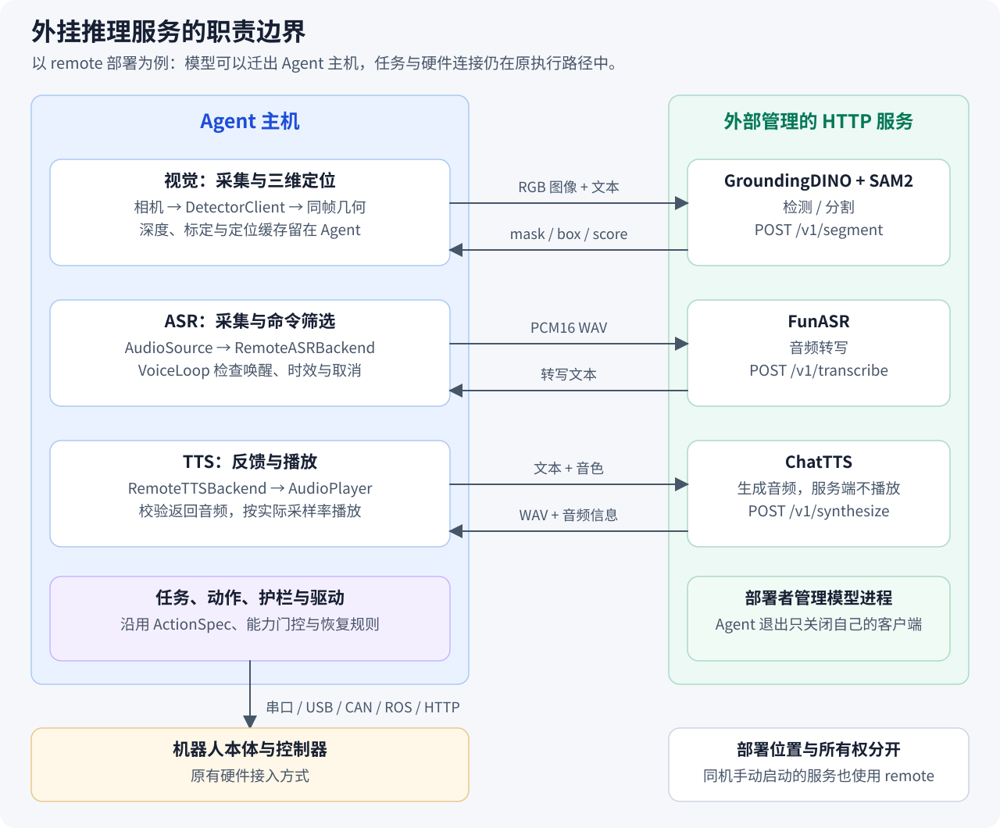
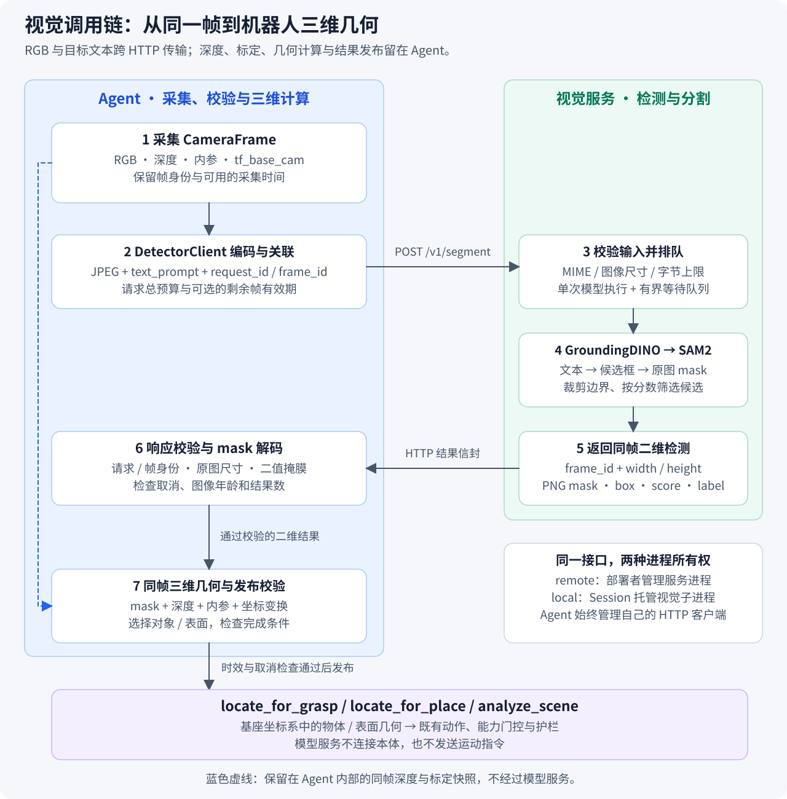

# 外挂 HTTP 推理服务设计：视觉与语音

本文说明外挂服务的职责、接口和生命周期，以项目已有的 GroundingDINO + SAM2、FunASR 和
ChatTTS 为例，围绕服务接入、调用与结果使用展开。

服务部署应按文末验收要求分别验证真实模型、资源占用、跨机性能与本体集成。
安装和启动步骤见[远程服务使用指南](../docs/zh/how-to/remote-inference.md)与
[部署说明](../deploy/inference/README.md)；依赖版本以 [pyproject.toml](../pyproject.toml) 为准。

- [职责与部署方式](#service-boundaries)
- [配置与接口](#configuration)
- [视觉调用链](#vision-flow)
- [语音调用链](#voice-flow)
- [生命周期与错误处理](#lifecycle)
- [验证原则与验收要求](#validation)

<a id="service-boundaries"></a>

## 1. 外挂服务在框架中的位置

外挂服务通过固定的 HTTP 输入/输出契约，为 Agent 提供模型推理能力。
Agent 仍负责规划、动作编排、安全护栏、硬件连接及结果使用；模型进程负责加载权重并计算结果。
这样可以把视觉和语音模型移到另一套 Python/GPU 环境，降低 Agent 主机的算力和安装要求。

这里有三个角色，角色不必对应三台机器：

| 角色 | 当前职责 | 典型代码 |
| --- | --- | --- |
| Agent 主机 | 输入采集、业务客户端、结果校验、三维几何、语音前端、任务和播放 | `perception/`、`voice/`、`agent/`、`adapters/` |
| 推理服务 | 接收有界输入、加载模型、排队推理、返回结果 | `serving/` |
| 本体与外设 | 机器人控制器、相机、麦克风、扬声器 | 原适配器驱动、`AudioSource`、`AudioPlayer` |

Agent 可以运行在 PC、工控机或服务器上，通过原来的串口、USB、CAN、ROS 或 HTTP 链路连接本体。
远程推理改变的是模型执行位置，机器人连接仍由原适配器完成。



图中以外部管理的服务为例。视觉、ASR、TTS 可以分别部署，地址可以相同，也可以指向不同进程。
采集与播放由 Agent 侧后端完成；当前远程 TTS 使用 Agent 可访问的 sounddevice 输出设备，
并不会自动接管任意机器人扬声器。本体原有的原生 TTS 动作仍走各自驱动。

### 1.1 稳定的业务接口

外挂服务接入发生在既有业务接口内部：

| 业务接口 | Agent 侧实现 | 参考服务端 | 上层获得的内容 |
| --- | --- | --- | --- |
| 可调用的检测函数 `segment_fn(image, text_prompt)` | [DetectorClient](../jiuwensymbiosis/perception/detector_client.py) | [视觉服务](../jiuwensymbiosis/serving/grounding_dino_sam2_server.py) | mask、box、score、label |
| `ASRBackend.transcribe`，远程后端另提供带片段身份的 `transcribe_utterance` | [RemoteASRBackend](../jiuwensymbiosis/voice/asr.py) | [speech_server](../jiuwensymbiosis/serving/speech_server.py) + FunASR | 转写文本或 `None` |
| `TTSBackend.speak / preload / wait` | [RemoteTTSBackend](../jiuwensymbiosis/voice/tts.py) | speech_server + [ChatTTSSynthesizer](../jiuwensymbiosis/serving/speech_models.py) | Agent 侧有序播报 |

三种 HTTP 客户端共用 [HttpServiceClient](../jiuwensymbiosis/utils/service_http.py)，集中处理连接、
总超时、字节上限、取消和清理。图像及检测结果由 `perception` 校验，音频由
[voice/protocol.py](../jiuwensymbiosis/voice/protocol.py) 编解码；共享传输不理解机器人动作。
客户端不导入模型服务入口，服务部署也不需要机器人串口或音频设备。

LLM 继续选择原有动作，语音继续向文本任务入口交付命令。服务 URL、Base64 图像和音频
不成为新的 ActionSpec 或动态发现的工具。能力门控、位置失效规则、护栏和恢复仍由原层负责。
当前没有通用外挂插件注册器、MCP、gRPC、流式音视频或自动服务发现；新增同类能力应先定义
业务结果与资源所有者，再复用传输实现。

## 2. 部署方式与资源归属

`remote` 表示**外部管理服务**，不要求跨机器。在 Agent 本机手动启动服务，再配置
`http://127.0.0.1:8114`，仍属于 remote。只有由 Session 启停的本地检测子进程称为 sidecar。

| 配置 | Agent 的行为 | 模型/服务进程的所有者 |
| --- | --- | --- |
| `detector.mode: remote` | 创建 HTTP 客户端；首次请求时建立连接 | 外部部署者；Session 退出只关闭客户端 |
| `detector.mode: local` | 启动本地视觉子进程，再使用相同 HTTP 客户端 | RobotSession |
| `detector.mode: disabled` | 不推理；检测调用明确报不可用 | 无模型资源 |
| `voice.asr.backend: remote` | WAV 经 HTTP 送出，接收文本 | 外部部署者 |
| `voice.asr.backend: funasr` | 在 Agent 进程中按需加载 FunASR | 创建该后端的 VoiceLoop 或调用方 |
| `voice.asr.backend: disabled / fixed` | 禁用 ASR，或使用固定转写测试输入 | 无模型资源 |
| `voice.tts.backend: remote` | 远程合成，Agent 侧播放 | 外部部署者管理模型；Agent 管理播放 |
| `voice.tts.backend: chattts` | 加载指定的本地 `tts.py`，调用其播报函数 | 创建该后端的 VoiceLoop 或调用方 |
| `voice.tts.backend: "null"` | 记录反馈文本，不合成或播放 | 无模型资源 |

本地视觉与独立视觉服务复用同一个服务入口。本地模式端口冲突会报错，不能把端口上的未知进程
当成本 Session 的资源。语音目前没有自动托管 HTTP 子进程；本地 FunASR/ChatTTS 是进程内后端。
远程调用失败只沿故障路径返回，不自动下载权重、启动本地模型或改选后端。

<a id="configuration"></a>

## 3. 配置：选择后端，填写服务地址

### 3.1 最小远程配置

下面是可以合入既有运行配置的片段；保留原来的 `adapter`、硬件、标定、LLM 与护栏字段。
示例使用三个独立服务端口，实际部署可调整。

```yaml
detector:
  mode: remote
  endpoint:
    url: http://127.0.0.1:8114

voice:
  asr:
    backend: remote
    endpoint:
      url: http://127.0.0.1:8115
  tts:
    backend: remote
    endpoint:
      url: http://127.0.0.1:8116
```

选择 remote 后，各 `endpoint` **只有 `url` 必填**。URL 是服务基础地址或部署前缀，例如
`https://inference.example/vision`，客户端会追加 `/v1/segment` 等路由。
仅接受 HTTP(S)，不接受 URL 中的用户名、密码、查询参数或 fragment。
当前客户端没有令牌、代理或自动跳转配置；HTTP 使用 `trust_env=False`。

| `HttpEndpointConfig` 字段 | 默认值 | 含义 |
| --- | --- | --- |
| `url` | 无 | 服务基础地址 |
| `connect_timeout_s` | 3 秒 | 单次连接建立的等待上限，受总预算约束 |
| `request_timeout_s` | 30 秒 | `request_json` 一次调用的总预算，包括 JSON 编码、连接、读取和连接重试 |
| `max_request_bytes` | 16 MiB | JSON 请求体上限，包含 Base64 编码后的体积 |
| `max_response_bytes` | 64 MiB | 响应读取上限 |

本地与 remote 均固定使用 `/v1`；响应以 `schema_version: 1` 表达结构版本。
**没有 `endpoint.protocol`，也不需要填写 `jws-v1` 或 `legacy-segment-v0`。**
服务端有自己的输入/输出限制，实际请求必须同时满足客户端和服务端限制。

### 3.2 业务默认值

配置来源为 [DetectorConfig](../jiuwensymbiosis/perception/config.py) 和
[VoiceConfig](../jiuwensymbiosis/voice/config.py)。

| 字段 | 默认值 | 作用 |
| --- | --- | --- |
| `detector.mode` | `disabled` | 未配置检测时不启动模型 |
| `detector.max_frame_age_s` | `null` | 不额外限制图像年龄；填写有限正数后启用 |
| `voice.asr.backend` / `voice.tts.backend` | `disabled` / `"null"` | 未选择时不加载语音模型 |
| `voice.audio_backend` / `voice.sample_rate` | `pulse` / 16000 Hz | Agent 侧采集方式与采样率 |
| `voice.wake_enabled` / `voice.wake_command_timeout_s` | `true` / 10 秒 | 启用唤醒；单独说唤醒词后的等待窗口 |
| `voice.asr.max_audio_duration_s` | 30 秒 | 单段录音/ASR 输入的时长上限 |
| `voice.asr.max_command_age_s` | 20 秒 | 从录音结束到命令派发的年龄上限 |
| `voice.tts.voice` / `voice.tts.playback_backend` | `default` / `sounddevice` | 服务音色和 Agent 播放后端 |
| `voice.tts.queue_size` / `voice.tts.async_play` | 8 / `true` | 待播报队列容量及后台串行播放 |
| `voice.tts.max_text_length` / `voice.tts.max_audio_duration_s` | 2000 字符 / 120 秒 | 单次合成文本与返回音频上限 |
| `voice.shutdown_timeout_s` | 5 秒 | 语音前端一次关闭的共享等待预算 |

时间预算必须有限且为正。`max_frames: 0` 使用音频时长上限，不表示无限录音。
真实 `--voice` 在打开麦克风前要求已选择 ASR；`--voice-text` 可注入固定文本后端。
图像/音频编码发生在 HTTP 业务客户端中，整条业务链还需依靠帧年龄或命令年龄校验，
不能把 HTTP 总超时当作从采集到使用结果的完整时限。

### 3.3 显式本地配置与旧配置迁移

```yaml
detector:
  mode: local
  local:
    host: 127.0.0.1
    port: 8114
    device: cuda:0
    gdino_model_id: ./models/grounding-dino
    sam2_model_id: ./models/sam2
    startup_timeout_s: 300

voice:
  asr:
    backend: funasr
    model: paraformer-zh
    device: cpu
  tts:
    backend: chattts
    module_path: ./voice/tts.py
```

本地模型字段、设备与端口放在本地配置中；remote 不接受模型目录或设备字段。
模型 ID 可以是 Hub ID，也可以是模型目录。显式目录路径按配置来源解析，远程 URL 保持原样。
部署时需要准备对应依赖和权重；CPU 可选不等于目标机器上的推理延迟已经合格。

兼容处理只负责把旧配置和构造入口归一化，通信使用当前接口：

- 旧 `api_servers` 的检测条目按原启动意图转换为 local；显式 `spawn: false` 转换为 remote。
  没有检测条目时默认 disabled。非检测条目不属于这项迁移。
- 新 `detector` 与旧检测条目同时出现会报冲突。`DetectorServerConfig` 保留 Python 构造兼容，
  `init_detector(url, timeout_s=30, max_frame_age_s=None)` 保留可调用客户端入口。
- 旧语音扁平字段暂时可读，但同一后端不能混用新旧字段；仅填写模型名或 device 不会隐式启用 FunASR。
- 旧 `/health`、`/segment` 和 raw-uint8 mask 接口已移除。独立部署的旧服务需要升级，
  用户无需通过新增配置选择“旧协议”。

工作台配置页提供视觉模式、URL、超时和显式就绪检查；remote 不寻找本地权重。
语音当前通过 CLI/VoiceLoop 接入，没有独立的 GUI 语音交互页面。

## 4. HTTP 接口与服务端执行

### 4.1 接口契约

所有路由都相对于 `endpoint.url`。

| 路由 | 请求要点 | `result` 中的成功结果 |
| --- | --- | --- |
| `GET /v1/health` | `X-Request-ID` | 服务身份、就绪信息和服务特有能力/限额 |
| `POST /v1/segment` | `schema_version: 1`、request_id、frame_id、图像、text_prompt、top_k | 同一 frame_id、原图尺寸、detections |
| `POST /v1/transcribe` | request_id、utterance_id、PCM16 WAV | 同一 utterance_id、text（允许 `null`） |
| `POST /v1/synthesize` | request_id、text、voice | WAV、sample_rate、channels、duration_s |

成功信封是 `{"schema_version": 1, "request_id": "…", "result": …}`。
错误使用实际非 2xx 状态和 `error: {code, message, retryable}`，不透传模型异常详情给客户端。
客户端在请求体和 `X-Request-ID` 中携带请求身份并校验响应；健康请求只使用请求头。
ASR/TTS 的请求体目前不包含 `schema_version`，不要把响应字段直接复制进请求体。

健康信息不是统一的完整模型清单：视觉报告 `service: vision` 与 `status: ready/loading`，
语音报告 `service: speech`、`ready` 和启用的 `asr/tts` 能力。
当前没有完整模型权重指纹，也没有统一的推理耗时字段。应用就绪检查比 TCP 端口探测更可靠，
但一次就绪成功不保证后续请求不会失败。

### 4.2 编码与校验

视觉客户端把 RGB 编成 JPEG；服务也接受 PNG。mask 使用无损 PNG Base64，恢复为原图尺寸的
布尔数组。框使用原图像素坐标 xyxy，允许右/下边界等于图像宽/高；分数必须有限且位于 `[0, 1]`。
客户端校验帧身份、图像尺寸、目标数和二值 mask，不猜测尺寸比例或用空列表代替错误。
当前图像最多 16,777,216 像素，单次最多 32 个目标。

ASR 和 TTS 均传单声道 PCM16 WAV，采样率以 WAV 头为准。
ASR 服务要求输入采样率与启用的模型配置一致，不做隐式重采样。
TTS 客户端核对 WAV 与响应中的采样率、声道、时长，再按真实采样率播放。
Base64 会增加传输体积，字节限制作用于编码后的载荷；当前没有流式传输。

### 4.3 模型加载、排队与取消

视觉服务启动时加载 GroundingDINO/SAM2，语音服务在应用 lifespan 中加载显式启用的后端。
模型在进程内复用；请求不能指定模型文件、下载 URL 或 Python 模块。
SAM2 加载失败不会自动改为矩形 mask；只有显式关闭 SAM2 时才使用 GroundingDINO 框生成矩形 mask。
ASR-only 与 TTS-only 服务分别按需加载后端，语音服务至少需要启用一种能力。

[http_support.py](../jiuwensymbiosis/serving/http_support.py) 提供两层共同约束：

1. 读取请求体时限制字节数，再进行 JSON 与业务校验。
2. `InferenceAdmission` 允许一个正在执行的模型调用，默认最多排队 8 项，排队等待默认 30 秒；
   队列满或等待超时返回 429 / `inference_busy`。

客户端断开时，排队请求在获得槽位后检查连接并跳过执行；不是立即从等待队列移除。
已经开始的模型运算由完成回调释放槽位，取消 HTTP 协程不会提前宣布 CUDA/模型计算结束。
几个服务进程共享 GPU 时，这些限制不构成跨进程的显存调度。

<a id="vision-flow"></a>

## 5. 视觉示例：检测服务如何参与三维定位



### 5.1 采集与客户端调用

Piper、SO-101、Cruzr 的官方 builder 创建检测客户端并注入 Api。上层仍使用
`segment_fn(image, text_prompt) -> list[dict]`，不需要判断模型运行在本机还是另一台服务器。

一次感知从 [CameraFrame](../jiuwensymbiosis/perception/frame.py) 开始：

- `rgb` 是发往检测服务的图像。
- `depth_m`、`intrinsics`、`tf_base_cam` 留在 Agent，供返回结果的三维计算使用。
- `frame_id` 标识这次采集；`captured_monotonic_s` 用于 Agent 内部的图像年龄检查。

DetectorClient 为每次业务请求生成独立 `request_id`，将 RGB 编成 JPEG，再发送到
`/v1/segment`。同一采集帧的不同文本请求可以共享 frame_id，但有各自的 request_id。
服务只收到 RGB 和目标描述，不收到深度、内外参或机械臂状态。

返回后，客户端先检查版本、请求身份、帧身份和原图尺寸，再逐项校验框、分数与 PNG mask。
解码结果保留原有成功形状：

```python
{
    "mask": numpy_bool_h_w,       # 与输入 RGB 同尺寸
    "box": [x1, y1, x2, y2],    # 原图像素坐标
    "score": 0.91,
    "label": "cup",
}
```

### 5.2 GroundingDINO 与 SAM2 分别做什么

服务的 `_do_segment()` 串联两个模型，模型资源在进程启动时加载并复用。

1. **规范化文本。** 将提示词转为小写、去除两端空白，并补上 GroundingDINO 使用的句号结尾。
2. **文本检测。** GroundingDINO 接收 RGB 与文本，输出目标框及检测分数；后处理把框还原到输入图像尺寸。
   `box_threshold` 和 `text_threshold` 控制这一阶段的筛选，默认分别为 0.35 和 0.25。
3. **修正候选框。** 剔除非有限坐标，把边缘框裁剪到图像内，再剔除裁剪后没有面积的框。
   因而贴近画面边缘的目标不会仅因原始框略微越界而使整个响应失效。
4. **排序与数量限制。** 按检测分数降序保留候选，服务端 `JIUWEN_VIS_TOPK` 默认为 32，并被限制在 1～32。
5. **框提示分割。** SAM2 以这些框为提示生成 mask，再恢复到原图分辨率。
   一个框有多个候选 mask 时，优先选择模型预测 IoU 分数最高的 mask；没有该评分时取第一项。
6. **封装结果。** 跳过空 mask，以无损 PNG 编码二值掩膜，并与对应框和检测分数一起返回。

GroundingDINO 负责“找到与文本对应的候选目标”，SAM2 负责“描述候选目标占据的像素区域”。
返回的 `score` 来自检测阶段；`label` 当前保存请求的原始 text_prompt，并非另一套分类器输出。
模型内部的推理缩放不会改变对外的坐标约定。

`use_sam2: false`（服务 CLI 为 `--no-sam2`）是显式的 GroundingDINO-only 模式，
用检测框填充矩形 mask。它保留返回结构，但不具备真实物体轮廓的含义，影响后续尺寸、顶面和放置几何。
SAM2 加载或执行失败不会自动退化为矩形 mask。

请求里的 `top_k` 只在返回结果时进一步截断；当前分割阶段受服务端候选上限控制，
减小请求 top_k 不能直接视为减少 SAM2 计算量的配置。

### 5.3 二维结果如何变成机器人坐标

HTTP 检测成功之后，Agent 才执行与本体相关的几何处理：

1. **选择可用采集快照。** 三维感知要求深度、内参及有效的相机到基座变换。
   缺少这些数据时，返回 `no_depth`、`no_intrinsics` 或 `no_live_tf` 等原因；不会从二维框编造三维位置。
2. **筛选目标并读取深度。** 简单质心路径按业务分数阈值选择检测，计算 mask 中心并读取邻域有效深度；
   物体/表面几何路径使用掩膜覆盖的有效深度点，进一步估计尺寸、边界或顶面。
3. **投影和变换。** `project_to_base()` 使用像素、深度和相机内参反投影到相机坐标，
   再通过 `tf_base_cam` 转到基座坐标。输入深度单位为米，已有几何路径输出的机器人坐标使用毫米。
4. **按具体动作整理结果。** 继续沿用适配器的几何修正和业务逻辑，选择抓取对象、放置面或场景实例。
5. **检查后再发布。** 本地计算结束后再次检查取消与采集有效期，确认可用才更新定位缓存或返回场景结果。

对应的共享入口是：

| 入口 | 使用检测结果的方式 | 状态与结果 |
| --- | --- | --- |
| `locate_for_grasp` | 目标三维几何；带 reference 时按空间关系筛选候选 | 成功后更新 `last_detection` |
| `locate_for_place` | 支撑面几何；可按与参考物的关系选择表面 | 成功后更新 `last_surface` |
| `analyze_scene` | 计算目标类别的多个可用实例 | 返回实例列表及数量 |

同类别存在多个物体时，服务返回候选，Agent 结合三维关系与动作需求选择目标。
远程服务不替 Agent 判断“哪个杯子在桌子上”，也不维护机器人移动后的空间有效性。
运动导致的位置失效仍由 [ExecutionMemory](../jiuwensymbiosis/api/memory.py) 与动作契约处理。

保留完整 mask 的原因正在于此：检测框或中心点可以支持粗略位置判断，却不足以替代
不规则物体范围、顶面和放置表面等计算。RGB、深度、内参和变换必须来自可关联的同一次采集，
服务端回显 frame_id 只能确认请求对应关系，不能弥补采集端的数据错配。

<a id="vision-contract"></a>

### 5.4 视觉请求与结果示例

检测客户端固定调用 `/v1/segment`，就绪检查使用 `/v1/health`，不尝试其他版本或地址。
请求头携带 `X-Request-ID`；检测请求体也包含相同 request_id。响应必须回显该身份。
下面两段 JSON 展示字段结构，Base64 为占位符，不是可直接推理的图像。

```json
{
  "schema_version": 1,
  "request_id": "request-001",
  "frame_id": "frame-001",
  "image": {
    "mime_type": "image/jpeg",
    "data_base64": "<JPEG Base64>",
    "width": 640,
    "height": 480
  },
  "text_prompt": "cup",
  "top_k": 32
}
```

```json
{
  "schema_version": 1,
  "request_id": "request-001",
  "result": {
    "frame_id": "frame-001",
    "width": 640,
    "height": 480,
    "detections": [
      {
        "box": [120.0, 80.0, 240.0, 300.0],
        "score": 0.91,
        "label": "cup",
        "mask": {"mime_type": "image/png", "data_base64": "<PNG Base64>"}
      }
    ]
  }
}
```

检测成功但没有目标时返回 `detections: []`。失败使用非 2xx 状态和
`error: {code, message, retryable}` 信封，不用空数组掩盖超时、模型未就绪或解码错误。

### 5.5 图像时效与连续跟踪

HTTP 总超时从 `request_json` 调用开始计算，图像编码发生在业务客户端里，几何计算又发生在 HTTP 返回之后。
因此请求在 30 秒内返回，不等于最终位置仍适合执行动作。

启用 `max_frame_age_s` 后，从采集时间到结果发布共用一个有效期，包括图像编码、同一帧的多个提示词请求、
mask 解码和本地几何；实际 HTTP 预算取请求超时与剩余帧有效期的较小值。
配置为 null 时不施加额外帧年龄上限，但身份、取消与原业务有效性检查仍执行。

年龄只在 Agent 的单调时钟域内比较，不拿另一台主机的时间直接相减。
对即时采集路径，缺少时间戳时可用取帧开始时间作保守记录；对驱动返回的缓冲帧，这不能证明图像真正新鲜。
可靠的时间/序列关联应由采集端提供，frame_id 回显本身也不证明外部物体没有移动。

连续跟踪另受 [BackgroundTracker](../jiuwensymbiosis/agent/fast/realtime/tracking.py) 和
[runner](../jiuwensymbiosis/agent/fast/runner.py) 约束，当前 runner 的图像年龄上限为 8 秒，
HTTP 超时不能将它放宽。静态定位与连续跟踪需要分别验收；改变部署位置不自动获得同等控制频率。

<a id="voice-flow"></a>

## 6. 语音示例：复用 HTTP 的可选文本前端

语音复用相同的端点配置、HttpServiceClient 和资源所有权规则，作为外挂服务接入的补充示例。
它向已有文本任务入口交付命令，不参与视觉定位、动作规划或直接控制本体。

| 能力 | 参考服务端 | Agent 侧处理 |
| --- | --- | --- |
| ASR：`POST /v1/transcribe` | speech_server + FunASR，接收 PCM16 WAV 并返回文本 | 采集音频，检查片段身份、唤醒和命令时效，再通过 OnCommand 接入原任务入口 |
| TTS：`POST /v1/synthesize` | speech_server + ChatTTSSynthesizer，返回 WAV 及音频信息 | 校验音频，按实际采样率在 Agent 可访问的设备上播放 |

[VoiceLoop](../jiuwensymbiosis/voice/loop.py) 默认采用半双工：上一轮反馈播放结束后再录音。
ASR 故障、取消或结果超龄不派发命令；TTS 失败只影响反馈，不重跑任务。
默认 ASR disabled、TTS null，需要时显式选择 remote 或本地后端。

配置见第 3 节，资源清理沿用第 7 节的共同规则。具体语音参数和操作步骤见
[使用指南](../docs/zh/how-to/remote-inference.md)与[部署说明](../deploy/inference/README.md)。

<a id="lifecycle"></a>

## 7. 生命周期、取消与故障语义

### 7.1 谁创建，谁关闭

| 资源 | 创建/登记位置 | 退出行为 |
| --- | --- | --- |
| 会话检测客户端 | 官方 builder 注入，登记到 RobotSession | 取消请求、关闭连接池并回收 I/O 线程 |
| local 视觉子进程 | `make_detector_sidecar` / `detector_subprocess` | Session 在关闭客户端后停止自有进程 |
| remote 模型进程 | 外部部署工具或人工启动 | 不由 Session/VoiceLoop 停止 |
| VoiceLoop 按配置构造的后端与音频设备 | 懒构造并记录所有权 | VoiceLoop 关闭已构造的自有资源 |
| 注入的语音后端、HTTP 客户端或播放器 | 调用方 | 默认由调用方关闭，不转移所有权 |

Session 内部的 `sidecar_starters` 也登记客户端上下文/closer，不表示所有资源都是子进程。
客户端构造和 `open()` 不发推理请求；第一次使用才创建连接池。
普通推理直接调用业务接口，不先隐式发健康请求；GUI、部署探针和 local 启动可显式检查就绪。

维护会话 `include_sidecars=False` 只登记客户端清理，不启动模型，不在连接时发推理请求。
若维护代码之后明确请求推理，才打开客户端并纳入会话清理。
remote 推理 URL 可共享，不作为本体独占资源锁；相机、本体命令端点和 local 检测端口仍沿用原准入规则。
直接构造、没有 Session 所有者的兼容 Api 使用按请求关闭的传输，避免遗留连接池。

### 7.2 HTTP 工作何时算结束

HttpServiceClient 对外同步，对内使用一个惰性 I/O 线程、事件循环和 `httpx.AsyncClient`。
每个客户端最多一个在途请求；额外并发返回 `inference_busy`，没有客户端请求积压队列。

取消通过 `CancelToken.on_cancel` 送到实际 HTTP 任务，工作通过 `register_work` 登记：

- **任务尚未创建**：启动等待被中断，或已排队回调尚未创建任务时，立即完成工作登记。
  取消与任务创建使用同一把锁；随后被执行的旧回调看到完成状态后退出，不再发请求。
- **任务已经执行**：取消 asyncio 任务，等待其协程实际退出后才移除工作登记。
  调用者先返回不代表响应读取和连接清理已经结束。
- **调用者被异常打断**：`request_json` 离开等待路径时先取消未完成任务，再注销取消回调，
  原异常继续传播。KeyboardInterrupt、SystemExit 和普通异常均有回归覆盖。

关闭超时保留句柄与失败状态，供所有者重试；不能把 daemon 线程或 wait 超时当作资源已释放。
视觉后处理、缓存发布、跟踪结果更新与语音派发也检查取消，阻止晚到结果继续产生业务效果。
跟踪停止超时同样保留线程和 pending-work；已有运动异常不会被晚到检测错误覆盖。

### 7.3 语音退出预算

VoiceLoop 一次 `close()` 使用 `shutdown_timeout_s` 的共享截止时间，按 TTS、音频、ASR 顺序处理
自有资源，并返回 CleanupReport。RemoteTTSBackend 内部的 HTTP 清理与队列/线程等待继续共享
传入的剩余时间，不各自重新获得 5 秒。

正常关闭在预算内排空反馈；取消关闭丢弃队列项、拒绝新播报并取消自有 HTTP/播放。
超时后保留自有客户端和工作线程，后续可以重试关闭。活动请求清理尚未结束时，pending-work
不会提前清空，也不会报告 released。

预算约束等待与超时报错，不保证任意同步函数都可被强制打断。本地 FunASR、旧外部 `tts.py`
或音频驱动可能不能立即停止；仍需保留未完成工作证据。

### 7.4 失败与重试

| 情况 | 当前处理 |
| --- | --- |
| 成功的空检测 | 无目标观测；只有这种结果才能成为相应感知循环正常结束的依据 |
| 成功的空转写 | 不派发命令 |
| 连接失败、超时、服务未就绪 | `inference_unavailable` / `inference_timeout`；不伪装成无目标或空语音 |
| 客户端已有请求，或服务队列满 | `inference_busy` |
| 身份、尺寸、编码、Schema 或载荷不合法 | `inference_protocol_error` |
| 帧已超出配置有效期 | `inference_result_stale`；不保留该次无效定位结果 |
| TTS 合成/播放失败 | 记录反馈失败，不重跑任务 |

视觉动作沿原返回契约携带 `ok=False`、`reason=detector_unavailable` 和可用的 `error_code`。
搜索、感知循环和跟踪消费者保留服务错误，避免把故障当作“目标已清空”或可继续搜索的普通漏检。
恢复和停止仍由现有任务/护栏所有者决定，HTTP 客户端不执行 home、release 或运动。

当前只对 `httpx.ConnectError / ConnectTimeout` 最多重试一次，沿用原 request_id 和总截止时间。
**429/503 即使标记 `retryable`，客户端也不自动重试**；已经发出的请求超时、协议错误和过期结果
同样不自动重试。服务器不提供跨副本 exactly-once；HTTP 重试不能扩展为重试任务、动作或播放。

## 8. 依赖与部署组合

| 安装组 | 用途 |
| --- | --- |
| `remote` | HTTP 和图像编解码；不引入 Torch/FunASR/ChatTTS 模型 |
| `camera` / `voice-io` | 按需安装 Agent 侧相机、音频采集/VAD/播放 |
| `vision-server` | GroundingDINO + SAM2 HTTP 服务及模型依赖 |
| `speech-server,voice-local` | 语音 HTTP 服务与 FunASR |
| `speech-server,chattts-server` | 语音 HTTP 服务与 ChatTTS 合成 |

“无 GPU”与“完全不安装 Torch”是不同要求。SO-101 的 LeRobot 安装组仍依赖 Torch/TorchVision；
OpenJiuwen 的 Transformers 间接依赖也仍存在。精简 Agent 的无 Torch 验证不包含 LeRobot。
本地模型安装与硬件 SDK 安装按实际后端选择，不能用 `full` 代替精简客户端环境。

当前视觉服务需要 Transformers 5，ChatTTS 安装组固定经验证的 Transformers 4 组合，
二者使用独立环境/镜像。版本约束只维护在 pyproject.toml，具体命令、模型目录和 Compose profiles
见[部署说明](../deploy/inference/README.md)。仓库提供构建模板不等于已经验证真实 GPU 镜像。

<a id="validation"></a>

## 9. 验证原则与验收要求

验证围绕服务契约、结果有效性和资源所有权展开。自动化回归与目标环境验收分别提供证据：
协议 stub 可以验证调用和故障处理，真实模型、硬件与跨机性能需在对应部署环境验证。

### 9.1 关键约束与测试看护

| 需要保持的约束 | 主要测试入口 |
| --- | --- |
| 配置选择明确，remote 不启动模型，维护连接无推理 I/O | [test_detector_config.py](../tests/unit_tests/perception/test_detector_config.py)、[test_remote_perception.py](../tests/unit_tests/adapters/common/test_remote_perception.py) |
| HTTP 请求有界，启动期与活动请求可取消，清理不遗漏工作 | [test_service_http.py](../tests/unit_tests/utils/test_service_http.py) |
| 视觉契约一致，帧与 mask 匹配，服务断连/取消不提前释放模型槽位 | [test_remote_vision.py](../tests/unit_tests/serving/test_remote_vision.py)、[test_detector_client.py](../tests/unit_tests/perception/test_detector_client.py) |
| 过期/取消结果不发布，服务故障不成为漏检，跟踪保留清理证据 | [test_completion_guards.py](../tests/unit_tests/perception/test_completion_guards.py)、[test_remote_failures.py](../tests/unit_tests/fast/test_remote_failures.py)、[test_tracking.py](../tests/unit_tests/fast/test_tracking.py) |
| 语音故障或超龄不派发，反馈失败不重跑任务，自有资源按预算关闭 | [test_remote.py](../tests/unit_tests/voice/test_remote.py)、[test_loop.py](../tests/unit_tests/voice/test_loop.py) |
| GUI 模式切换与配置往返保持实际后端语义 | [test_config_model.py](../tests/gui/workbench/unit/test_config_model.py)、[test_config_view.py](../tests/gui/workbench/components/test_config_view.py) |

测试应断言可观察的行为：错误不能变成成功，取消不能继续发布位置或派发命令，
资源未退出不能报告释放。用受控的挂起、迟到响应和中断覆盖边界，避免只检查私有列表长度
或重复实现内部步骤。

### 9.2 目标环境验收要求

| 验收维度 | 应提供的证据与通过条件 |
| --- | --- |
| 安装与依赖隔离 | 在干净 Agent 环境安装实际交付包，从仓库外运行客户端并确认导入路径；远程客户端不加载模型运行时。硬件 SDK 带入的依赖单独记录。服务端完整依赖图的审计与模型兼容性分别验证。 |
| 服务契约与模型结果 | 加载部署使用的真实权重，确认服务身份及就绪状态；以固定样本核对检测框、分割 mask、尺寸和坐标语义。启用语音时另验转写、合成与播放采样率。 |
| 生命周期与资源上限 | 验证启动失败回滚、队列满、客户端退出和关闭重试；连接池/自有线程与进程得到回收，不能结束的工作保留可观察证据。独立共享服务不随 Agent 退出而停止。 |
| 性能与数据时效 | 记录编码、传输、排队、推理、解码和几何计算耗时，以及端到端 p50/p95。静态定位、连续跟踪和启用的语音链分别满足所选任务预算，超龄结果被拒绝。 |
| 故障与取消 | 注入断网、拥塞、超时、断连和晚到响应，确认服务错误不会变成无目标或有效命令，取消结果不写入缓存；模型计算仍在执行时不能提前释放其并发槽位。 |
| 本体与运行环境 | 核对实际相机的 RGB/深度/内参与实时变换关联，执行受控本体集成验证；记录容器构建、GPU 驱动/CUDA、冷启动及峰值内存/显存。启用音频时另验实际采集和播放设备。 |

验收记录应注明代码 revision、硬件、模型 revision、输入分辨率/音频长度、网络条件、
服务并发与使用的预算，并明确执行范围、未覆盖项和失败项。
任务预算须结合目标环境确定；一次请求成功或 stub 回归通过不能证明持续控制频率、
模型质量、真机表现或生产部署安全。
