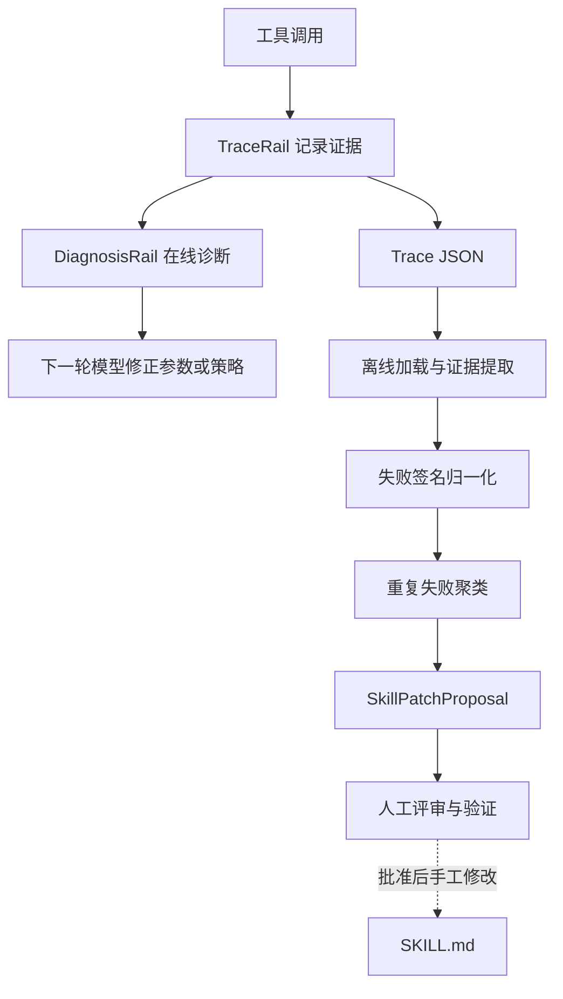
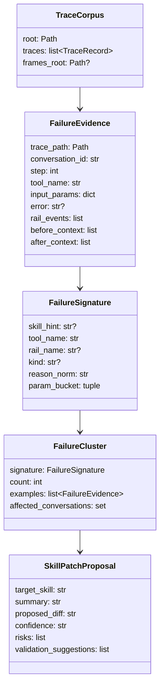

# Trace Feedback Loop 模块设计文档

## 1. 设计目的

本设计针对 `TraceRail` 已能记录失败、但证据只停留在 JSON 和人工回放中的状态。Agent 在一次任务内
可能用相同参数反复失败；多次运行积累的同类故障也缺少自动归并，维护者难以判断应在哪个
SKILL.md 中补充约束。

模块要把已有 Trace 证据转化为两种反馈，同时保持人机控制边界：

1. **在线反馈**：失败后向下一轮模型提供当前参数、相关历史和系统状态，帮助它换参数或换策略。
2. **离线反馈**：跨 Trace 聚类重复失败并生成可审查的技能修改建议。
3. 任何反馈故障都不得覆盖原任务结果；离线分析不得自动修改技能或下发机器人动作。

设计基线是 Trace JSON 已包含步骤、Rail 事件、日志和可选帧，但没有反馈消费者的状态。
用户操作见
[使用 Trace Feedback Loop](../docs/zh/how-to/use-trace-feedback.md)，Trace 数据契约见
[执行轨迹参考](../docs/zh/reference/tracing.md)。

## 2. 核心概念

- **失败证据（FailureEvidence）**：失败步骤及其前后有限上下文，是离线分析的最小输入单元。
- **失败签名（FailureSignature）**：将原因中的具体数字和参数值归一化后的可哈希身份。
- **失败簇（FailureCluster）**：共享一个失败签名的一组证据。
- **技能补丁建议（SkillPatchProposal）**：基于失败簇生成、必须人工确认目标技能的建议，不是可直接应用的补丁。
- **暂存诊断（Pending Diagnosis）**：在线阶段已经生成、尚未在合法消息时序点注入的诊断文本。
- **因果链（Causal Chain）**：当前失败之前，与同一工具或相关 Rail 事件匹配的有限步骤集合。

在线与离线共享 Trace 证据，但不共享执行路径：在线逻辑是 Agent Rail，离线逻辑是纯数据分析库与 CLI。

## 3. 设计逻辑

### 3.1 总体闭环



闭环刻意在 `SkillPatchProposal → SKILL.md` 之间设置人工门禁。Trace 只能说明“发生了什么”，
无法证明某条工作流规则在所有机器人和场景下都安全，因此模块不自动写技能文件。

### 3.2 在线诊断采用两阶段注入

失败可能通过两条通道出现：工具返回 `success=False`，或 Rail/工具抛出异常。`DiagnosisRail`
分别在 `after_tool_call` 和 `on_tool_exception` 检测它们，并按 step 去重，防止异常路径随后进入
finally 回调时重复诊断。

检测阶段只把文本放入 `ctx.extra["diagnosis_pending"]`；`before_model_call` 才写入
`ModelContext`。这是消息协议约束：工具结果必须紧跟对应 tool call，若在 `after_tool_call`
直接插入用户诊断，会形成非法的 `assistant(tool_calls) → user(diag) → tool(result)` 顺序。

诊断内容按优先级保留：

1. 当前工具、错误和参数；
2. Recovery 结果与当前 pose；
3. 同工具或指定 Rail kind 的相关历史。

超过 `diagnosis_max_chars` 时先删除历史，再压缩系统状态，尽量保留当前失败和“不要原参数重试”的
行动指令。fast path 没有 `ModelContext` 时静默跳过注入，但 Trace 本身仍然保留。

### 3.3 离线分析分为确定性流水线

离线分析依次执行：加载 → 提取 → 归一化 → 聚类 → 建议 → 渲染。各阶段使用显式数据结构连接，
避免报告渲染器重新读取文件或重复分析。

- 加载阶段跳过损坏、非 UTF-8 或非字典 JSON，单个坏文件不终止批处理。
- 缺失 `success` 默认为成功，防止旧版或手写 Trace 被误判为全部失败；存在 `error` 仍视为失败。
- SafetyRail 的拒绝是根因候选；Recovery 是失败后的补救，不能被错误标成聚类根因。
- 原因字符串中的数字替换为 `<num>`；运动参数按符号和数量级分桶；长文本使用稳定 SHA-256 摘要。
- 聚类只输出达到 `min_cluster_size` 的重复模式，示例最多保留 3 个控制报告体量。

### 3.4 补丁建议只表达规则，不定位文件

第一阶段不解析 SKILL.md，也没有从 Trace 可靠推断“当前使用了哪个技能”的字段。因此
`target_skill` 固定为 `<unresolved>`，建议只给出约束模板、证据、置信度、风险和验证方式。
置信度只由样本数决定，不等价于真机安全置信度。

该封装策略让分析库保持只读和确定性；未来如增加技能匹配，应作为独立解析/映射模块增强，而不是
让 `patches.py` 直接扫描和改写技能目录。

## 4. 核心数据结构



`FailureSignature` 是唯一冻结的数据类，因为它作为字典聚类键必须可哈希；其他记录保留可变集合，
便于分析阶段逐步补充上下文和报告信息。

在线侧不新增持久化结构，只在 `ctx.extra` 使用 `diagnosis_pending` 和 `diagnosis_injected`，后者按
step 记录已经暂存过的诊断。

## 5. 接口定义

### 5.1 在线接口

```python
class DiagnosisRail(AgentRail):
    def __init__(
        self, session, *, max_chars=1500,
        history_steps=3,
        history_kinds=("reject", "recover"),
    ) -> None: ...

    async def on_tool_exception(self, ctx) -> None: ...
    async def after_tool_call(self, ctx) -> None: ...
    async def before_model_call(self, ctx) -> None: ...
    async def after_invoke(self, ctx) -> None: ...
```

builder 只有在 `enable_tracing=True` 且 `enable_diagnosis=True` 时安装该 Rail；单独开启 diagnosis
会告警并禁用，因为没有 Trace 就没有可信的当前步骤和历史证据。

### 5.2 离线接口

```python
def load_trace_corpus(paths: list[Path], *, frames_root=None) -> TraceCorpus: ...
def extract_failure_evidence(corpus: TraceCorpus, *, context_steps=2) -> list[FailureEvidence]: ...
def build_failure_signature(evidence: FailureEvidence) -> FailureSignature: ...
def cluster_failures(evidence: list[FailureEvidence], *, min_size=2) -> list[FailureCluster]: ...
def propose_skill_patches(clusters: list[FailureCluster]) -> list[SkillPatchProposal]: ...
def render_clusters_json(clusters: list[FailureCluster]) -> str: ...
def render_failure_report(clusters: list[FailureCluster], *, corpus=None) -> str: ...
```

`scripts/analyze_traces.py` 只负责解析路径和参数、调用这些接口、写报告及返回退出码，不承载新的分析规则。

## 6. 一致性校验

- **概念一致性**：Recovery 始终作为系统状态/补救证据，不作为原始失败根因。
- **失败通道完备性**：返回失败与异常失败都暂存一次；成功步骤不产生诊断。
- **消息时序**：只能在 `before_model_call` 注入；invoke 结束清理未消费诊断。
- **分析稳定性**：相同文本和参数跨进程生成相同签名；坏文件不影响其余语料。
- **层次一致性**：分析库不读取或写入 SKILL.md，报告层不重新分析，CLI 不下发机器人动作。
- **安全性**：所有建议声明真机未验证、目标技能未确定，并要求人工评审。
- **测试证据**：`tests/unit_tests/rails/test_diagnosis.py` 覆盖在线通道、去重、截断和降级；
  `tests/unit_tests/trace_feedback/` 覆盖加载、签名、聚类、建议和报告；
  `tests/unit_tests/scripts/test_analyze_traces.py` 覆盖 CLI 编排和退出码。

## 7. 变更历史

| 日期 | 变更内容 | 原因 |
| --- | --- | --- |
| 2026-08-10 | 新增 Trace Feedback Loop 模块设计文档 | 记录反馈通道、人工门禁、接口与一致性约束 |
