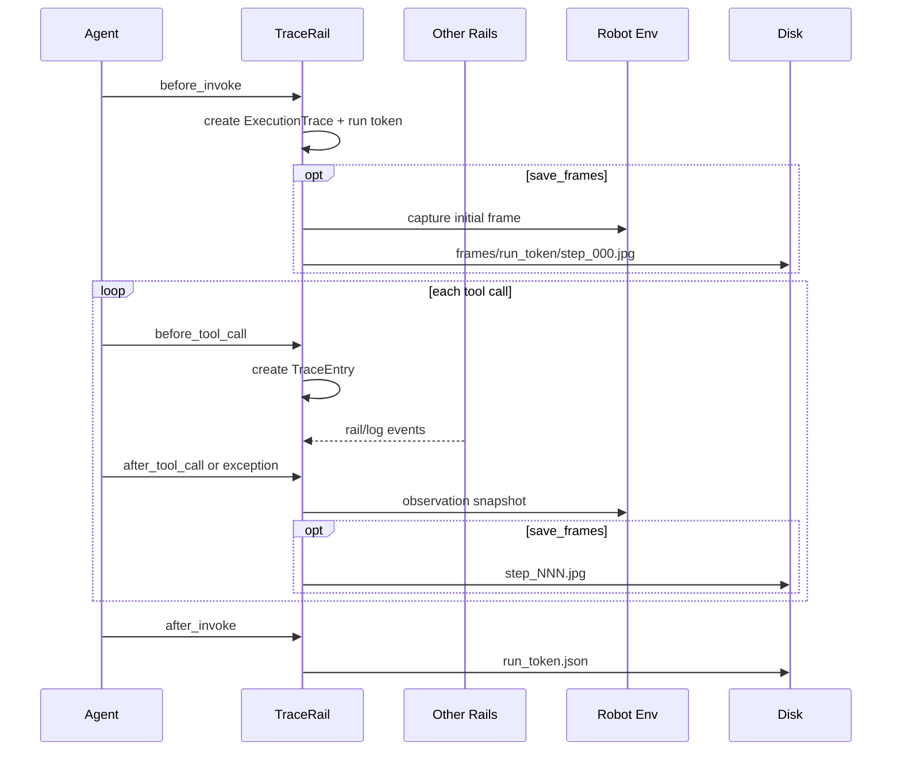
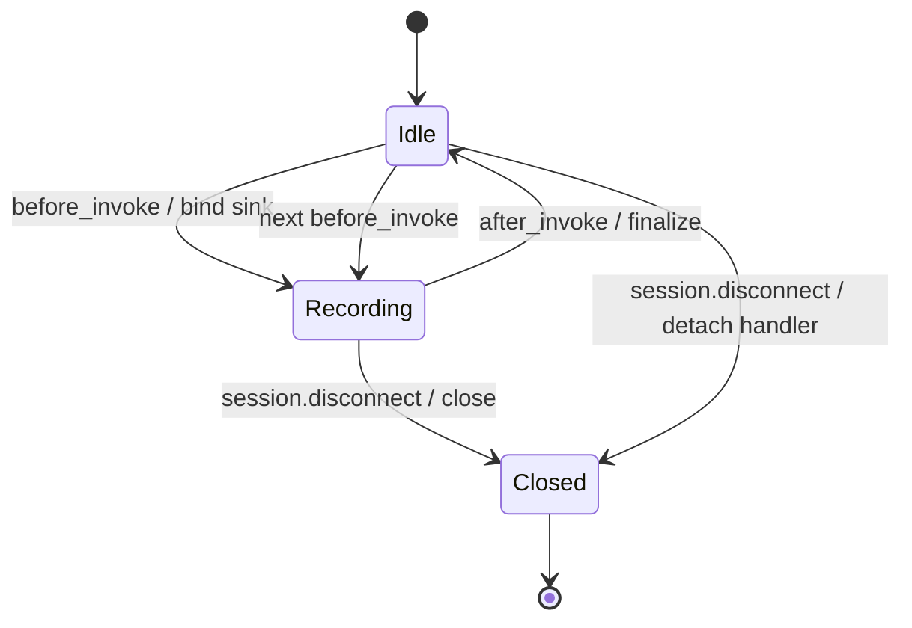

# 执行轨迹模块设计文档

## 1. 设计目的

本设计针对 Trace 功能引入前的 Agent 执行模型：工具、Safety/Recovery/VisualFeedback Rails
各自运行，但一次任务结束后缺少可关联的步骤、参数、结果、环境快照和异常证据，真机问题只能依赖
零散控制台日志复盘。

模块需要在不修改 `@robot_tool`、Env 和工具业务逻辑的前提下，建立一次 `agent.invoke()` 的
结构化证据链，并满足以下约束：

1. Trace 默认关闭；开启后仍应把磁盘 I/O 和图像开销限制在可配置范围内。
2. Safety 拒绝、Recovery 结果、延迟注入帧和告警日志必须归属到正确工具步骤。
3. 一次运行的 JSON 与帧路径长期稳定，后续运行不能覆盖历史帧。
4. 采集或持久化失败不得替代原任务结果；Session 结束时不能遗留日志 handler。

设计基线是“框架已有串行 Rail 回调和 `RobotSession` 生命周期，但没有结构化持久化”的状态。
用户操作和稳定数据契约分别见
[记录和回放执行轨迹](../docs/zh/how-to/use-tracing.md)与
[执行轨迹参考](../docs/zh/reference/tracing.md)。

## 2. 核心概念

- **调用轨迹（ExecutionTrace）**：一次 `agent.invoke()` 的根记录。
- **步骤记录（TraceEntry）**：一次有效工具动作的记录；`robot_control` 会先解包为真实动作名。
- **当前步骤（Active Step）**：Rail 共享上下文中正在执行的 `TraceEntry`，同步事件默认归属它。
- **步骤感知事件（Step-aware Event）**：事件产生和写入不在同一回调阶段时，携带明确 step 的事件。
- **运行令牌（Run Token）**：JSON 文件与帧子目录共享的稳定标识。
- **采集器 Rail（TraceRail）**：把 Agent 生命周期事件转换成上述结构并负责持久化的并行 Rail。

`TraceRail` 是采集协调者，不解释业务失败原因；Safety、Recovery 等源模块通过 sink 报告真实结果，
日志模块通过 handler 报告非结构化告警。

## 3. 设计逻辑

### 3.1 内存采集，一次写盘

每次 invoke 在 `before_invoke` 创建 `ExecutionTrace`，工具回调只修改内存结构；
`after_invoke` 才写一个 JSON 文件。选择“一次写盘”是为了避免每步同步 I/O 干扰机器人控制时序。
帧因体量较大且需要被上下文注入复用，可以在步骤结束时增量写入，但受 `max_frames` 限制。



### 3.2 事件归属采用两级 Sink

同步 Rail 在当前工具调用内产生事件，通过 `TraceEventSink.record_rail_event()` 归入最新步骤。
VisualFeedback 的帧先在 `after_tool_call` 暂存，后在 `before_model_call` 注入；此时最新步骤可能已经
变化，因此使用 `StepAwareTraceEventSink.record_rail_event_at_step()` 显式定位。

拆成基础协议和扩展协议是为了兼容已有自定义 sink：只实现基础协议的 sink 仍能收到事件，调用方
通过能力探测决定是否使用 step-aware 接口。显式 step 已被 `max_entries` 淘汰时丢弃事件，不能把
迟到事件误挂到后续步骤。

### 3.3 回调顺序由优先级和串行约束保证

`TraceRail.priority=100`，高于普通 Rail：

- `before_tool_call` 先创建步骤，SafetyRail 随后的拒绝才有归属目标；
- `on_tool_exception` 先把步骤标记失败；
- `after_tool_call` 不覆盖异常阶段已经写入的失败状态；
- 动作后观察和帧在反馈 Rail 处理前完成关联。

当前步骤存放在共享 `ctx.extra`，并行工具调用会竞争同一键和 `entries[-1]`。因此 builder 对
“tracing + parallel”直接报错；具有运动或抓取能力的机器人也禁止并行工具调用。这是正确性和
物理安全约束，不做 best-effort 降级。

### 3.4 观测、帧和输出按成本分层

- `observation` 只保留 pose、joints 和 extra，不把 RGB/depth 数组写入 JSON。
- 大于 64 个元素的 ndarray 只保存 shape/dtype 摘要。
- 工具输出序列化后最多保留 2000 字符。
- 第 1 步前帧使用 `step_000.jpg`；第 N 步的前帧复用第 N-1 步后帧，避免每步抓两张。
- `run_token` 同时命名 JSON 与 `frames/{run_token}/`，历史引用不会被新运行覆盖。

### 3.5 Invoke 结束与 Session 结束分离

`finalize()` 结束一次 invoke：写盘、解除 handler sink，但保留 handler 本身，下一次 invoke
可以重新绑定。`close()` 用于 Session 终点：先 finalize，再从所有捕获 logger 移除 handler。
`RobotSession.disconnect()` 调用 `close()` 作为 `after_invoke` 未执行时的安全兜底。



## 4. 核心数据结构

### 4.1 `TraceEntry`

| 字段组 | 字段 | 设计含义 |
| --- | --- | --- |
| 身份 | `step`、`tool_name`、`started_at` | 步骤顺序和动作身份 |
| 输入输出 | `input_params`、`output_summary` | 可检索且有界的调用证据 |
| 结果 | `success`、`error`、`duration_s` | 执行结论与耗时 |
| 环境 | `observation`、`frame_path` | 动作后的轻量状态和可选图像 |
| 外部证据 | `rail_events`、`log_events` | 结构化 Rail 结果与告警日志 |

### 4.2 `ExecutionTrace`

核心字段为 `conversation_id`、`robot_name`、`query`、`started_at`、`entries`、`trace_log`、
`workspace` 和 `initial_frame_path`。内部 `_step_counter` 保证步骤号单调递增，
`_pending_events` 暂存尚无当前步骤的无目标事件。

### 4.3 事件协议

```python
class TraceEventSink(Protocol):
    def record_rail_event(
        self, *, rail_name: str, kind: str, detail: dict, success: bool
    ) -> None: ...


class StepAwareTraceEventSink(TraceEventSink, Protocol):
    def record_rail_event_at_step(
        self, *, rail_name: str, kind: str, detail: dict,
        success: bool, step: int
    ) -> None: ...
```

## 5. 接口定义

```python
class ExecutionTrace:
    def new_entry(self, tool_name: str, input_params: dict, started_at: float) -> TraceEntry: ...
    def record_rail_event(self, *, rail_name, kind, detail, success, step=None) -> None: ...
    def record_log_event(self, *, logger_name, level, msg, ts, step=None) -> None: ...
    def run_token(self) -> str: ...
    def save(self, traces_dir: Path, *, frames_dir: Path | None = None) -> Path: ...


class TraceRail(AgentRail):
    async def before_invoke(self, ctx) -> None: ...
    async def before_tool_call(self, ctx) -> None: ...
    async def on_tool_exception(self, ctx) -> None: ...
    async def after_tool_call(self, ctx) -> None: ...
    async def after_invoke(self, ctx) -> None: ...
    def finalize(self) -> Path | None: ...
    def close(self) -> None: ...
```

调用关系是：builder 根据 `RobotAgentConfig` 创建 `TraceRail`、注入各 Rail sink 并安装
`TraceLogHandler`；Agent 生命周期驱动采集；`RobotSession` 持有当前 rail 并负责最终关闭；
回放器只消费持久化 JSON 和帧，不参与采集。

## 6. 一致性校验

- **步骤一致性**：每个同步事件归当前步骤，延迟事件必须携带原 step；找不到显式 step 时丢弃。
- **状态完备性**：正常结果、`success=False` 结果、抛异常和 before-tool Safety 拒绝均能确定成功状态。
- **生命周期一致性**：每次 invoke 最多落一个 JSON；多次 finalize 幂等；Session 终点无悬挂 handler。
- **资源上限**：`max_entries`、`max_frames`、输出摘要和 JSON 归一深度均有边界。
- **安全性**：并行 tracing 被显式拒绝；trace 关闭时不创建 rail、文件或 handler。
- **可恢复性**：观察、编码、写帧或 finalize 失败记录 warning，不改写工具业务结果。
- **测试证据**：`tests/unit_tests/rails/test_trace.py` 覆盖采集、事件、帧、日志与生命周期；
  `tests/unit_tests/agent/test_builder_parallel.py` 覆盖并行互斥；
  `tests/unit_tests/agent/test_trace_html.py` 覆盖持久化数据的回放消费。

## 7. 变更历史

| 日期 | 变更内容 | 原因 |
| --- | --- | --- |
| 2026-08-10 | 新增执行轨迹模块设计文档 | 记录 Trace 的数据、状态、接口与一致性约束 |
