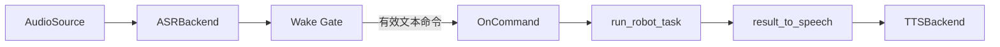
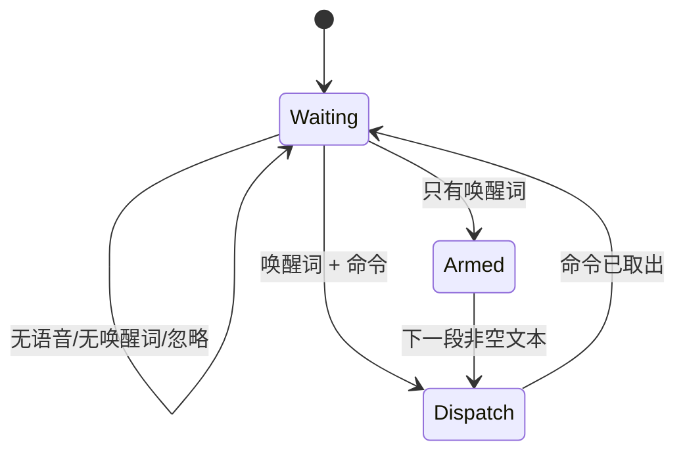

# 语音控制集成模块设计文档

## 1. 设计目的

本设计针对机器人任务入口只接受文本、原语音实现又与特定本体和大量环境变量耦合的状态。
需要为任意 `RobotSession` 增加可选语音前端，同时保证语音 I/O 不侵入 Agent、Env、适配器和安全 Rail。

具体目标是：

1. 把采集、ASR、唤醒、TTS 组合成机器人无关的前端，最终只输出文本命令。
2. 把可选重依赖延迟到后端真正使用时加载，使核心包、Mock 和 CI 在未安装 `.[voice]` 时仍可运行。
3. 语音或反馈播放失败不得触发默认机器人动作，也不得绕过 `RobotSession` 生命周期和安全策略。
4. 同一编排支持持续麦克风、一次性文本和一次性音频，便于测试与部署排障。

设计基线是 `run_robot_task(session, query, config)` 已提供稳定文本入口，旧语音实现的配置和本体逻辑
尚未形成独立模块。

## 2. 核心概念

- **语音前端（Voice Front-end）**：从音频输入到文本命令、再到语音反馈的 I/O 边界，不参与任务决策。
- **命令接缝（OnCommand Seam）**：`Callable[[str], str]`，把语音前端与任意文本任务执行器连接起来。
- **后端族（Backend Family）**：`AudioSource`、`ASRBackend`、`TTSBackend` 三组可替换协议。
- **唤醒门（Wake Gate）**：决定转写文本是否成为命令的状态机。
- **已唤醒状态（Armed State）**：用户单独说出唤醒词后，允许下一段语音直接作为命令。
- **反馈归一化（Result-to-Speech）**：把不同任务返回形态压缩为一条适合播报的文本。

命令接缝是模块的封装核心：Voice 层完全封装音频/模型后端，但只薄封装任务执行器，后者通过
回调显式暴露，不让 Voice 层直接依赖某个机器人或 Agent 实现。

## 3. 设计逻辑

### 3.1 机器人无关的数据流



`VoiceLoop` 只知道 `OnCommand` 返回一段反馈文本。Piper demo 在 `_run_voice()` 中把该回调接到
`run_robot_task()`；替换机器人时只替换 Session，语音模块无需变化。所有工具调用仍由原 Agent
完成，因此 SafetyRail、RecoveryRail、Capability Gating 和 Trace 行为保持不变。

### 3.2 唤醒门使用两阶段状态机

自然说话时，唤醒词和命令可能被 VAD 切成两个片段。仅做单句字符串匹配会丢失第二段命令，
因此引入 Armed State：



关闭 `wake_enabled` 时跳过状态机，整段转写直接作为命令，服务 push-to-talk 和测试输入。
无有效文本时返回 `None`，绝不能用内置默认任务补位。

### 3.3 后端通过协议和惰性构造隔离依赖

三类后端通过 Protocol 定义最小接口，并允许构造 `VoiceLoop` 时注入实例。注入实例优先，默认后端
只在首次访问属性时构造，因此纯 Mock 测试不会导入 FunASR、sounddevice、webrtcvad 或 ChatTTS。

默认 `NullTTS` 记录并打印待播报文本，不要求声卡或 GPU。ChatTTS 使用动态模块路径加载并串行化
实际播放；异步模式跟踪后台线程，`wait()` 在退出前回收。TTS 加载失败只告警并不影响命令执行。

### 3.4 命令处理保持“先确认、后执行、再反馈”

`handle_command()` 可先播报 `ack_text`，再调用 `OnCommand`，最后播报结果。回调异常被记录并转换成
固定错误反馈，不传播到持续监听循环，避免一条坏命令终止后续服务。

`result_to_speech()` 只做表现层归一化：识别 fast-path `{"ok": ...}`、字符串、对象的
`content/output` 等形态。它不改变任务成功状态，也不从错误中生成新的机器人动作。

### 3.5 配置集中但保持运行时覆盖

`VoiceConfig` 把唤醒、ASR、音频、VAD、TTS 和行为参数集中为 dataclass。YAML 的 `voice:` 块提供
基线，demo 的 `--tts`、`--asr-device`、`--no-wake` 等参数只做本次运行覆盖。
`from_dict()` 忽略未知键以兼容旧配置渐进迁移；这与核心 Agent 配置的严格未知键策略不同，
因为语音后端可选且历史配置来源更分散。

## 4. 核心数据结构

| 结构 | 关键成员 | 作用 |
| --- | --- | --- |
| `VoiceConfig` | wake、ASR、audio/VAD、TTS、ack 字段 | 声明式描述语音前端 |
| `VoiceLoop` | `config`、`on_command`、三类 backend、`_armed` | 编排语音状态和命令分发 |
| `RecordTuning` | 采样率、分帧、静音与能量参数 | 约束音频分段行为 |
| `NullTTS.spoken` | 已请求播报的文本列表 | 无设备环境的可观察反馈 |
| `ChatTTSBackend._threads` | 活跃播放线程集合 | 保证异步播放可等待和回收 |

后端关系如下：

```python
class AudioSource(Protocol):
    def record_segment(self): ...

class ASRBackend(Protocol):
    def transcribe(self, audio) -> str: ...

class TTSBackend(Protocol):
    def speak(self, text: str) -> None: ...
    def preload(self, text: str) -> None: ...
    def wait(self) -> None: ...
```

## 5. 接口定义

```python
OnCommand = Callable[[str], str]


class VoiceLoop:
    def __init__(
        self, config: VoiceConfig, on_command: OnCommand,
        *, asr=None, tts=None, audio=None,
    ) -> None: ...

    def run_once(self) -> str | None:
        """采集并通过唤醒门，返回一条命令或 None。"""

    def handle_command(self, text: str) -> None:
        """确认、执行回调并播报反馈；回调异常不外抛。"""

    def run_forever(self) -> None:
        """持续执行 run_once/handle_command，退出前等待 TTS。"""


def result_to_speech(result, *, ok_text="好的，已完成", fail_text="抱歉，没能完成") -> str: ...
```

一次性文本使用 `FixedASRBackend` 和占位音频，一次性文件使用 `FileAudioSource`，实时模式使用配置选择的
麦克风后端。三者最终进入相同 `VoiceLoop`，避免 CLI 各自实现不同的唤醒和错误处理逻辑。

## 6. 一致性校验

- **层次一致性**：Voice 不导入具体适配器，不直接调用机器人 API，只调用 `OnCommand`。
- **安全性**：空文本、未唤醒或 ASR 失败均不分发；不存在默认机器人任务。
- **状态完备性**：Waiting/Armed 对无声、无唤醒、单独唤醒和同句命令均有确定处理。
- **依赖隔离**：导入 `jiuwensymbiosis.voice` 不加载可选重后端；注入 Mock 时不构造默认后端。
- **可靠性**：回调和 TTS 故障不终止持续监听，退出时等待后台播放线程。
- **可测试性**：`tests/unit_tests/voice/test_loop.py` 覆盖状态机、分发和结果归一化；
  `test_audio.py`、`test_wake.py`、`test_tts.py`、`test_config.py` 分别覆盖协议实现和配置边界。

## 7. 变更历史

| 日期 | 变更内容 | 原因 |
| --- | --- | --- |
| 2026-08-10 | 新增语音控制集成模块设计文档 | 记录语音状态机、封装策略、接口与一致性约束 |
