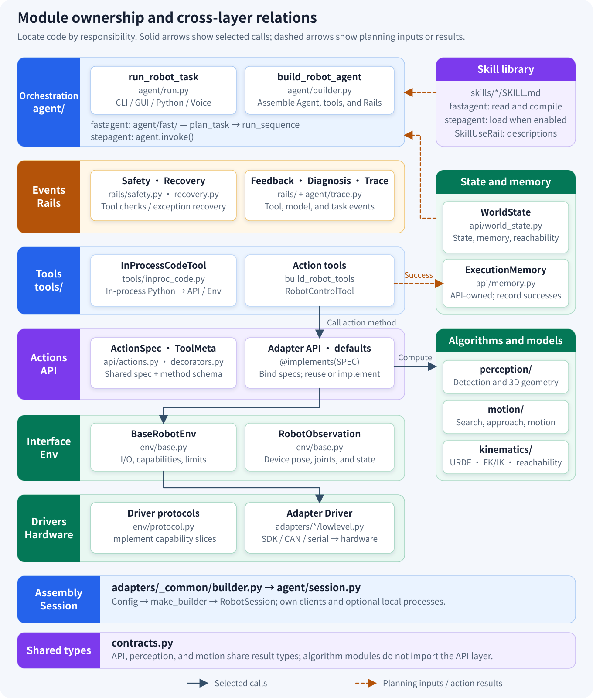
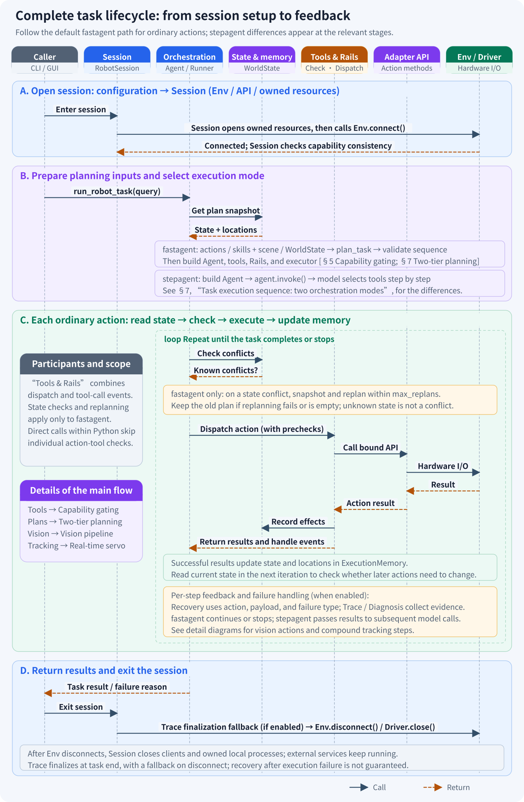
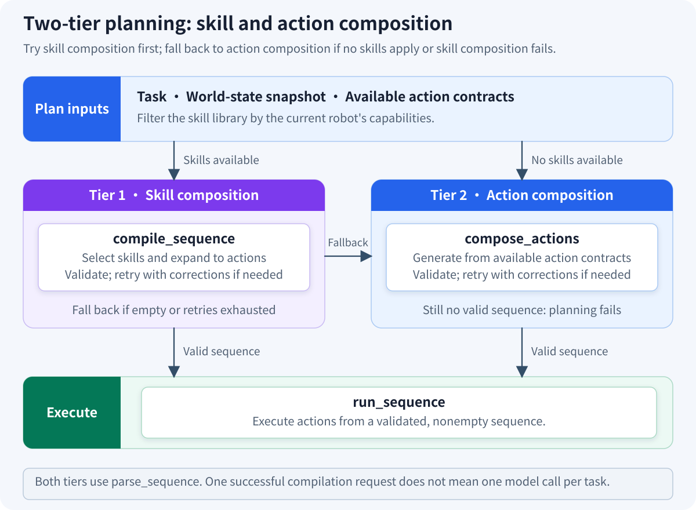
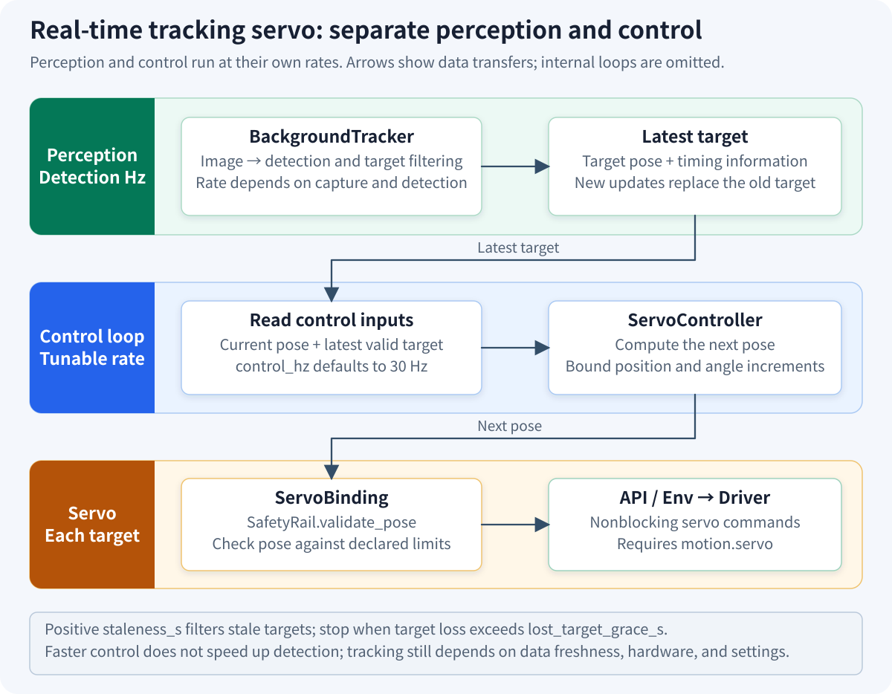
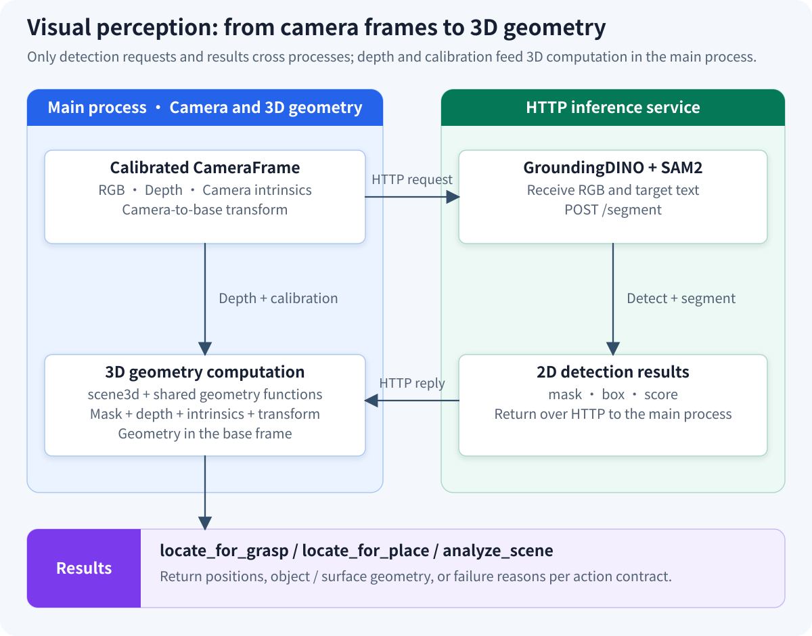

# JiuwenSymbiosis Architecture

JiuwenSymbiosis is an embodied agent framework built on `openjiuwen`. **Shared action contracts (ActionSpec) and capability gating** let different robots reuse planning and execution logic. Adapters handle hardware protocols, coordinate transforms, and device configuration. When the existing action vocabulary covers new hardware, task logic usually needs no changes.

## 1. Architecture overview

Start with three questions: **who owns each responsibility, which actions are available, and how a task runs**. The diagram below shows responsibilities, not call order; the [module ownership and cross-layer relations](#module-map) map in this section locates the code and its key connections. Section 2 follows the [complete task lifecycle](#task-lifecycle), and later sections explain individual mechanisms.


| Responsibility | Main implementation | Inputs and outputs |
|---|---|---|
| Task orchestration | `run_robot_task`, `plan_task`, `run_sequence`, Agent | Task and configuration → plan, tool calls, and execution results |
| Lifecycle | `RobotSession` | Env, API, and auxiliary service (sidecar) launchers → connections and resource cleanup |
| Action tools | `build_robot_tools`, `RobotControlTool` | Action name and parameters → bound adapter method call |
| Action implementation | `BaseRobotApi`, adapter API, `api/defaults.py` | Action contract → shared algorithms and hardware operations |
| Hardware interface | `BaseRobotEnv`, adapter Driver | Common operations → vendor protocols; device readings → `RobotObservation` |
| Planning inputs | Skill library, `WorldState`, `ExecutionMemory`, `Reachability` | Skill workflows, observations, execution records, and robot models → planning information |

`perception/` and `motion/` provide reusable perception, geometry, and motion algorithms called by action implementations. `kinematics/` handles model computations such as URDF processing and forward/inverse kinematics; these responsibilities differ from camera detection and live device observations.

Rails perform checks, recovery, or evidence collection at tool-call, exception, and model-call events. They are not a chain of functions that every operation must traverse. `InProcessCodeTool` and real-time servoing have their own execution paths; see [tool strategies](#tool-strategies) and [real-time tracking servo](#realtime-servo).

<a id="module-map"></a>

### Module ownership and cross-layer relations

This diagram maps responsibilities to code modules. It retains six responsibility lanes, with side panels for skills, state and execution memory, and shared algorithms and models. Session assembly and shared result types appear separately at the bottom. Solid arrows show selected calls; dashed arrows show planning inputs or successful action results. It is not a complete import dependency graph and does not expand every event callback.



API, Env, and Driver are responsibility groups; each robot's `api.py`, `env.py`, and `lowlevel.py` live in `adapters/<body>/`. `TraceRail` lives in `agent/trace.py`, while `openjiuwen` provides `SkillUseRail`. `WorldState` combines Env observations, execution memory, and reachability information. The API owns `ExecutionMemory`, which records successful action effects. Model computation and live observations have distinct responsibilities.

See [section 5](#capability-gating) for action-tool capability gating and [section 6](#tool-strategies) for the boundaries of direct calls within in-process Python. The [feature matrix](../reference/feature-matrix.md) lists each adapter's current capabilities.

<a id="task-lifecycle"></a>

## 2. Complete task lifecycle

The following diagram places the modules in the context of a task: the caller opens a session, prepares planning inputs, dispatches actions, uses results to determine subsequent steps, and finally exits the session. It follows the ordinary-action path of the default `fastagent` mode. Differences for `stepagent` appear at planning and feedback stages; see the [“Task execution sequence: two orchestration modes” diagram](#execution-modes) in section 7 for details.



“Orchestration” groups the task entry point, planner, and executor. “Tools & Rails” groups tool dispatch and its surrounding events; it does not imply a separate serial layer of Rails. “Env / Driver” groups hardware access. Session owns the resource lifecycle; orchestration and execution logic determine action order.

**Execution feedback affects subsequent behavior in two ways**: action tools record successful results in `ExecutionMemory` according to the contract, and `fastagent` reads current state and checks for conflicts before later steps; `stepagent` uses tool results in subsequent model calls. State checks do not re-perceive the entire environment at every step. Replanning and exception recovery also have distinct triggers.

| Main-diagram stage | Key relationship | Further detail |
|---|---|---|
| A: Open a session | Configuration assembles Env/API; Session starts auxiliary services and connects devices | [Session lifecycle](#session-lifecycle), [Session construction](#session-builder) |
| B: Prepare planning and execution | Available actions, skills, and state feed orchestration; the mode determines execution setup | [Capability gating](#capability-gating), [Two orchestration modes](#execution-modes), [Two-tier planning](#two-tier-planning) |
| C: Execute actions | Tools dispatch to API methods, which call shared algorithms and hardware interfaces | [Tool strategies](#tool-strategies), [Vision pipeline](#perception-pipeline), [Real-time servo](#realtime-servo) |
| C: Results and feedback | Results update memory; state conflicts and action failures have different handling conditions | [Execution memory](#execution-memory), [State checks and replanning](#runtime-replanning), [Safety Rails](#safety-rails) |
| D: End the task and session | Return results and record traces; disconnect devices and stop auxiliary services on session exit | [Execution trace](#execution-trace), [Session lifecycle](#session-lifecycle) |

The diagram shows one task. A Session can run multiple tasks; devices disconnect when the caller exits the session, not immediately after each task finishes.

## 3. Env: the single hardware contract

`jiuwensymbiosis/env/base.py` defines the hardware access interface. Adapters implement connection, disconnection, and observation, and access devices through the `low_level` driver. Env explicitly declares hardware capabilities. For example, the current `MockArmEnv` declares:

```python
capabilities = frozenset({
    "motion.cartesian", "motion.servo", "grasp.parallel",
    "vision.camera", "vision.detection",
})
```

`BaseRobotEnv` exposes motion, end-effector control, and image acquisition interfaces. Some have default implementations that delegate to the driver; adapters implement interfaces such as `home()`. Drivers implement the protocols in `env/protocol.py` that match their hardware capabilities, such as `CartesianDriver`, `JointDriver`, `BaseDriver`, and `CameraDriver`. A mobile base does not need to implement an arm's Cartesian motion interface.

Safety-envelope properties include `z_min_safe`, `workspace_bounds`, `joint_limits`, `base_step_limits`, `lift_limits`, and `waist_step_limit_rad`. Each defaults to `None`, meaning the corresponding range check is disabled; SafetyRail still performs the relevant type and finiteness checks. Adapters supply the limits, and SafetyRail applies them consistently.

Geometry and model properties are separate; their defaults do not define a safety policy:

- `home_pose`, `tool_offset_mm`: home pose and tool offset; base-class defaults are `None` and `0.0`, respectively.
- `joint_units`: `"deg"`, `"rad"`, or `None` for joint commands and observations; units are not inferred when unspecified.
- `default_orientation_policy`: default policy when `goto_xyzr` does not specify one.
- `urdf_path`, `arm_chains`: robot model and kinematic chains used to derive Env's `planning.reachability` capability.
- `arm_joints`: joint names for each arm; `cameras`: available camera selections.

### Known capabilities (`KNOWN_CAPABILITIES`)

The capability vocabulary is defined in `env/base.py`:

| Capability string | Meaning |
|---|---|
| `motion.cartesian` | End-effector pose motion in the base coordinate frame |
| `motion.joint` | Joint-space motion |
| `motion.servo` | Nonblocking servo pose commands |
| `motion.base` | Relative planar base motion; current shared actions support differential drive, not lateral translation |
| `motion.base_servo` | Nonblocking continuous base control |
| `motion.lift` | Lift position control |
| `motion.waist` | Waist yaw rotation |
| `motion.goal` | Navigate to a target region through a navigation interface |
| `motion.dual_arm` | Coordinated dual-arm motion; end-effectors are declared separately through `grasp.*` |
| `grasp.suction` | Suction control |
| `grasp.parallel` | Parallel-gripper control |
| `grasp.paddle` | Clamping with two flat paddles |
| `vision.camera` | Image acquisition |
| `vision.depth` | Depth acquisition |
| `vision.detection` | Target detection |
| `vision.eye_to_hand` | Fixed-camera hand–eye geometry |
| `vision.search` | Target bearing search; whether the robot moves depends on the action |
| `planning.reachability` | Model-based reachability checks, derived from the implementation and model |
| `sorting.command` | Device-specific sorting protocol |
| `speech.tts` | Text-to-speech |

These capabilities describe different dimensions and are combined according to actual support. A capability name alone does not guarantee that a task can run: the task also needs corresponding actions, satisfied preconditions, and the necessary sensor and model data.

`MockArmEnv` and `build_mock_model` support logic checks without hardware or a real LLM. The hardware substitute in `examples/run_task.py --mock` currently supports only the Piper path and forces `stepagent`; new adapters need their own test doubles.

## 4. API layer: action contracts and `@implements`

Action contracts, implementation bindings, and shared implementations have separate owners:

- **`ActionSpec`**: defined in `api/decorators.py`, with shared action instances in `api/actions.py`. It declares the action name, capability requirement, parameters, result type, preconditions, and effects.
- **`@implements(SPEC)`**: attaches `ToolMeta` when the method is defined, linking the shared contract to the method's parameter schema. The tool builder reads this metadata later; runtime calls invoke the bound method, not the decorator again.
- **`api.defaults`**: functions that adapters can reuse. Each adapter explicitly delegates to a chosen function instead of inheriting groups of actions through mixins.

For example, Cruzr's `search_target` reuses a shared implementation:

```python
class CruzrApi(BaseRobotApi):
    @implements(SEARCH_TARGET)
    def search_target(self, object_name: str = "box", reference: str | None = None,
                      relation: str = "on") -> dict:
        return defaults.search_target(self, object_name, reference, relation)
```

Adapters implement methods when geometry or device semantics differ. For example, Piper's `goto_xyzr` must transform from the tool tip to the flange, so the generic implementation cannot be used directly. `@implements` keeps contract metadata consistent; tests must still verify that the implementation obeys the contract.

`BaseRobotApi.capabilities` derives capabilities from bound actions' specs and also accepts marker capabilities from the `capability` class attribute. `planning.reachability` is derived from a callable `check_reachable`; it should not be manually declared as an ordinary hardware capability. API capabilities describe implementation support and must still be checked against Env's hardware capabilities.

The `home` contract has no capability requirement (`capability=None`). `BaseRobotApi` provides it by delegating to `env.home()`. Each robot must define an appropriate homing behavior; see [Safety Rails](#safety-rails) for recovery while carrying a payload.

### The planning contract: callable and plannable

| Contract field | Meaning |
|---|---|
| `result` / `ToolMeta.returns` | The spec's `result` stores a result type or schema; `returns` exposes the derived JSON Schema for validating `<bind>.field` references |
| `requires` / `provides` / `invalidates` | Robot states required, established, or cleared by an action, using the closed vocabulary in `api/state.py` |
| `produces_location` | The result supplies a location that later steps can use |
| `consumes_location` | The action implicitly reads a cached location; explicit `<bind>.field` references are checked separately |
| `invalidates_locations` | The action invalidates earlier locations, such as base motion that changes the measurement frame relationship |
| `opens_access` / `closes_access` | Effects that open or close access; validation exists, but current built-in actions do not declare these effects |

Shared result types live in `contracts.py` for use by API, perception, and motion modules. `api/` may call `perception/` and `motion/`; neither imports the API layer in return.

Contracts state preconditions and effects, from which the planner organizes action order. `parse_sequence` checks actions, parameters, state conditions, result references, and location validity. Runtime state aggregation gives observations precedence over inferences from execution records. An unreported state is unknown, not false.

<a id="execution-memory"></a>

### Execution memory: record results and invalidate locations

`BaseRobotApi.memory` holds `ExecutionMemory`. Calls dispatched through action tools are recorded by `record_action`. Successful results update state according to the contract, produced locations receive per-target timestamps, and locations declared invalid are cleared. When an action invalidates locations without producing a new one, `invalidate_sensing_cache()` also clears the API's sensing cache.

A recording failure is logged without turning a successful hardware action into a failure. Code that directly calls API/Env must not assume it passes through this recording path. Location validity depends on action declarations and cannot automatically detect objects moving independently; tasks that need fresh perception must still schedule sensing actions.

`WorldState.snapshot(session)` combines Env observations, execution memory, and reachability information into a planning snapshot. It does not persist execution records. The sequence executor's `<bind>.field` references results of executed steps, a mechanism separate from the locations stored in `ExecutionMemory`.

### Vision: shared pipelines and explicit projection actions

`perception/scene3d.py` uses the adapter's calibrated frames and detector to compute object or surface geometry in 3D. `api/defaults.py` forwards actions, and `motion/approach.py` reuses perception results for search and approach. See the [vision pipeline](#perception-pipeline).

`pixel_to_base_xyz` is a separate, explicit action bound by the adapter through `@implements(PIXEL_TO_BASE_XYZ)`. An eye-in-hand camera needs the current flange pose and hand–eye calibration; a fixed camera uses the corresponding camera-to-base transform.

`search_target` checks available cameras at the current orientation and reports the target's `bearing_rad`. It does not move the robot or declare that it produces a 3D location. `approach_for_grasp` / `approach_for_place` handle incremental turning, remeasurement, and approach.

<a id="capability-gating"></a>

## 5. Capability gating: aligning tools with hardware

This diagram expands action-tool construction in [stage B of the complete task lifecycle](#task-lifecycle): read implementations, then filter by capability. Inputs are action contracts, adapter methods, and Env capabilities; outputs are available tools. Arrows indicate **construction inputs and outputs** only.


`build_robot_tools(api, env=env)` filters actions with capability requirements using `api.capabilities ∩ env.effective_capabilities`. For an Env without `effective_capabilities`, it uses `capabilities` instead. Actions such as `home` that have no capability requirement are exempt from this filter. When building individual action tools, the Agent also sets `planner_only=True` to expose only actions allowed in plans.

For example, if the hardware does not declare `grasp.parallel`, the individual-tool list excludes gripper actions requiring that capability. Session's strict capability check may also report a configuration error during startup. This controls action-tool exposure, not direct Python access to objects within the process.

`planning.reachability` is derived: the API provides `check_reachable`, while Env provides `urdf_path` and `arm_chains`. `kinematics/` supports model computations including URDF parsing, forward kinematics (FK), inverse kinematics (IK), and related geometry checks. Conclusions depend on the model, joint state, and algorithm assumptions; they do not mean motion has already completed safely.

`WorldState` can annotate recorded locations with `reachable`, omitting it when reachability cannot be determined. The planner also uses spatial relations `on` / `under` / `in` / `beside` / `near` to relate a target to a reference object. These relations describe locations; they do not imply that the robot has actions for opening doors or clearing obstacles.

<a id="tool-strategies"></a>

## 6. Tool layer: three strategies can coexist

`agent/builder.py` builds tools according to `mode`, then adds the skill entry point according to `enable_skill`:

| Configuration or tool | Behavior |
|---|---|
| `mode="tool"` | Uses `build_robot_tools`, with one individual tool per available action |
| `mode="code"` | Uses `InProcessCodeTool` for in-process Python execution |
| `mode="hybrid"` (default) | Provides both individual action tools and the in-process Python tool |
| `enable_skill=True` | Adds `RobotControlTool` and `SkillUseRail`; configured independently of `mode` |

`RobotControlTool` dispatches through `action` / `params`. SafetyRail reads those fields before checking the actual action and parameters, so individual action tools and this unified entry point can share the same motion checks.

The current `fastagent` executor dispatches ordinary actions through `robot_control`. With the built-in builder, set `enable_skill=True` to register that entry point; setting only `exec_mode="fastagent"` does not register it automatically. `plan_task` reads the skill library directly, a separate mechanism from loading descriptions through `SkillUseRail`.

`InProcessCodeTool` uses `exec()` with injected objects such as `env`, `api`, and `np`, without sandbox isolation. Its direct API/Env calls do not individually pass through action-tool capability gating, SafetyRail, or recording wrappers. Operations that need those checks should use the action-tool path.

`mode` controls tool configuration; `exec_mode` controls whether the model orchestrates a task step by step or a sequence is compiled first. They are separate settings.

<a id="6-two-tier-autonomous-planning"></a>

<a id="execution-modes"></a>

## 7. Two-tier autonomous planning (`exec_mode: fastagent`)

The caller first connects with `with session:`, then calls `run_robot_task(session, query, config)`. Session manages resources; the task entry point selects execution according to `exec_mode`. This diagram expands the two orchestration modes in [stages B/C of the complete task lifecycle](#task-lifecycle):


- **`fastagent` (default)**: `plan_task` generates an action sequence; `run_sequence` calls `robot_control` through the Agent's ability executor to execute ordinary actions. It does not call `agent.invoke()` or make an LLM call for every ordinary step. Initial planning, correction retries, and replanning can still call the model.
- **`stepagent`**: builds the Agent and calls `agent.invoke()`, letting the model choose subsequent calls based on tool results.

Both paths obtain Rails through the same Agent assembly. `fastagent` explicitly initializes the relevant lifecycle hooks; compound tracking steps use the servo path described later in this section.

<a id="two-tier-planning"></a>

### Two-tier planning: try skills, then compose actions

The skill library contains workflow descriptions and contracts for the planner to select and expand, not fixed executable scripts. `fastagent` reads the library directly for compilation; in `stepagent`, `SkillUseRail` loads skill descriptions when attached through `enable_skill=True`.

This diagram expands `fastagent` planning in [stage B of the complete task lifecycle](#task-lifecycle). Inputs are the task, state, skills, and action contracts; the output is a valid sequence passed to the executor.



1. **Skill composition (Tier 1, `compile_sequence`)**: selects capability-filtered skills and expands them into a flat action sequence. If the first generated sequence passes validation, this compilation stage needs only one LLM request.
2. **Action composition (Tier 2, `compose_actions`)**: generates a sequence directly from available actions and their contracts. It takes over under three conditions: no skills are available; Tier 1 returns an explicit empty sequence; or Tier 1 still produces no valid sequence after correction retries.
3. **Sequence validation (`parse_sequence`)**: both tiers use the validator. Validation failures are fed back to the model for correction; if Tier 2 still cannot produce a valid sequence, planning fails.

Task parsing, planning retries, and runtime replanning may add model calls, so one compilation request does not mean one model call for the entire task. Automatically saving successful sequences as new SKILL.md files is not implemented.

<a id="runtime-replanning"></a>

### State checks and replanning

Before each step, the executor checks whether observable state contradicts action requirements and whether implicitly consumed location caches are invalid. It reads lightweight `current_tokens` and execution memory, rather than re-perceiving the entire scene at every step.

A new `WorldState.snapshot` is created when replanning is triggered, subject to `max_replans`. Unreported states are unknown and do not establish a conflict. In the current implementation, a replanning error or empty sequence leaves the original plan in place. This is a plan-correction mechanism, not a replacement for action safety checks.

<a id="realtime-servo"></a>

### Real-time tracking servo: perceive while acting

`fastagent` supports compound `TRACK_DETECT` / `TRACK_GRASP` steps, running detection and control separately. This is a dedicated execution branch in [stage C of the complete task lifecycle](#task-lifecycle): detection produces targets, and the controller issues servo commands after pose checks. The diagram shows data transfers without expanding each thread's internal loop.



- **`BackgroundTracker`**: continuously detects in a background thread and stores the latest target and timing information. A positive `staleness_s` makes expired targets return `None`; explicitly passing `None` disables this expiry filter. The current runner's tracking entry point configures a positive threshold.
- **`ServoController`**: reads the current pose and target at `control_hz`, bounds each pose increment, and sends nonblocking commands. The default is 30 Hz; actual frequency and performance depend on hardware, detection latency, and parameters.
- **`ServoBinding`**: adapts the controller to the device. Each commanded pose first passes through `SafetyRail.validate_pose`, then goes to `api.servo_to_tip` or `env.servo_to_flange`. Env must declare `motion.servo`.

The controller stops tracking when target loss exceeds `lost_target_grace_s`; target filtering can also reject detection jumps. Detection and control can run at different rates, but a high command rate alone does not guarantee accurate tracking of fast-moving targets.

<a id="safety-rails"></a>

## 8. Safety Rails: checks, recovery, and feedback

Configuration and applicable capabilities determine which Rails are enabled. Each operates on different events:

| Rail | Main trigger | Role |
|---|---|---|
| `SafetyRail` | `before_tool_call` | Check parameters and declared safety limits for watched actions |
| `RecoveryRail` | `on_tool_exception` | Attempt recovery for watched motion or grasp exceptions |
| `VisualFeedbackRail` | `after_tool_call`, `before_model_call` | Stage post-action images and inject them before a later model call |
| `DiagnosisRail` | Exception or tool-result events, `before_model_call` | Collect failure evidence and inject a diagnosis before a later model call |
| `TraceRail` | Tool-call and task lifecycle events | Record traces, logs, and optional images |
| `SkillUseRail` | Skill-context loading | Provide skill descriptions; not a motion safety check |

`SafetyRail` checks the Z floor, XY workspace, joint soft limits, per-command base translation/rotation limits, lift range, and waist rotation according to motion capabilities. Exceeding a limit raises `ValueError`. `stepagent` can feed tool exceptions back to the model; `fastagent` follows the executor's failure policy and does not guarantee model correction at each step.

Coverage also depends on the action name and parameter format. For example, Piper's `goto_pose` uses flange coordinates `x_mm` / `y_mm` / `z_mm`. Its driver performs the corresponding Z-floor check; SafetyRail's tool-tip Z/XY checks are not applied directly to those fields.

`RecoveryRail` uses action tags and payload state to decide whether to release the end-effector and attempt homing. A motion failure with a confirmed payload preserves the grasp. Recovery prefers `recovery_home()`, falling back to `home()` when unavailable. A homing failure does not trigger another homing attempt. Recovery is best effort and cannot guarantee that the device ends in a safe state.

`VisualFeedbackRail` requires camera capability and injects images before the next model call. Since `fastagent` does not call the model at every step, this does not automatically provide per-step VLM verification. `DiagnosisRail` requires Trace to be enabled; see [Trace Feedback Loop](../how-to/use-trace-feedback.md).

`parallel_tool_calls` is disabled by default. The current builder rejects it when Env declares any of `motion.cartesian`, `motion.joint`, `grasp.suction`, or `grasp.parallel`; combining it with Trace is also rejected. This check does not yet cover every motion and grasp capability, so its acceptance does not establish that other capabilities are safe to run concurrently. Software boundary checks do not replace device emergency stops or hardware protection.

<a id="execution-trace"></a>

## 9. Execution trace and replay (TraceRail)

`TraceRail` lives in `agent/trace.py` and is attached through `enable_tracing`, which is off by default. It collects execution evidence rather than intercepting actions or performing recovery.

Depending on configuration, traces record action names, parameters, result summaries, success or error, duration, observation snapshots, and optional JPEG frames, subject to entry and frame limits. Observations do not directly serialize raw RGB/depth arrays. `TraceEventSink` collects Rail events; `TraceLogHandler` collects `WARNING` and higher records from configured loggers.

At task completion, JSON is written to `<workspace>/traces/{run_token}.json`; optional frames go to `traces/frames/{run_token}/step_NNN.jpg`. `fastagent` uses explicit lifecycle events for recording and finalization; Session also attempts finalization on disconnect.

`jiuwensymbiosis-replay <trace.json>` generates a self-contained HTML replay by default; `--text` prints a text timeline. It replays execution evidence and does not command the robot to execute the actions again.

See the [execution trace reference](../reference/tracing.md) for fields, configuration, and serialization rules. Samples are in `examples/sample_trace/`.

<a id="session-lifecycle"></a>

## 10. RobotSession: lifecycle ownership

`RobotSession` is a context manager holding an Env instance, an API instance, sidecar launchers, and a `globals_provider` for code-tool globals. Env holds the low-level driver; Session does not determine action order.

| Stage | Order |
|---|---|
| Enter `with session:` | Start configured sidecars → connect Env → check capability consistency |
| Run a task within the session | The caller invokes `run_robot_task`, which builds the Agent and selects the execution mode |
| Exit `with session:` | Attempt Trace finalization → disconnect Env and release drivers → exit sidecar contexts |

Connection and disconnection are idempotent. Ordinary capabilities declared by the API but unsupported by Env cause startup failure when `strict_capabilities=True`; Env-only capabilities generate warnings. Derived capabilities may be asymmetric and are not treated as ordinary capability mismatches. `describe()` reports effective capabilities using the intersection of both sides.

`globals_provider` returns `env`, `api`, `np`, and adapter-specific objects. During Agent construction, descriptions of available objects are added to the code-tool prompt context.

<a id="perception-pipeline"></a>

## 11. Visual perception: detector as a subprocess

The detection service runs GroundingDINO and SAM2. The client sends images and target text over HTTP and receives masks, boxes, and scores. Depth and calibration transforms are used for 3D computation in the main process.

This diagram expands the internals of vision actions in [stage C of the complete task lifecycle](#task-lifecycle). Inputs are a calibrated frame and target text; outputs follow each action's contract and return to the tool caller for recording and subsequent orchestration.



1. **Acquisition**: the adapter supplies a `CameraFrame` with RGB, depth, camera intrinsics, and the camera-to-base transform.
2. **Detection**: `detector_client` sends RGB and target text to `/segment`, then decodes masks and other returned results.
3. **3D computation**: `scene3d` passes masks, depth, intrinsics, and coordinate transforms to shared geometry algorithms, producing positions and object/surface geometry in the base frame.
4. **Action return**: `locate_for_grasp`, `locate_for_place`, and `analyze_scene` return results or failure reasons according to their own contracts; there is no single result-field set shared by all actions.

Session manages the lifecycle of a local detection sidecar. An existing detection service can also be configured; `spawn` determines whether a local process starts. Adapters still need correct camera, calibration, and detection configuration.

`pixel_to_base_xyz` is a single-point projection action, not a mandatory internal action call in this shared pipeline. `api/defaults.py` delegates to shared functions; vision and approach logic enter the tool list through explicit action bindings.

<a id="session-builder"></a>

## 12. `make_builder`: removing boilerplate

`make_builder` in `adapters/_common/builder.py` encapsulates configuration parsing, Env/API construction, sidecar launcher collection, and Session assembly, with an optional `decorate` callback:

```python
build_xxx_session = make_builder(
    XxxConfig, XxxEnv, XxxApi,
    api_kwargs_from_cfg=["z_correction_mm", "detector.url:detector_service_url"],
    sidecar_builders=[make_detector_sidecar()],
    decorate=_set_extra_globals,
)
# build_xxx_session(cfg)
# build_xxx_session.from_yaml("path.yaml")
# build_xxx_session.from_dict({...})
```

`api_kwargs_from_cfg` supports same-name fields, `cfg:api` renaming, and nested dotted paths; complex transformations can use a callback. `make_detector_sidecar()` reads detection configuration and uses `spawn` to decide whether to start a local service. Constructing a Session and connecting hardware are separate stages.

## 13. File responsibilities for new hardware

`templates/xxx_adapter/` provides six Python files and a YAML template, plus an optional calibration template. Templates reduce repeated configuration and assembly code; the actual work depends on driver, geometry, sensor, and behavior differences.

| File | Adapter responsibility |
|---|---|
| `__init__.py` | Export public adapter entry points |
| `config.py` | Configuration structure and YAML/dict parsing |
| `config_template.yaml` | Example hardware, perception, and safety parameters |
| `lowlevel.py` | Vendor SDK or communication protocol; implement supported Driver protocols |
| `env.py` | Lifecycle, observations, capability declarations, units, geometry, and safety properties |
| `api.py` | Action bindings; reuse shared functions or implement device-specific semantics |
| `session.py` | Assemble configuration, Env, API, and sidecars with `make_builder` |
| `calibration.py` (optional template) | Calibration adapter wrapper; follow the template instructions to place it in `calibration/adapters/<body>.py` and expose `CALIBRATION_ADAPTER_SPEC` |

Actions that satisfy shared implementation assumptions can delegate directly to `defaults`. Actions with different coordinate, sensor, end-effector, or recovery semantics need adapter implementations and validation. If the existing vocabulary cannot express a new requirement, design the shared contract before adding an implementation.

## 14. Complete new-hardware integration flow

1. Copy `templates/xxx_adapter/`, fill in configuration, and rename public entry points.
2. Implement Driver protocols, Env lifecycle, and observations for the hardware's capabilities; specify units and safety limits.
3. Bind existing actions and check parameter/result contracts; supply perception, coordinate-transform, and recovery implementations.
4. Assemble the Session with `make_builder`; add a calibration wrapper if needed.
5. Run structural validation and a smoke test using a stub driver:

   ```bash
   python scripts/validate_adapter.py --module jiuwensymbiosis.adapters.acme
   python scripts/smoke_test_adapter.py --module jiuwensymbiosis.adapters.acme
   ```

6. Add adapter tests for units, geometry transforms, failure handling, and recovery with a payload. Passing a generic smoke test does not validate real hardware behavior.
7. Verify device behavior using the adapter's instructions; do not treat Piper's `--mock` as a simulator for arbitrary new hardware.

When reusing existing actions, changes are concentrated in the adapter. Adding shared actions, Driver protocols, or common algorithms requires corresponding changes to core contracts and tests. See [Port a hardware adapter](../how-to/port-hardware-adapter.md) for details.

## 15. Key design principles

| Design | Maintenance benefit |
|---|---|
| Shared `ActionSpec`, referenced by `ToolMeta` | Fewer contract copies; implementations across hardware still need conformance tests |
| Explicit action bindings and capability gating | Separate implementation support from hardware support and control tool exposure |
| Shared functions and adapter responsibilities | Maintain common algorithms centrally and keep device differences in adapters |
| Env and capability-sliced Driver protocols | A common hardware interface for callers; drivers implement only relevant capabilities |
| Shared result types in `contracts.py` | Perception, motion, and API use the same result definitions without reverse dependencies |
| Preconditions, effects, and location validity | Evidence for sequence validation and runtime state checks |
| Separate observations and execution memory | Distinguish current measurements, historical execution inferences, and unknown state |
| Separate detection and servo loops | Control need not block on each detection; performance still depends on data freshness |
| Session owns resources; Rails handle events | Clear ownership of connections, checks, recovery, and evidence collection |

## 16. Related internal designs

This page covers the main responsibilities and execution mechanisms. Detailed interfaces and tradeoffs are recorded in the repository's `design/` directory:

- [Execution trace module design](../../../design/tracing.md): Trace lifecycle, event ownership, persistence, and resource boundaries.
- [Trace Feedback Loop module design](../../../design/trace-feedback-loop.md): online diagnosis and offline failure clustering.
- [Logging module design](../../../design/logging.md): handler ownership, output isolation, and forwarding logs to Trace.
- [Voice control integration design](../../../design/voice-control-integration.md): connecting voice input to the text task executor.
