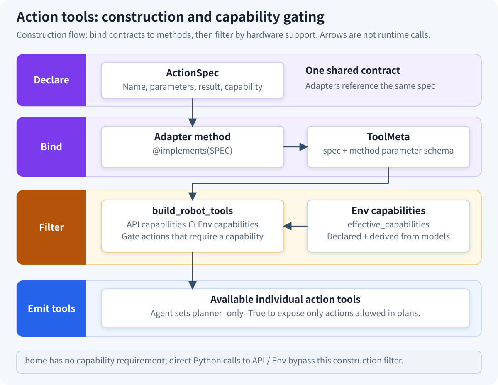
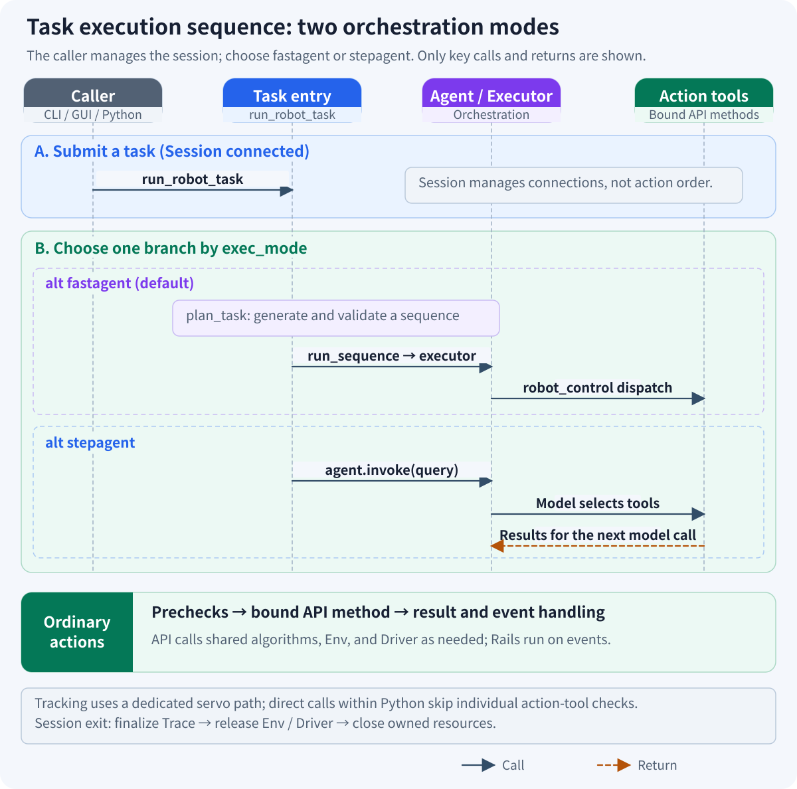
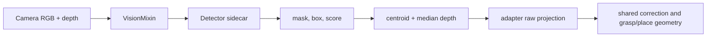

# JiuwenSymbiosis Architecture

> Category: Explanation. The [Chinese source](../../zh/explanation/architecture.md) is authoritative.

JiuwenSymbiosis adapts one Agent framework to different robot bodies by composing capabilities rather than forking the
framework. Hardware differences remain in adapters; shared motion semantics, safety, tools, skills, tracing, and Agent
lifecycle remain reusable.

## 1. Seven-layer model


Commands follow the six-layer Agent → Rails → Tool → API → Env → Hardware execution chain. Observations and failures
flow upward, while Skill is the seventh architectural domain and guides the Agent from the side. Each domain exposes
appropriate concepts instead of leaking vendor SDK objects through the entire stack.

The dependency map uses the same structure as the overview: the six lanes on the left form the execution chain, while
the right side groups Skill guidance, Tool/API/Env capability gating, and the optional visual-perception branch. The
Detector sidecar is no longer an isolated out-of-layer box; Detector client, the sidecar, and GroundingDINO/SAM2 form
one branch with Session lifecycle ownership and VisionMixin calls shown explicitly.



Runtime order is shown separately. Agent → Rails → Tool → API → Env → Hardware map one-to-one to the six-layer main
chain, while Skill guidance, the Vision sidecar, and Trace storage join as side participants.



Key call paths:

| Scenario | Call relationship |
|---|---|
| Startup | YAML → Adapter Config → `make_builder()` → Session(Env/Api/sidecars); RobotAgentConfig + Session → `run_robot_task()` |
| Ordinary tool | Agent → Rail precheck → Tool → Api Mixin/override → Env verb → Driver → hardware |
| Visual tool | `VisionMixin` → camera frames → detector sidecar → adapter raw projection → shared correction and grasp/place geometry |
| Evidence | Driver/camera → `RobotObservation`/tool result → VisualFeedback/Trace/Diagnosis → next model turn or offline analysis |
| Shutdown | `RobotSession.disconnect()` → Trace finalization → `Env.disconnect()` → `Driver.close()` → sidecar exit |

See the [Feature Matrix](../reference/feature-matrix.md) for current framework and built-in adapter support.

## 2. Env is the single hardware contract

`BaseRobotEnv` isolates hardware lifecycle and state:

```python
# env/mock.py: a simulated 4-DoF arm with gripper and camera
class MyEnv(BaseRobotEnv):
    capabilities = frozenset({"motion.cartesian", "grasp.parallel"})

    def connect(self) -> None: ...
    def disconnect(self) -> None: ...
    def get_observation(self) -> RobotObservation: ...
```

The base contract also provides common verbs and properties:

- motion: `home`, `get_flange_pose`, `move_to_flange`, and `move_joint`;
- end effector: `set_end_effector`, dispatched from the declared grasp capability;
- image: `grab_rgb`, normally delegated to `get_observation().rgb`;
- body constants: `home_pose` and `tool_offset_mm`;
- safety: `z_min_safe`, `workspace_bounds`, and `joint_limits`;
- controlled vendor access: typed `low_level` for camera calibration and body-specific features.

Agent, Rails, and generated tools use this contract rather than reaching into private driver attributes. A new driver
therefore changes hardware translation without changing orchestration.

### Known capabilities (`KNOWN_CAPABILITIES`)

Capability strings use the closed vocabulary in `jiuwensymbiosis.env.base.KNOWN_CAPABILITIES`. Env subclasses declare
the hardware subset manually; unknown values fail during class creation instead of becoming unusable runtime promises.

## 3. Capability Mixins define the Api

An Api composes reusable behavior through multiple inheritance:

```python
class MyApi(
    MotionMixin,
    JointMotionMixin,
    ParallelGripperMixin,
    VisionMixin,
    BaseRobotApi,
):
    pass
```

Each Mixin declares one `capability` and supplies decorated tool methods. `BaseRobotApi.capabilities` derives the union
from the MRO, so the Api capability set cannot drift from its composition.

### The `@robot_tool` decorator

`@robot_tool` stores the public name, description, input schema, capability, and tags on an unbound method. Tool
construction walks the MRO, binds the selected implementation, and preserves inherited metadata on an override.

Motion, joints, grasp, and image operations have default implementations that delegate to Env verbs. Adapters override
only public geometry that differs by body, such as TIP-to-FLANGE conversion or pose field names.

### Vision requires only one camera-to-base projection function

`VisionMixin` owns the common detect → centroid/depth → raw projection → correction → grasp/place pipeline. The adapter
implements `_project_pixel_to_base_raw()`:

- eye-in-hand: `T_base_cam = T_base_flange(live) @ T_flange_cam`;
- eye-to-hand: use a fixed `T_base_cam`.

Keeping correction outside the adapter prevents the same XY/Z correction from being applied twice.

### Available capability Mixins

The built-in composition covers cartesian and joint motion, suction and parallel grippers, camera/detection workflows,
sorting commands, and speech. An adapter inherits only the Mixins backed by its Env capabilities.

## 4. Capability gating aligns tools with hardware

Env capabilities describe what connected hardware can do. Api capabilities describe what the software surface can
express. The effective set is their intersection:

```text
effective_capabilities = api.capabilities ∩ env.capabilities
```

`build_robot_tools(api, env=env)` emits only tools in that set. An unsupported Mixin method is not merely expected to
fail later; it is absent from the model's tool list. `session.describe()` exposes Env, Api, and effective capability
sets. Strict mode rejects Api-only capabilities during connection.

This is capability gating rather than model prompting: hardware truth constrains the actual tool surface.

## 5. Tool strategies can coexist

JiuwenSymbiosis supports three tool shapes:

| Strategy | Shape | Best fit |
| --- | --- | --- |
| `build_robot_tools(api)` | One LLM tool per `@robot_tool` method | Small, explicit tool sets |
| `RobotControlTool(api)` | One `robot_control` action/params dispatcher | SKILL.md workflows |
| `InProcessCodeTool` | In-process Python with Session globals | Programmatic multi-step reasoning |

`build_robot_agent()` selects them from `RobotAgentConfig.mode` and `enable_skill`. The aggregate `robot_control` form
does not hide actions from Rails: safety, recovery, diagnosis, and tracing unwrap `action`/`params` before applying their
logic.

### Transparent unwrapping by safety Rails

For `RobotControlTool`, Rails inspect the nested action and parameters before applying the same checks used for direct
tools. Choosing an aggregate tool surface therefore does not create a safety bypass.

## 6. Rails add cross-cutting behavior

Rails observe Agent lifecycle without modifying every tool.

### 1. SafetyRail: software precheck before motion

`SafetyRail` rejects Z-floor, XY-workspace, and joint-limit violations before dispatch.

### 2. RecoveryRail: automatic reset after failure

`RecoveryRail` attempts home and end-effector release after motion or grasp failure.

### 3. VisualFeedbackRail: capture and inject a post-action frame

`VisualFeedbackRail` captures an action result frame and injects it before the next model call. `DiagnosisRail` is an
additional feedback Rail that stages compact failure evidence when tracing is enabled.

Rail attachment is capability-aware. For example, visual feedback requires a camera, while SafetyRail attaches when
cartesian or joint motion is present. Physical controller limits and E-stop behavior remain below this software layer.

## 7. TraceRail records a parallel evidence stream

`TraceRail` is not a safety Rail. It records each `agent.invoke()` as an `ExecutionTrace` containing tool parameters,
results, timing, lightweight observations, Rail events, warning logs, and optional frame paths.

Tracing is disabled by default. When enabled:

- one invoke creates one JSON file;
- frames use an invoke-specific directory and never collide with later runs;
- Safety, Recovery, and VisualFeedback publish structured events through sink protocols;
- `TraceLogHandler` captures configured `WARNING+` logger records;
- `RobotSession.disconnect()` flushes and detaches resources as a final safety net.

Trace step attribution currently requires serial tool calls, so tracing and `parallel_tool_calls=True` are mutually
exclusive. Offline replay and failure clustering consume the persisted evidence without participating in execution.

### Sample Trace (`examples/sample_trace/`)

The sample directory demonstrates the persisted JSON timeline and frame-path convention without requiring hardware.
Replay reads this evidence but never reconnects to or commands a robot.

## 8. RobotSession owns lifecycle

`RobotSession` packages Env, Api, sidecars, code-tool globals, strict capability policy, and optional Trace cleanup:

```python
with session:
    result = run_robot_task(session, query, config)
```

Connection starts sidecars and then connects the Env. Disconnect flushes tracing, disconnects hardware, and closes all
sidecars. Both methods are idempotent. This ownership prevents demos and applications from each inventing a different
detector or hardware teardown sequence.

## 9. Visual perception is a sidecar-backed shared pipeline

Open-vocabulary detection runs as a GroundingDINO/SAM2 subprocess. The Session starts and stops it through a detector
sidecar, while the Api binds a lightweight HTTP client lazily.

### Visual-pipeline data flow



Heavy model lifecycle is isolated from the robot driver. Camera mounting geometry remains in the adapter, and shared
result construction remains in `VisionMixin`/`perception.vision`.

## 10. `make_builder()` removes Session boilerplate

Adapter `session.py` normally declares:

```python
# It can then be assembled as follows
build_my_robot_session = make_builder(
    MyConfig,
    MyEnv,
    MyApi,
    api_kwargs_from_cfg=[...],
    sidecar_builders=[...],
)
```

The result supports configuration objects, dictionaries, and YAML paths. Declarative `api_kwargs_from_cfg` mappings
cover direct and renamed fields; shared detector-sidecar helpers cover normal visual adapters.

This leaves adapter authors with one primary hard problem: translating vendor hardware semantics in `lowlevel.py` and
body geometry in the small set of Api overrides.

## 11. Hardware extension cost

A normal body adds:

1. `config.py` for settings and loading;
2. `lowlevel.py` for vendor I/O;
3. `env.py` for lifecycle, observation, capabilities, and safety properties;
4. `api.py` for Mixin composition and body geometry;
5. `session.py` for builder wiring;
6. `config_template.yaml` for an annotated deployment starting point.

The adapter can be checked without changing framework layers:

```bash
python scripts/validate_adapter.py --module jiuwensymbiosis.adapters.my_robot
python scripts/smoke_test_adapter.py --module jiuwensymbiosis.adapters.my_robot
```

The [first-adapter tutorial](../tutorial/02-build-first-adapter.md) provides a no-hardware example; the
[porting guide](../how-to/port-hardware-adapter.md) covers production safety and acceptance.

## 12. Complete new-hardware integration flow

Choose capabilities, implement and mock the driver, wrap it in an Env, compose the Api, load Config and YAML, assemble
the Session, then run static validation, generated-tool smoke tests, and low-speed hardware acceptance. Each boundary is
verified before the next one introduces physical risk.

## 13. Summary of key design principles

| Principle | Result |
| --- | --- |
| Env is the only hardware contract | Vendor changes remain below one boundary |
| Mixin defaults delegate to Env | Adapters override only real body differences |
| Capability intersection gates tools | Unsupported actions are invisible to the model |
| Sidecars follow Session lifecycle | Heavy services start and stop deterministically |
| Rails are tool-strategy independent | Safety and evidence work for direct and aggregate tools |
| Mock and validators are first-class | Integration can progress before hardware arrives |
| Tracing is parallel and opt-in | Evidence is available without changing business tools |

## 14. Related internal designs

- [Execution Trace Module Design](../../../design/tracing.md): lifecycle, event attribution, persistence, and bounds.
- [Trace Feedback Loop Module Design](../../../design/trace-feedback-loop.md): online diagnosis and offline clustering.
- [Logging Module Design](../../../design/logging.md): handler ownership and trace-log forwarding.
- [Voice Control Integration Module Design](../../../design/voice-control-integration.md): voice I/O and text-task seam.
- [Piper Calibration Migration Design](../../../design/piper-pick-box-migration.md): candidate calibration provenance and release gates.

These maintainer-facing records explain implementation choices and do not replace Tutorial, How-to, or Reference pages.
