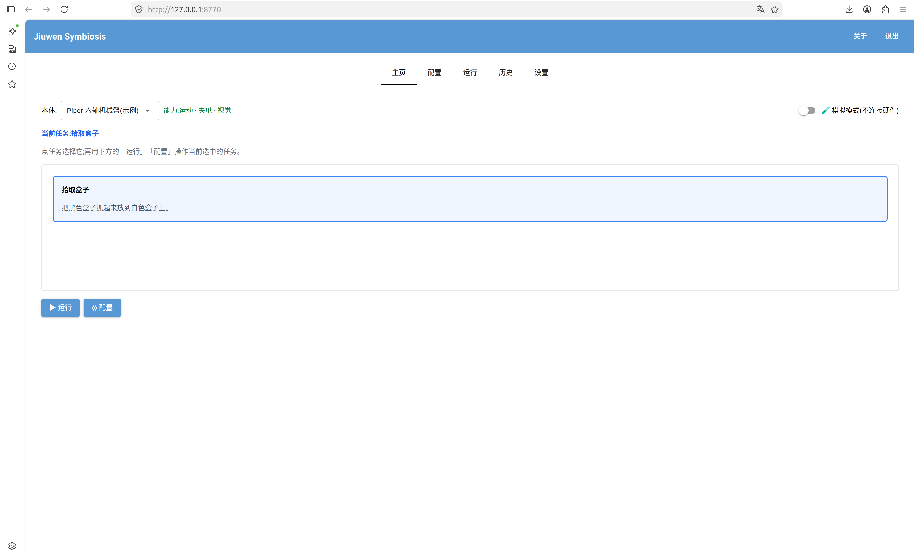
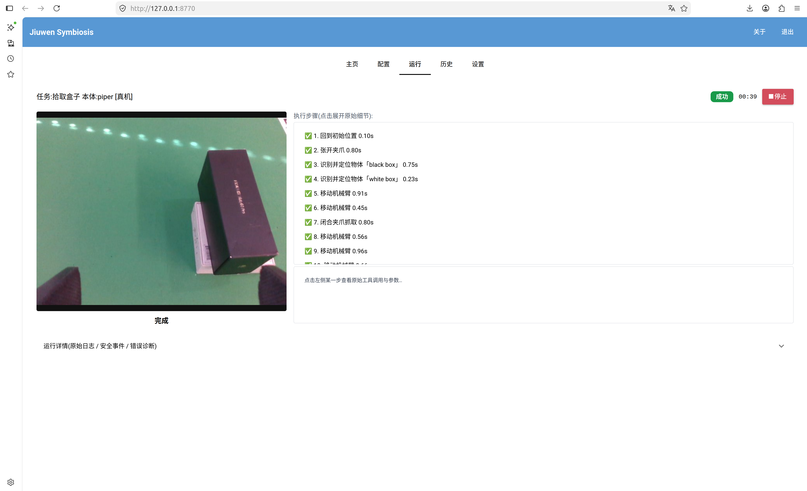

# Configure and Use the GUI

> Category: How-to. The [Chinese source](../../zh/how-to/configure-gui.md) is authoritative.

JiuwenSymbiosis provides a NiceGUI browser console for selecting a robot and task, editing YAML-backed settings,
watching a run, and replaying trace history.



## Contents

Install and start the GUI, run a task, inspect its steps, replay history, and use the bounded diagnostics actions.

## 1. Feature overview

| Page | Purpose |
| --- | --- |
| Home | Select the robot and task, then open configuration or start the run |
| Configuration | Edit common fields through forms or use the synchronized raw YAML view |
| Run | Watch the camera, current action, tool timeline, logs, safety events, and diagnosis |
| History | Browse recorded traces and open self-contained HTML replay files |
| Settings | Select the workspace used for run history and configure the UI language |

The server uses browser mode and binds only to `127.0.0.1`; it does not use `native=True`, pywebview, or WebKitGTK.

## 2. Install

### Install GUI dependencies

Install the lightweight GUI extra independently from the vision/GPU stack:

```bash
pip install -e ".[gui]"
```

If NiceGUI is missing, the startup preflight reports the exact package command instead of failing with a raw traceback.

### Install a desktop launcher (recommended)

To add a desktop launcher:

```bash
bash scripts/install_desktop_entry.sh
```

Search the application menu for **Jiuwen Symbiosis**. Remove the launcher with:

```bash
bash scripts/install_desktop_entry.sh --uninstall
```

The launcher runs the current checkout through `scripts/launch_gui.sh` and activates the `jiuwensymbiosis` conda
environment by default. Override it with `JIUWEN_CONDA_ENV`. Reinstall the launcher only after moving or renaming the
repository directory.

## 3. Run examples

### Run a task

Use any one of these entry points; each opens the default browser at `http://127.0.0.1:8770`:

```bash
# 1. Desktop launcher: select Jiuwen Symbiosis from the application menu
# 2. Console-script entry point
jiuwensymbiosis-gui
# 3. Python module entry point
python -m jiuwensymbiosis.gui
# 4. Repository launcher that activates the conda environment
bash scripts/launch_gui.sh
```

1. On **Home**, select a robot body and task card.
2. Open **Configuration** and set the model `api_base` and `api_key`, CAN interface, camera serial, and any
   adapter-specific parameters. Use the raw YAML tab for fields not represented in the form.
3. Before real-hardware execution, verify CAN, E-stop, camera, calibration, workspace limits, and the local
   GroundingDINO/SAM2 detector service.
4. Enter the task instruction, for example “place the black box on the white box.” Built-in SKILL.md workflows define
   the detailed pick/place sequence and height calculations.
5. Select **Run** and monitor the live timeline.



## 4. Other features

### Inspect each step

Each timeline step exposes the raw tool name, arguments, model explanation, duration, result, and error. Selecting a
historical step also switches the image panel to that step's saved frame.

### Replay history

The **History** page scans `<workspace>/traces/`. Enable tracing in the `agent:` block before a run:

```yaml
agent:
  enable_tracing: true
  trace_save_frames: true
```

The GUI opens the trace's self-contained HTML replay, whose image frames are embedded for portability. Change the
workspace from **Settings** if runs are stored elsewhere.

### Automatic error diagnosis and one-click fixes

When a run fails, the diagnostics panel translates recognized technical errors into a short explanation and recovery
steps. Supported cases include detector model download or startup failure, occupied ports, model authentication and
connectivity errors, insufficient GPU memory, and robot connection failures. Some model-path issues provide local model
detection or mirror-selection actions.

Diagnostics do not bypass robot safety or silently rerun a motion. Review the proposed action and hardware state before
trying again.

## 5. Notes

- The default port is `8770`, bound to the loopback interface only.
- The current UI language is Simplified Chinese.
- GUI execution calls library functions in process; it does not shell out to the CLI.
- `run_engine`, `run_status`, and diagnostic formatting remain independent of NiceGUI and can be unit tested headlessly.
