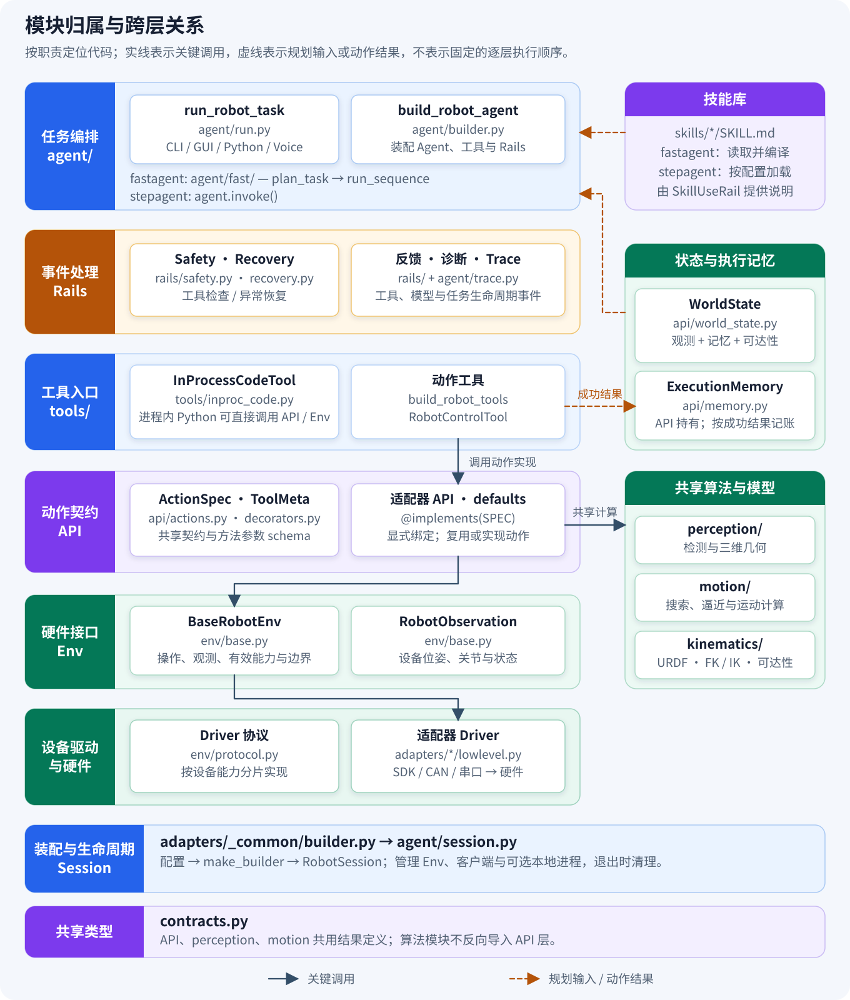
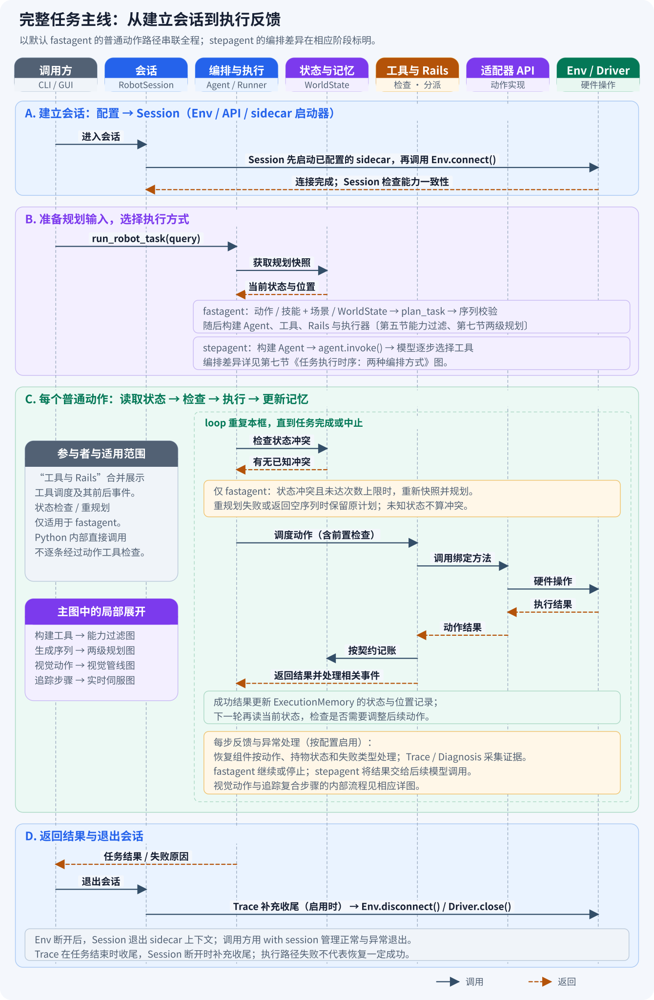
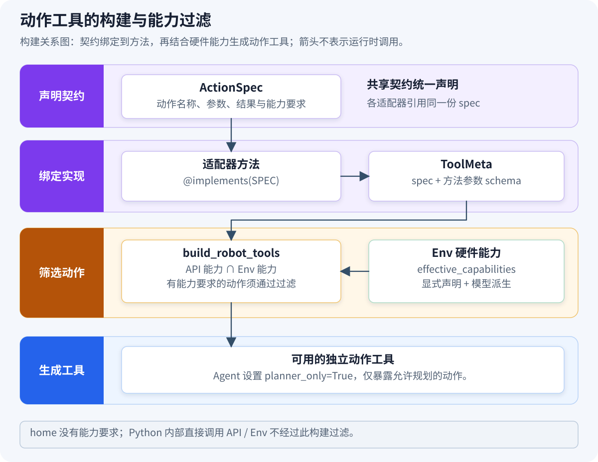
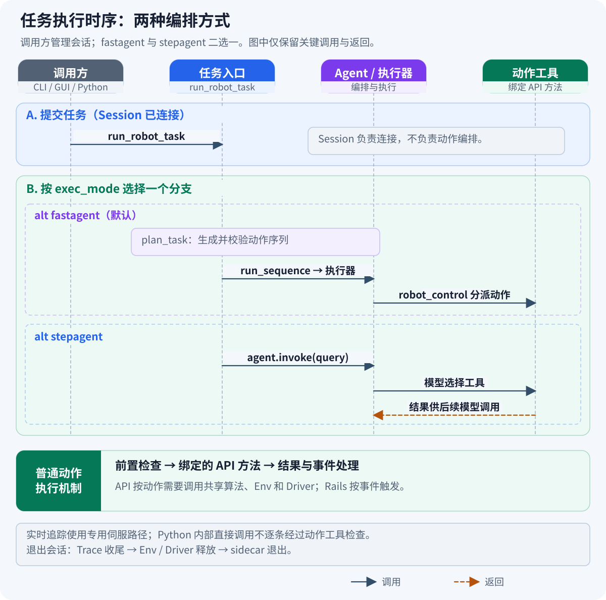
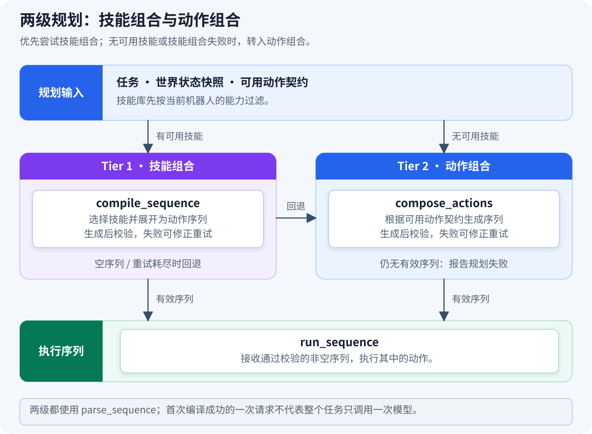
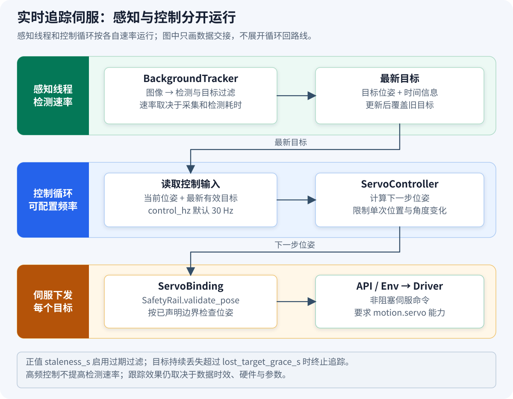
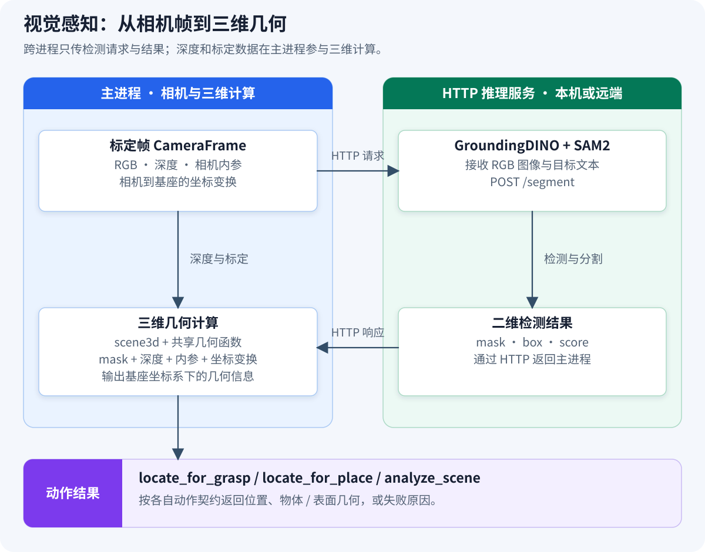

# JiuwenSymbiosis 架构指南

JiuwenSymbiosis 是基于 `openjiuwen` 的具身智能体框架。它用**共享动作契约（ActionSpec）与能力过滤**，让规划和执行逻辑复用于不同机器人。适配器负责硬件协议、坐标变换和设备配置；在已有动作词表能覆盖新硬件需求时，上层任务逻辑通常无需修改。

## 一、架构总览

先区分三个问题：**谁负责什么、哪些动作可用、任务如何执行**。下面的职责图不表示调用顺序；本节的[模块归属与跨层关系](#module-map)进一步定位代码与关键联系。第二节的[完整任务主线](#task-lifecycle)串联执行过程，后续章节展开具体机制。


| 职责 | 主要实现 | 输入与输出 |
|---|---|---|
| 任务编排 | `run_robot_task`、`plan_task`、`run_sequence`、Agent | 任务与配置 → 计划、工具调用及执行结果 |
| 生命周期 | `RobotSession` | Env、API、辅助服务进程（sidecar）启动器 → 连接与资源清理 |
| 动作工具 | `build_robot_tools`、`RobotControlTool` | 动作名与参数 → 调用已绑定的适配器方法 |
| 动作实现 | `BaseRobotApi`、适配器 API、`api/defaults.py` | 动作契约 → 通用算法与硬件操作 |
| 硬件接口 | `BaseRobotEnv`、适配器 Driver | 统一操作 → 厂商协议；设备读数 → `RobotObservation` |
| 规划输入 | 技能库、`WorldState`、`ExecutionMemory`、`Reachability` | 技能流程、观测、执行记录、机器人模型 → 规划所需信息 |

`perception/` 和 `motion/` 提供可复用的感知、几何与运动算法，由动作实现调用。`kinematics/` 提供 URDF、正逆运动学等模型计算；它与相机检测、实时设备观测的职责不同。

Rails 在工具调用、异常和模型调用等事件处执行检查、恢复或信息采集，并不是所有操作都必须逐层穿过的一串函数。`InProcessCodeTool` 和实时伺服有各自的执行路径，见[工具策略](#tool-strategies)和[实时追踪伺服](#realtime-servo)。

<a id="module-map"></a>

### 模块归属与跨层关系

下图将职责落实到代码模块：沿用六个职责泳道，右侧分别展示技能库、状态与执行记忆、共享算法与模型，底部单列会话装配和共享结果类型。实线只画关键调用，虚线表示规划输入或成功动作结果；它不是完整的导入依赖图，也不展开每个事件回调。



API、Env 和 Driver 是职责分组，具体本体的 `api.py`、`env.py`、`lowlevel.py` 位于 `adapters/<本体>/`。`TraceRail` 位于 `agent/trace.py`，`SkillUseRail` 由 `openjiuwen` 提供。`WorldState` 汇总 Env 观测、执行记忆和可达性信息，`ExecutionMemory` 由 API 持有并记录成功动作的效果；模型计算与实时观测分别承担不同职责。

动作工具的能力过滤见[第五节](#capability-gating)，进程内 Python 的直接调用边界见[第六节](#tool-strategies)。当前各适配器支持的能力见[特性矩阵](../reference/feature-matrix.md)。

<a id="task-lifecycle"></a>

## 二、完整任务主线

下面把各模块放回一次任务的执行过程中：调用方建立会话，准备规划输入，调度动作，再根据结果决定后续步骤，最后退出会话。主图以默认 `fastagent` 的普通动作路径展开；`stepagent` 的差异在规划与反馈处标明，具体编排方式见第七节的[《任务执行时序：两种编排方式》图](#execution-modes)。



图中的“编排与执行”汇总任务入口、规划器和执行器；“工具与 Rails”表示工具调度及其前后事件，不表示 Rails 是独立的串行调用层；“Env / Driver”合并展示硬件接入。Session 负责资源生命周期，动作顺序由编排与执行逻辑决定。

**执行反馈通过两种方式影响后续行为**：动作工具把成功结果按契约记入 `ExecutionMemory`，`fastagent` 在后续步骤前读取当前状态并检查冲突；`stepagent` 则将工具结果用于后续模型调用。状态检查不等于每步重新感知整个环境，重新规划和异常恢复也有各自的触发条件。

| 主图位置 | 需要把握的关系 | 局部展开 |
|---|---|---|
| A：建立会话 | 配置装配 Env/API；Session 启动辅助服务并连接设备 | [Session 生命周期](#session-lifecycle)、[Session 构建](#session-builder) |
| B：准备规划与执行 | 可用动作、技能与状态进入编排；按模式准备执行器 | [能力过滤](#capability-gating)、[两种编排方式](#execution-modes)、[两级规划](#two-tier-planning) |
| C：执行动作 | 工具分派到 API，API 调用共享算法及硬件接口 | [工具策略](#tool-strategies)、[视觉管线](#perception-pipeline)、[实时伺服](#realtime-servo) |
| C：结果与反馈 | 结果更新记忆；状态冲突和动作失败按不同条件处理 | [执行记忆](#execution-memory)、[状态检查与重规划](#runtime-replanning)、[安全 Rails](#safety-rails) |
| D：任务与会话结束 | 返回结果、记录轨迹；退出会话时断开设备并停止辅助服务 | [执行轨迹](#execution-trace)、[Session 生命周期](#session-lifecycle) |

主图按一次任务展示。同一个 Session 可以运行多个任务；设备在调用方退出会话时断开，不是每个任务完成后立即断开。

## 三、Env 层：唯一的硬件契约

`jiuwensymbiosis/env/base.py` 定义硬件接入接口。适配器实现连接、断开和观测，并通过 `low_level` 驱动访问设备。硬件能力由 Env 显式声明，例如当前 `MockArmEnv`：

```python
capabilities = frozenset({
    "motion.cartesian", "motion.servo", "grasp.parallel",
    "vision.camera", "vision.detection",
})
```

`BaseRobotEnv` 提供运动、末端控制和图像读取等接口；部分接口有委托驱动的默认实现，`home()` 等接口由适配器实现。Driver 按硬件能力实现 `env/protocol.py` 中对应的协议，如 `CartesianDriver`、`JointDriver`、`BaseDriver`、`CameraDriver`；移动底盘不需要实现机械臂的笛卡尔运动接口。

安全边界属性包括 `z_min_safe`、`workspace_bounds`、`joint_limits`、`base_step_limits`、`lift_limits`、`waist_step_limit_rad`。这些边界默认 `None`，表示不执行对应的范围检查；相关参数的类型和有限数检查仍由 SafetyRail 执行。适配器提供边界数据，SafetyRail 统一应用检查逻辑。

几何与模型属性单独提供，不能把它们的默认值解释为安全策略：

- `home_pose`、`tool_offset_mm`：归位姿态与工具偏移；基类默认分别为 `None` 和 `0.0`。
- `joint_units`：关节命令及观测使用的 `"deg"`、`"rad"` 或 `None`；未声明时不推断单位。
- `default_orientation_policy`：`goto_xyzr` 未指定姿态策略时使用的默认策略。
- `urdf_path`、`arm_chains`：机器人模型与运动链；用于派生 Env 侧的 `planning.reachability`。
- `arm_joints`：各机械臂对应的关节名；`cameras`：可选择的相机列表。

### 已知能力（`KNOWN_CAPABILITIES`）

能力词表定义在 `env/base.py`：

| 能力字符串 | 含义 |
|---|---|
| `motion.cartesian` | 基座坐标系下的末端位姿运动 |
| `motion.joint` | 关节空间运动 |
| `motion.servo` | 非阻塞伺服位姿命令 |
| `motion.base` | 平面底盘相对运动；当前共享动作支持差分运动，不支持横移 |
| `motion.base_servo` | 非阻塞连续底盘驱动 |
| `motion.lift` | 升降位置控制 |
| `motion.waist` | 腰部偏航旋转 |
| `motion.goal` | 通过导航接口驶向目标区域 |
| `motion.dual_arm` | 双臂协同运动；末端类型另由 `grasp.*` 声明 |
| `grasp.suction` | 吸盘控制 |
| `grasp.parallel` | 平行夹爪控制 |
| `grasp.paddle` | 双夹板夹持 |
| `vision.camera` | 图像读取 |
| `vision.depth` | 深度读取 |
| `vision.detection` | 目标检测 |
| `vision.eye_to_hand` | 使用固定相机的手眼几何关系 |
| `vision.search` | 目标方位搜索；是否移动机器人由具体动作决定 |
| `planning.reachability` | 基于机器人模型的可达性检查；由实现和模型派生 |
| `sorting.command` | 设备专用分拣协议 |
| `speech.tts` | 文本转语音 |

这些能力描述不同维度，适配器按实际支持情况组合。能力名称本身不保证某个任务可执行：任务还需要对应动作、满足前置条件，并提供必要的传感器和模型数据。

`MockArmEnv` 和 `build_mock_model` 可用于无硬件、无真实 LLM 的逻辑验证。当前 `examples/run_task.py --mock` 的硬件替身仅针对 Piper 路径，并强制使用 `stepagent`；新适配器需提供自己的测试替身。

## 四、API 层：动作契约与 `@implements`

动作契约、实现绑定和通用实现分别由以下对象承担：

- **`ActionSpec`**：类定义在 `api/decorators.py`，共享动作实例集中在 `api/actions.py`。声明动作名称、能力要求、参数、结果类型、前置条件和效果。
- **`@implements(SPEC)`**：在方法定义时附加 `ToolMeta`，关联共享契约和方法的参数 schema。工具构建器随后读取这些元数据；运行时调用的是绑定后的方法，不会重新执行装饰器。
- **`api.defaults`**：可由多个适配器复用的函数。适配器显式选择转发到哪个函数，不通过动作 mixin 继承整组能力。

例如 Cruzr 的 `search_target` 复用共享实现：

```python
class CruzrApi(BaseRobotApi):
    @implements(SEARCH_TARGET)
    def search_target(self, object_name: str = "box", reference: str | None = None,
                      relation: str = "on") -> dict:
        return defaults.search_target(self, object_name, reference, relation)
```

当几何或设备语义不同时，适配器提供方法实现。例如 Piper 的 `goto_xyzr` 需要处理工具尖端到法兰的坐标变换，不能直接套用通用实现。`@implements` 保持契约元数据一致，具体实现是否遵守契约仍需测试验证。

`BaseRobotApi.capabilities` 从已绑定动作的 spec 推导能力，也接纳类属性 `capability` 中的标记能力。`planning.reachability` 由可调用的 `check_reachable` 派生，不应作为普通硬件能力手动声明。API 的能力描述实现支持什么，仍需与 Env 的硬件能力核对。

`home` 的契约没有能力要求（`capability=None`），由 `BaseRobotApi` 提供并委托 `env.home()`。每种机器人必须定义适合自身的归位行为；持物状态下的恢复另见[安全 Rails](#safety-rails)。

### 规划契约：除了可调用，还要可规划

| 契约字段 | 含义 |
|---|---|
| `result` / `ToolMeta.returns` | spec 的 `result` 保存结果类型或 schema；`returns` 提供推导出的 JSON Schema，供校验器检查 `<bind>.field` |
| `requires` / `provides` / `invalidates` | 动作需要、建立或清除的机器人状态，使用 `api/state.py` 的封闭词表 |
| `produces_location` | 结果提供后续步骤可使用的位置 |
| `consumes_location` | 动作隐式读取已有位置缓存；显式 `<bind>.field` 引用另行检查 |
| `invalidates_locations` | 动作使先前位置失效，例如改变测量坐标关系的底盘运动 |
| `opens_access` / `closes_access` | 描述打开或关闭通路的效果；校验机制已存在，当前内置动作尚未声明这些效果 |

共享结果类型位于 `contracts.py`，供 API、感知和运动模块共同使用。`api/` 可以调用 `perception/` 和 `motion/`；后两者不反向导入 API 层。

契约陈述前置条件和效果，规划器据此组织动作顺序。`parse_sequence` 检查动作、参数、状态条件、结果引用与位置有效性。运行时状态汇总遵循“观测优先于执行记录推断”；没有报告的状态表示未知，不能直接当作假。

<a id="execution-memory"></a>

### 执行记忆：记录结果并清除失效位置

`BaseRobotApi.memory` 持有 `ExecutionMemory`。经过动作工具分派的调用由 `record_action` 记账；成功结果按契约更新状态，产生的位置按目标记录时间戳，声明失效的位置被清除。需要失效且没有生成新位置时，同时调用 `invalidate_sensing_cache()` 清除 API 的感知缓存。

记账失败会记录日志，不把已成功的硬件动作改判为失败。直接调用 API/Env 的代码不能假定自动经过这条记账路径。位置有效性依赖动作声明，也不能自动发现外部物体自行移动；需要重新感知的场景仍应安排感知动作。

`WorldState.snapshot(session)` 汇总 Env 观测、执行记忆和可达性信息，形成规划快照。它不负责持久保存执行记录。序列执行器的 `<bind>.field` 则引用已执行步骤的结果，与 `ExecutionMemory` 的位置记录是不同机制。

### 视觉：共享管线 + 显式投影动作

`perception/scene3d.py` 接收适配器提供的标定帧和检测器，计算物体或表面的三维几何。`api/defaults.py` 提供动作转发，`motion/approach.py` 复用感知结果完成搜索与逼近。处理流程见[视觉管线](#perception-pipeline)。

`pixel_to_base_xyz` 是独立的显式动作：适配器通过 `@implements(PIXEL_TO_BASE_XYZ)` 绑定实现。随臂相机需要结合当前法兰姿态和手眼标定；固定相机使用相应的相机到基座变换。

`search_target` 在当前朝向检查可用相机，报告目标方位 `bearing_rad`，不移动机器人，也不声明产生三维位置。逐步转动寻找目标、重新测量并逼近的过程由 `approach_for_grasp` / `approach_for_place` 承担。

<a id="capability-gating"></a>

## 五、能力门控（Capability Gating）：工具与硬件自动对齐

下图展开[完整任务主线 B 阶段](#task-lifecycle)的动作工具构建：先读取实现，再按能力过滤。输入是动作契约、适配器方法和 Env 能力，输出是可用工具；箭头只表示**构建过程中的输入与输出**。



`build_robot_tools(api, env=env)` 使用 `api.capabilities ∩ env.effective_capabilities` 过滤带能力要求的动作；不提供 `effective_capabilities` 的 Env 则使用其 `capabilities`。`home` 等没有能力要求的动作不受该过滤限制。Agent 构建独立动作工具时还设置 `planner_only=True`，仅向规划器暴露允许规划的动作。

例如硬件未声明 `grasp.parallel`，独立工具列表就不包含要求该能力的夹爪动作。Session 的严格能力检查还可能在启动时先报配置错误。这里控制的是动作工具的暴露范围，不限制进程内 Python 对对象的直接访问。

`planning.reachability` 是派生能力：API 侧提供 `check_reachable`，Env 侧提供 `urdf_path` 和 `arm_chains`。模型计算由 `kinematics/` 支持，包括 URDF 解析、正运动学（FK）、逆运动学（IK）及相关几何检查。计算结论受模型、关节状态和算法假设约束，不等同于运动已经安全完成。

`WorldState` 可为已记录位置添加 `reachable` 判断；无法判断时省略该字段。规划器也使用空间关系 `on` / `under` / `in` / `beside` / `near`，将目标与参照物关联。这些关系描述目标位置关系，本身不意味着机器人已经具备开门、移开障碍等动作。

<a id="tool-strategies"></a>

## 六、Tool 层：三种工具策略可共存

`agent/builder.py` 根据 `mode` 构建工具，再按 `enable_skill` 添加技能入口：

| 配置或工具 | 行为 |
|---|---|
| `mode="tool"` | 使用 `build_robot_tools`，每条可用动作对应一个独立工具 |
| `mode="code"` | 使用 `InProcessCodeTool`，执行进程内 Python |
| `mode="hybrid"`（默认） | 同时提供独立动作工具和进程内 Python 工具 |
| `enable_skill=True` | 额外添加 `RobotControlTool` 和 `SkillUseRail`；与上述 `mode` 分开配置 |

`RobotControlTool` 通过 `action` / `params` 分派动作。SafetyRail 先读取这两个字段，再检查实际动作及参数，因此独立动作工具和该统一入口可以使用同一套运动检查。

当前 `fastagent` 的普通动作执行器固定调用 `robot_control`。使用内置构建器时，需要设置 `enable_skill=True` 来注册该入口；只设置 `exec_mode="fastagent"` 不会自动注册它。`plan_task` 直接读取技能库，与 `SkillUseRail` 加载说明是不同机制。

`InProcessCodeTool` 通过 `exec()` 访问注入的 `env`、`api`、`np` 等对象，没有沙盒隔离。其内部直接调用 API/Env 不会逐条经过动作工具的能力过滤、SafetyRail 和记账包装。需要这些检查的操作应使用动作工具路径。

`mode` 决定工具配置；`exec_mode` 决定任务由模型逐步编排还是先编译序列，二者含义不同。

<a id="六-两级自主规划"></a>

<a id="execution-modes"></a>

## 七、两级自主规划（`exec_mode: fastagent`）

调用者先用 `with session:` 建立连接，再调用 `run_robot_task(session, query, config)`。Session 管理资源，任务入口根据 `exec_mode` 选择执行方式。下图展开[完整任务主线 B/C 阶段](#task-lifecycle)中两种编排方式的差异：



- **`fastagent`（默认）**：`plan_task` 生成动作序列；`run_sequence` 通过 Agent 的能力执行器调用 `robot_control`，执行普通动作。它不调用 `agent.invoke()`，也不为每个普通步骤调用 LLM；初始规划、修正重试和重新规划仍可能调用模型。
- **`stepagent`**：构建 Agent 后调用 `agent.invoke()`，由模型根据工具结果继续选择后续调用。

两条路径通过同一套 Agent 装配获得 Rails。`fastagent` 显式初始化相应生命周期；实时追踪复合步骤使用本节后面的伺服路径。

<a id="two-tier-planning"></a>

### 两级规划：先尝试技能，再组合动作

技能库包含可供规划器选择和展开的流程说明及契约，不是直接执行的固定脚本。`fastagent` 直接读取技能库进行编译；`stepagent` 的技能说明则由 `enable_skill=True` 时附加的 `SkillUseRail` 加载。

下图展开[完整任务主线 B 阶段](#task-lifecycle)的 `fastagent` 规划：输入是任务、状态、技能和动作契约，输出是交给执行器的有效序列。



1. **技能组合（Tier 1，`compile_sequence`）**：对能力过滤后的技能，选择并展开为平坦动作序列。首次生成即通过校验时，这个编译阶段只需一次 LLM 请求。
2. **动作组合（Tier 2，`compose_actions`）**：直接根据可用动作及契约生成序列。在三个条件下接管：没有可用技能；Tier 1 返回显式空序列；Tier 1 在修正重试后仍未生成有效序列。
3. **序列校验（`parse_sequence`）**：两级生成过程都使用校验器。校验失败会反馈给模型修正；Tier 2 仍无法得到有效序列时报告规划失败。

任务解析、规划重试和运行时重规划可能带来额外模型调用，因此不能将编译阶段的一次请求理解为整个任务只调用一次模型。自动把成功序列保存成新 SKILL.md 尚未实现。

<a id="runtime-replanning"></a>

### 状态检查与重新规划

执行器在步骤前检查可观测状态是否与动作要求冲突，以及隐式读取的位置缓存是否已失效。它读取轻量的 `current_tokens` 和执行记忆，不会在每步重新感知整个场景。

触发重新规划时才生成新的 `WorldState.snapshot`，并受 `max_replans` 限制。未报告的状态视为未知，不据此判定冲突。当前实现中，重规划抛错或返回空序列时保留原计划；因此这是一种计划修正机制，不能替代动作安全检查。

<a id="realtime-servo"></a>

### 实时追踪伺服：边感知边执行

`fastagent` 支持 `TRACK_DETECT` / `TRACK_GRASP` 追踪复合步骤，将检测和控制分开运行。这是[完整任务主线 C 阶段](#task-lifecycle)的专用执行分支：检测产生目标，控制器经位姿检查下发伺服命令。图中只画数据交接，不展开线程内部的循环。



- **`BackgroundTracker`**：后台线程持续检测，保存最近一次目标和时间信息。正值 `staleness_s` 使过期目标返回 `None`；显式传 `None` 会关闭该项过期过滤。当前 runner 的追踪入口配置了正值阈值。
- **`ServoController`**：按 `control_hz` 读取当前位姿和目标，每次限制位姿变化步长，再发非阻塞命令。默认配置为 30 Hz，实际频率和效果取决于硬件、检测延迟及参数。
- **`ServoBinding`**：适配控制器与设备。每个下发位姿先经过 `SafetyRail.validate_pose`，再调用 `api.servo_to_tip` 或 `env.servo_to_flange`；要求 Env 声明 `motion.servo`。

目标丢失超过 `lost_target_grace_s` 时控制器终止追踪；目标过滤还可拒绝检测跳变。检测速率与控制速率可以不同，但高频发令本身不保证对快速移动目标的跟踪精度。

<a id="safety-rails"></a>

## 八、安全 Rails：检查、恢复与反馈

Rails 由配置和适用能力决定是否启用，各自在不同事件上工作：

| Rail | 主要触发点 | 作用 |
|---|---|---|
| `SafetyRail` | `before_tool_call` | 检查受监控动作的参数及已声明安全边界 |
| `RecoveryRail` | `on_tool_exception` | 对受监控的运动或抓取异常尝试恢复 |
| `VisualFeedbackRail` | `after_tool_call`、`before_model_call` | 暂存动作后图像，在后续模型调用前注入 |
| `DiagnosisRail` | 异常或工具结果事件、`before_model_call` | 收集失败证据，在后续模型调用前注入诊断 |
| `TraceRail` | 调用与任务生命周期事件 | 记录轨迹、日志和可选图像 |
| `SkillUseRail` | 技能上下文加载 | 提供技能说明；不属于运动安全检查 |

`SafetyRail` 根据运动能力检查 Z 下限、XY 工作区、关节软限位、底盘单步位移/转角、升降范围和腰部转角。超限时抛出 `ValueError`。`stepagent` 可将工具异常反馈给模型；`fastagent` 按执行器的失败策略处理，不保证发生逐步模型纠错。

检查范围还取决于动作名和参数格式。例如 Piper 的 `goto_pose` 使用法兰坐标 `x_mm` / `y_mm` / `z_mm`，当前由驱动执行对应的 Z 下限检查，不直接套用 SafetyRail 的工具尖端 Z/XY 检查。

`RecoveryRail` 根据动作标签和持物状态决定是否释放末端并尝试归位。确认持物的运动失败会保留夹持；恢复优先调用 `recovery_home()`，没有时退回 `home()`。归位本身失败时不会再次重试归位。恢复属于尽力执行，不能保证设备最终处于安全状态。

`VisualFeedbackRail` 需要相机能力，图像在下一次模型调用前注入；没有逐步模型调用的 `fastagent` 不会因此自动获得逐步 VLM 核验。`DiagnosisRail` 依赖启用 Trace，详见 [Trace Feedback Loop](../how-to/use-trace-feedback.md)。

`parallel_tool_calls` 默认关闭。当前构建器在 Env 声明 `motion.cartesian`、`motion.joint`、`grasp.suction`、`grasp.parallel` 中任一能力时拒绝开启；同时启用 Trace 也会被拒绝。这项检查尚未覆盖全部运动与抓取能力，不能据此认定其他能力可以安全并行。软件边界检查不替代设备急停与硬件保护。

<a id="execution-trace"></a>

## 九、执行轨迹与回放（TraceRail）

`TraceRail` 位于 `agent/trace.py`，由 `enable_tracing` 启用，默认不挂载。它采集执行证据，不承担动作拦截或恢复。

轨迹按配置记录工具调用的动作名、参数、结果摘要、成功或错误、耗时、观测快照以及可选 JPEG 帧，并受条目与帧数上限约束。观测不直接序列化原始 RGB/depth 数组。`TraceEventSink` 收集 Rail 事件；`TraceLogHandler` 收集配置日志源的 `WARNING` 及以上日志。

任务结束时写 JSON 到 `<workspace>/traces/{run_token}.json`；可选帧保存到 `traces/frames/{run_token}/step_NNN.jpg`。`fastagent` 通过显式生命周期事件完成记录与收尾，Session 断开时还会尝试补充收尾。

`jiuwensymbiosis-replay <trace.json>` 默认生成自包含 HTML 回放，`--text` 输出文本时间线。这是执行证据回放，不会重新驱动机器人执行动作。

字段、配置与序列化规则见[执行轨迹参考](../reference/tracing.md)，样例位于 `examples/sample_trace/`。

<a id="session-lifecycle"></a>

## 十、RobotSession：生命周期聚合器

`RobotSession` 是上下文管理器，持有 Env 实例、API 实例、sidecar 启动器，以及提供代码工具全局对象的 `globals_provider`。Env 持有底层驱动；Session 不负责决定动作顺序。

| 时机 | 顺序 |
|---|---|
| 进入 `with session:` | 启动已配置的 sidecar → 连接 Env → 检查能力一致性 |
| 会话内运行任务 | 调用者执行 `run_robot_task`，由它构建 Agent 并选择执行模式 |
| 退出 `with session:` | Trace 补充收尾 → Env 断开并释放驱动 → 退出 sidecar 上下文 |

连接和断开支持重复调用。API 声明而 Env 不支持的普通能力，在 `strict_capabilities=True` 时导致启动失败；Env 独有能力产生警告。派生能力允许两侧不对称，不按普通能力差异报错。`describe()` 的有效能力汇总使用两侧交集。

`globals_provider` 返回 `env`、`api`、`np` 及适配器额外对象；Agent 构建时会把可用对象说明加入代码工具相关的提示上下文。

<a id="perception-pipeline"></a>

## 十一、视觉感知：检测器作为子进程

检测服务运行 GroundingDINO 和 SAM2。客户端通过 HTTP 发送图像和目标文本，接收掩膜、框和分数；深度与标定变换用于主进程内的三维计算。

下图展开[完整任务主线 C 阶段](#task-lifecycle)中视觉动作的内部处理。输入是标定帧与目标文本，输出按动作契约返回到工具调用方，再进入记账和后续编排。



1. **采集**：适配器提供 `CameraFrame`，包括 RGB、深度、相机内参以及相机到基座的变换。
2. **检测**：`detector_client` 将 RGB 与目标文本发送到 `/segment`，解码返回的 mask 等结果。
3. **三维计算**：`scene3d` 使用 mask、深度、内参和坐标变换调用共享几何算法，得到基座坐标系下的位置及物体/表面几何。
4. **动作返回**：`locate_for_grasp`、`locate_for_place`、`analyze_scene` 按各自契约返回结果或失败原因；不存在所有动作都相同的一组结果字段。

使用本地检测 sidecar 时，Session 管理其生命周期；也可以配置已有检测服务，是否启动本地进程由 `spawn` 决定。适配器仍需提供正确的相机、标定和检测配置。

`pixel_to_base_xyz` 是单点投影动作，不是这条共享管线内部必经的动作调用。`api/defaults.py` 转发到共享函数；视觉和逼近逻辑仍由显式动作绑定进入工具列表。

<a id="session-builder"></a>

## 十二、`make_builder`：消除样板代码

`adapters/_common/builder.py` 的 `make_builder` 封装配置解析、Env/API 构造、sidecar 启动器收集和 Session 装配，可追加 `decorate` 回调：

```python
build_xxx_session = make_builder(
    XxxConfig, XxxEnv, XxxApi,
    api_kwargs_from_cfg=["z_correction_mm", "detector.url:detector_service_url"],
    sidecar_builders=[make_detector_sidecar()],
    decorate=_set_extra_globals,
)
# build_xxx_session(cfg)
# build_xxx_session.from_yaml("path.yaml")
# build_xxx_session.from_dict({...})
```

`api_kwargs_from_cfg` 支持同名字段、`cfg:api` 重命名和嵌套点路径；复杂转换可使用回调。`make_detector_sidecar()` 读取检测配置并按 `spawn` 决定是否启动本地服务。构造 Session 与连接硬件是不同阶段。

适配器 Config 声明自身的 `path_fields`，`from_yaml` 通过公共 `load_yaml_config` 解析。
Runtime 和冒烟验证使用同一 `parse_config` 处理配置来源，适配器继续负责默认值、环境覆盖和校验；
Runtime 只冻结有效配置与资源身份，不维护本体路径字段名单。

通过 Runtime 或官方 CLI 接入硬件时，builder 还须声明 `resource_keys(cfg)`。
适配器负责识别真实命令端点，公共准入补充相机和自启检测服务。builder 本身不加锁：
Runtime / `admitted_session` 取得资源使用权，RobotSession 负责连接及清理，
`CleanupReport` 确认释放后才能重用设备。具体接线见[硬件移植指南](../how-to/port-hardware-adapter.md)。


## 十三、接入新硬件的文件职责

`templates/xxx_adapter/` 提供六个 Python 文件及一份 YAML 模板，另有可选标定模板。模板减少重复配置和装配代码，实际工作量取决于驱动、几何、传感器及行为差异。

| 文件 | 适配器负责的内容 |
|---|---|
| `__init__.py` | 导出适配器公共入口 |
| `config.py` | 配置结构及 YAML/dict 解析 |
| `config_template.yaml` | 硬件、感知和安全参数示例 |
| `lowlevel.py` | 厂商 SDK 或通信协议；实现设备支持的 Driver 协议 |
| `env.py` | 生命周期、观测、能力声明、单位、几何与安全属性 |
| `api.py` | 动作绑定；复用通用函数或实现设备特有语义 |
| `session.py` | 用 `make_builder` 装配配置、Env、API 和 sidecar |
| `calibration.py`（可选模板） | 标定适配包装；按模板说明放入 `calibration/adapters/<本体>.py` 并暴露 `CALIBRATION_ADAPTER_SPEC` |

能满足共享实现假设的动作直接转发 `defaults`。坐标、传感器、末端控制或恢复语义不同的动作，需要适配器实现与验证。若已有动作词表不能表达新需求，应先设计共享契约，再增加实现。

## 十四、接入新硬件的完整流程

1. 拷贝 `templates/xxx_adapter/`，填写配置并重命名公共入口。
2. 按硬件能力实现 Driver 协议、Env 生命周期与观测；明确单位和安全边界。
3. 绑定已有动作，检查参数及结果契约；提供感知、坐标变换和恢复所需的实现。
4. 使用 `make_builder` 装配 Session；需要标定时增加标定适配包装。
5. 运行结构校验与使用替身驱动的冒烟测试：

   ```bash
   python scripts/validate_adapter.py --module jiuwensymbiosis.adapters.acme
   python scripts/smoke_test_adapter.py --module jiuwensymbiosis.adapters.acme
   ```

6. 增加适配器测试，验证单位、几何转换、失败处理和持物恢复。通用冒烟通过不代表真实硬件行为已验证。
7. 按适配器使用说明验证设备行为；不要把 Piper 专用的 `--mock` 当作任意新硬件的模拟器。

复用已有动作时，改动主要集中在适配器。新增共享动作、驱动协议或通用算法时，需要相应调整核心契约及测试。详细步骤见[移植机器人硬件适配器](../how-to/port-hardware-adapter.md)。

## 十五、关键设计原则小结

| 设计 | 维护上的作用 |
|---|---|
| 共享 `ActionSpec`，`ToolMeta` 引用 spec | 减少契约副本；跨硬件实现仍需一致性测试 |
| 显式动作绑定与能力过滤 | 分开描述实现能力和硬件能力，控制工具暴露范围 |
| 共享函数与适配器分工 | 共用算法集中维护，设备差异由适配器承担 |
| Env 与能力分片 Driver 协议 | 上层使用统一硬件接口，驱动只实现对应能力 |
| `contracts.py` 保存共享结果类型 | 感知、运动和 API 使用同一结果定义，避免反向依赖 |
| 前置条件、效果与位置有效性 | 为序列校验和运行时状态检查提供依据 |
| 观测与执行记忆分工 | 区分当前实测、历史执行推断和未知状态 |
| 检测与伺服分开运行 | 控制循环不必阻塞等待每次检测；效果仍受数据时效约束 |
| Session 管理资源，Rails 处理事件 | 明确连接、检查、恢复与证据采集的职责 |

## 十六、相关内部设计

本页说明主要职责与执行机制。更详细的接口和取舍记录位于仓根 `design/`：

- [执行轨迹模块设计](../../../design/tracing.md)：Trace 生命周期、事件归属、持久化与资源边界。
- [Trace Feedback Loop 模块设计](../../../design/trace-feedback-loop.md)：在线诊断与离线失败聚类。
- [日志模块设计](../../../design/logging.md)：handler 所有权、输出隔离与 Trace 日志转发。
- [语音控制集成模块设计](../../../design/voice-control-integration.md)：语音前端与文本任务执行器的连接。
