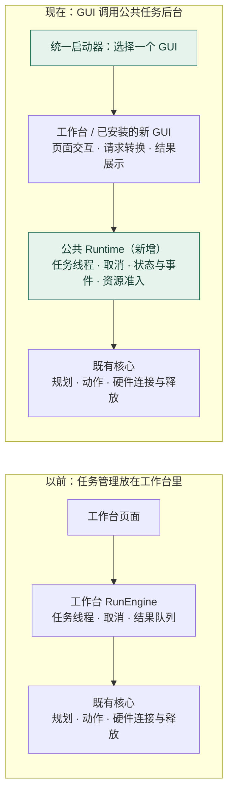

# GUI 架构变化：任务管理从工作台移到公共层

**工作台负责交互，Runtime 负责单次任务的运行管理，既有核心负责规划、动作和硬件。**

目录上看到的是 GUI 移到根目录、增加 `runtime/`；职责上发生的是：工作台里原有的任务线程、取消、结果管理被提取出来，成为新 GUI 也能直接使用的公共能力，同时增加统一的资源使用权管理。

## 1. 一张图看懂前后变化



图中向下的箭头表示调用；执行进度和结果从 Runtime 返回 GUI。启动器每次选择一个 GUI；新 GUI 表示接入能力，当前产品界面仍是工作台。

**`RunEngine` 这个名字仍在，但职责变了：以前自己启动任务线程，现在主要把工作台表单转成 Runtime 请求，再把执行事件转成界面内容。**

## 2. 真正改变了三件事

| 变化 | 以前 | 现在 | 直接收益 |
| --- | --- | --- | --- |
| **GUI 可以替换** | 固定启动工作台 | 启动器通过插件注册发现界面，用 `--gui` 选择 | 新 GUI 可以采用自己的布局和 UI 框架 |
| **任务后台可以复用** | 工作台 `RunEngine` 管线程、取消和结果队列 | 公共 Runtime 管任务、状态和事件；工作台 `AppHost` 持有它 | 新 GUI 复用任务接口；多个页面各自读事件，不会互相取走 |
| **硬件占用统一裁决** | 各页面和入口各自协调连接、忙碌状态 | 连接前统一申请使用权，确认清理后才释放 | 同一设备被任务、工具或 CLI 占用时，其他已接入入口不能抢用 |

所以，新 GUI 需要实现自己的页面、注册启动入口、调用 Runtime。已有任务能力所需的线程、取消、事件记录和占用检查，都可以复用。

## 3. 以“点击抓取盒子”为例

1. **GUI 收集输入**：读取任务指令和机器人配置，向 Runtime 提交任务。
2. **Runtime 接管任务**：检查设备是否可用，取得使用权，建立任务记录并启动后台线程。设备已被占用时，提交被拒绝。
3. **既有核心执行**：Runtime 创建并连接 `RobotSession`，调用既有任务执行器；Agent / Planner、感知、动作工具和驱动完成任务。
4. **GUI 展示进度**：Runtime 记录步骤、状态和结果；页面按各自的读取位置获取事件，转换成文字、进度和画面。
5. **Runtime 协调收尾**：任务完成或用户请求取消后，由 Session / Driver 执行清理；Runtime 根据清理结果决定是否释放占用。

**例如：页面 A 正在执行抓取，页面 B 或已接入的 CLI 再申请同一设备，会被拒绝。点击“停止”只是请求取消；确认在途工作结束、连接释放后，设备才能接受下一次操作。**

任务由应用进程持有。浏览器页面刷新或断开不会自动取消任务；应用退出时负责请求停止并等待收尾。

## 4. Runtime 与既有核心怎么分工

| 模块 | 负责回答的问题 |
| --- | --- |
| GUI 启动器 | 启动哪一个界面？把哪些启动参数传给它？ |
| 工作台或其他 GUI | 用户想做什么？怎样输入和展示？ |
| Runtime | 任务是否被接受？运行到哪一步？如何取消？设备能否被下一次操作使用？ |
| Agent / Planner / API / Rails | 怎样规划和执行动作？动作是否符合能力和安全约束？ |
| RobotSession / Env / Driver | 怎样连接设备、发送命令、断开和报告清理结果？ |

ActionSpec、能力门控和原有规划执行路径继续沿用。Session / Driver 补充清理结果，让 Runtime 有依据判断何时能释放资源。

**工具与 CLI 的接法：** 感知测试、标定和硬件控制仍由工作台工具组织流程；已接入的官方 CLI 也保留自己的执行与输出。它们与普通任务共享的是“资源使用权管理”，不统一改成 Runtime 任务。任务中的检测、定位等感知能力仍在既有核心执行链中。

**当前范围：** GUI 与 Runtime 在同一 Python 进程；一个进程最多执行一个硬件任务或维护操作。跨进程互斥适用于同机、同用户、共用锁目录并遵守协议的入口。此次仍由同一个发行包提供核心与工作台；独立后端服务、多机调度和持续硬件连接不属于本次变化。

<details>
<summary>需要定位代码时：目录与关键入口</summary>

```text
jiuwensymbiosis_gui/          界面层：启动器、插件契约、工作台
  launcher.py / plugin.py    选择并启动 GUI
  workbench/                页面、交互、显示和维护工具
    app_host.py             应用级 Runtime 和工具的持有者
    run_engine.py           工作台请求与显示的转换

jiuwensymbiosis/runtime/     公共层：任务管理和资源使用权
  jobs.py / worker.py        提交、取消、执行协调与收尾
  events.py / store.py       执行事实、状态和事件读取
  resources.py              资源占用与释放判定

jiuwensymbiosis/agent/       既有规划、任务执行和 Session
jiuwensymbiosis/api/         既有动作契约与能力门控相关接口
jiuwensymbiosis/env/         既有硬件环境契约
jiuwensymbiosis/adapters/    各机器人实现
```

代码入口：[GUI 启动器](../../../jiuwensymbiosis_gui/launcher.py)、[RunEngine](../../../jiuwensymbiosis_gui/workbench/run_engine.py)、[AppHost](../../../jiuwensymbiosis_gui/workbench/app_host.py)、[Runtime](../../../jiuwensymbiosis/runtime/jobs.py)、[资源管理](../../../jiuwensymbiosis/runtime/resources.py)。

继续阅读：[接入一个 GUI 插件](../how-to/add-gui.md) · [完整迁移设计](../../../design/pluggable-gui.md)。

</details>

本文依据 2026-09-21 的本地代码：对比迁移前 `6fba072` 与当前 `504c56c`，用于说明已实现的架构变化。
